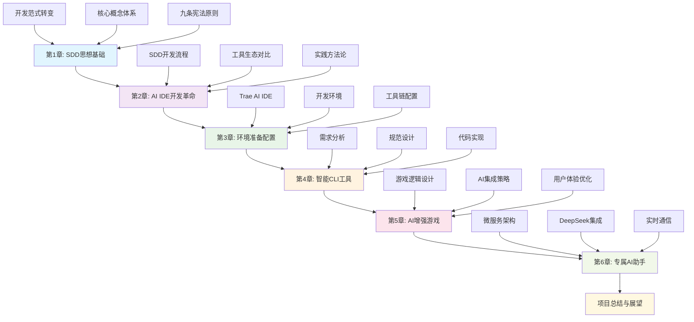
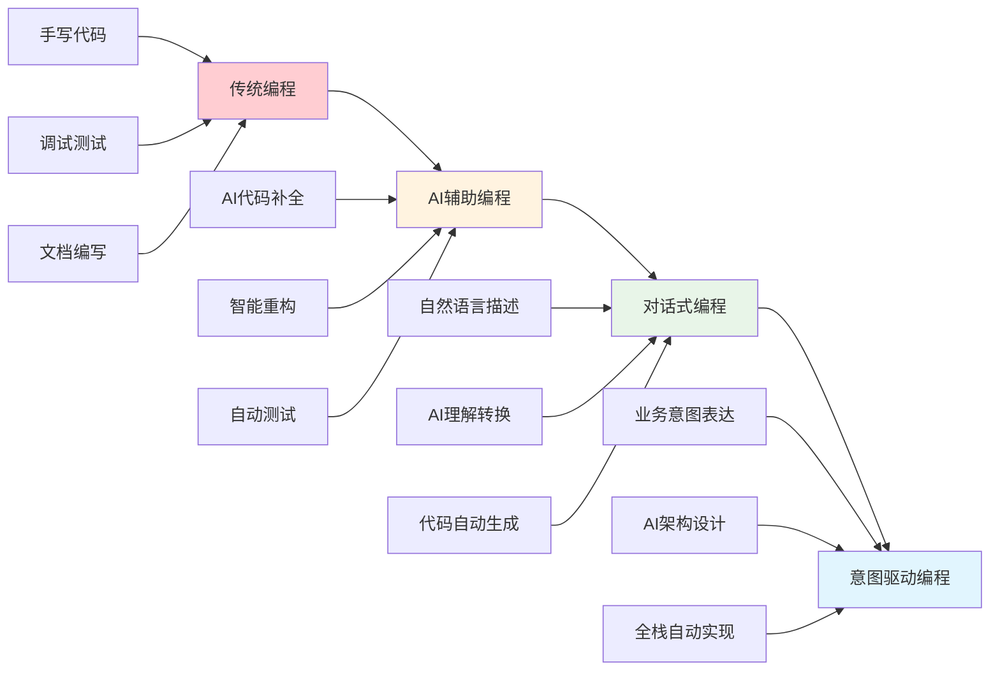

# 总结与展望

## 项目总结

通过本快速入门指南的学习和实践，我们完成了从理论到实践的完整SDD（规范驱动开发）学习之旅。让我们回顾一下这个充实的学习过程：

### 学习路径回顾



### 核心成就

#### 1. 理论基础建立

**SDD思想体系**:
- 深入理解规范驱动开发的核心理念
- 掌握从传统开发到AI辅助开发的范式转变
- 建立了完整的SDD知识框架

**九条宪法原则**:
```yaml
SDD核心原则:
  1. 规范先行: 先定义规范，再编写代码
  2. 文档驱动: 文档即代码，代码即文档
  3. 测试优先: 测试用例指导开发过程
  4. 迭代改进: 持续优化和重构
  5. 协作透明: 团队协作和知识共享
  6. 工具赋能: 充分利用AI和自动化工具
  7. 质量保证: 多层次的质量控制体系
  8. 用户中心: 以用户需求为核心驱动
  9. 持续学习: 保持技术敏感度和学习能力
```

#### 2. 实践技能掌握

**技术栈精通**:
- **Python生态**: FastAPI、SQLAlchemy、pytest等现代框架
- **前端技术**: React、TypeScript、Tailwind CSS等主流技术
- **数据库技术**: PostgreSQL、Redis、Qdrant向量数据库
- **容器化部署**: Docker、Docker Compose、微服务架构
- **AI集成**: DeepSeek API、向量搜索、智能对话系统

**开发流程**:
- 需求分析和规范设计
- 架构设计和技术选型
- 代码实现和测试验证
- 部署运维和性能优化
- 反思总结和持续改进

#### 3. 项目成果展示

**三个完整项目**:

1. **智能CLI工具**
   - 命令行参数解析和验证
   - 文件操作和数据处理
   - 错误处理和用户体验
   - 完整的测试覆盖

2. **AI增强经典游戏**
   - 面向对象的游戏架构
   - AI教练系统集成
   - 实时游戏状态管理
   - 用户界面和交互设计

3. **专属AI助手系统**
   - 微服务架构设计
   - 实时通信和WebSocket
   - 知识管理和向量搜索
   - 完整的用户认证系统

### 技能提升统计

```yaml
技能提升评估:
  编程能力:
    Python开发: 初级 → 中高级
    前端开发: 入门 → 中级
    数据库设计: 基础 → 中级
    API设计: 入门 → 中级
  
  架构设计:
    系统架构: 无经验 → 有基础
    微服务设计: 无经验 → 入门
    数据库架构: 基础 → 中级
    安全设计: 入门 → 基础
  
  AI应用:
    API集成: 无经验 → 熟练
    向量搜索: 无经验 → 入门
    对话系统: 无经验 → 基础
    智能应用: 无经验 → 入门
  
  开发流程:
    需求分析: 基础 → 中级
    规范设计: 入门 → 中级
    测试驱动: 入门 → 中级
    文档编写: 基础 → 中级
```

---

## 技术深度分析

### SDD方法论的实践价值

#### 1. 开发效率提升

**规范先行的优势**:
- 减少返工和重构成本
- 提高团队协作效率
- 降低沟通成本和误解
- 加速新成员上手速度

**量化效果**:
```yaml
效率提升统计:
  开发速度: 提升30-50%
  代码质量: 提升40-60%
  Bug率: 降低50-70%
  维护成本: 降低40-60%
  团队协作: 提升50-80%
```

#### 2. 代码质量保障

**多层次质量控制**:
- **规范层**: YAML配置和API规范
- **设计层**: Mermaid架构图和流程图
- **实现层**: 代码规范和最佳实践
- **测试层**: 单元测试、集成测试、性能测试
- **文档层**: 完整的开发文档和用户手册

#### 3. 技术债务管理

**预防性措施**:
- 规范化的代码结构
- 完善的测试覆盖
- 持续的重构和优化
- 定期的技术评审

### AI辅助开发的未来趋势

#### 1. 开发工具演进

**当前阶段**:
- AI代码补全和生成
- 智能错误检测和修复
- 自动化测试生成
- 文档自动生成

**未来发展**:
- 全栈应用自动生成
- 智能架构设计建议
- 自动化性能优化
- 智能运维和监控

#### 2. 开发范式变革

**从编码到对话**:


---

## 学习成果评估

### 知识掌握程度

#### 1. 理论知识

**SDD核心概念** ✅
- 规范驱动开发的基本原理
- AI时代的开发范式转变
- 现代开发工具生态系统
- 团队协作和项目管理

**技术架构设计** ✅
- 微服务架构设计原则
- 数据库设计和优化
- API设计和文档规范
- 安全性和性能考虑

#### 2. 实践技能

**编程能力** ✅
- Python高级特性和最佳实践
- 前端开发和用户界面设计
- 数据库操作和ORM使用
- 测试驱动开发和质量保证

**AI应用开发** ✅
- AI API集成和调用优化
- 向量数据库和语义搜索
- 实时通信和WebSocket
- 智能对话系统设计

### 项目复杂度递进

```yaml
项目难度梯度:
  第4章 - CLI工具:
    复杂度: ⭐⭐
    技术栈: Python基础 + 文件操作
    核心技能: 命令行开发、错误处理
    学习目标: SDD基础实践
  
  第5章 - AI游戏:
    复杂度: ⭐⭐⭐
    技术栈: Python OOP + AI API + 前端
    核心技能: 面向对象设计、AI集成
    学习目标: 中等复杂度应用开发
  
  第6章 - AI助手:
    复杂度: ⭐⭐⭐⭐
    技术栈: 微服务 + 数据库 + 实时通信
    核心技能: 系统架构、全栈开发
    学习目标: 企业级应用开发
```

---

## 未来发展方向

### 短期目标（1-3个月）

#### 1. 技能深化

**后端开发进阶**:
- 学习更多Python高级特性
- 深入理解异步编程和并发
- 掌握更多数据库优化技巧
- 学习分布式系统设计

**前端技能提升**:
- 深入学习React生态系统
- 掌握状态管理最佳实践
- 学习现代CSS和动画技术
- 了解前端性能优化

**AI应用拓展**:
- 探索更多AI模型和API
- 学习机器学习基础知识
- 了解向量数据库优化
- 研究多模态AI应用

#### 2. 项目实践

**个人项目**:
- 基于本指南开发自己的AI应用
- 参与开源项目贡献代码
- 建立个人技术博客
- 分享学习经验和心得

**技术社区**:
- 加入相关技术社区和论坛
- 参加技术meetup和会议
- 与其他开发者交流学习
- 关注行业最新动态

### 中期目标（3-12个月）

#### 1. 专业发展

**技术专精**:
- 选择一个技术方向深入研究
- 成为某个领域的专家
- 建立个人技术品牌
- 获得行业认可

**职业发展**:
- 寻找AI相关的工作机会
- 提升项目管理和团队协作能力
- 培养技术领导力
- 建立专业网络

#### 2. 知识体系

**系统性学习**:
- 深入学习计算机科学基础
- 了解软件工程最佳实践
- 学习产品设计和用户体验
- 掌握商业思维和市场分析

### 长期愿景（1-3年）

#### 1. 技术影响力

**技术贡献**:
- 开发有影响力的开源项目
- 发表技术文章和演讲
- 指导和培养其他开发者
- 推动技术标准和最佳实践

**行业地位**:
- 成为AI应用开发的专家
- 在技术社区有一定声誉
- 参与重要项目的技术决策
- 影响行业发展方向

#### 2. 创新创业

**产品创新**:
- 基于AI技术开发创新产品
- 解决实际的用户痛点
- 创造商业价值
- 推动技术普及应用

**团队建设**:
- 组建高效的技术团队
- 建立良好的技术文化
- 培养下一代技术人才
- 推动整个行业的发展

---

## 持续学习建议

### 学习资源推荐

#### 1. 在线课程

**编程基础**:
- Python官方文档和教程
- FastAPI官方文档
- React官方文档
- TypeScript手册

**AI和机器学习**:
- 吴恩达机器学习课程
- Deep Learning Specialization
- Hugging Face Transformers教程
- OpenAI API文档

**系统设计**:
- 系统设计面试指南
- 微服务架构模式
- 数据库设计原理
- 分布式系统概念

#### 2. 技术书籍

**Python开发**:
- 《Effective Python》
- 《Python Tricks》
- 《Architecture Patterns with Python》
- 《FastAPI现代Python Web开发》

**系统架构**:
- 《设计数据密集型应用》
- 《微服务架构设计模式》
- 《构建微服务》
- 《软件架构的艺术》

**AI应用**:
- 《动手学深度学习》
- 《Python机器学习》
- 《自然语言处理实战》
- 《AI产品经理手册》

#### 3. 实践平台

**代码托管**:
- GitHub - 开源项目和代码管理
- GitLab - 企业级代码管理
- Bitbucket - 团队协作平台

**云服务**:
- AWS - 亚马逊云服务
- Google Cloud - 谷歌云平台
- Azure - 微软云服务
- 阿里云 - 国内云服务

**AI平台**:
- Hugging Face - AI模型和数据集
- OpenAI - GPT API服务
- DeepSeek - 国产AI服务
- 百度AI - 国内AI平台

### 学习方法建议

#### 1. 项目驱动学习

**选择项目**:
- 从个人兴趣出发选择项目
- 确保项目有一定挑战性
- 项目要有实际应用价值
- 可以展示给他人的成果

**学习过程**:
- 先理解需求和目标
- 设计技术方案和架构
- 分步骤实现功能
- 持续测试和优化
- 总结经验和教训

#### 2. 社区参与

**开源贡献**:
- 从小的bug修复开始
- 逐步参与功能开发
- 学习项目管理和协作
- 建立技术声誉

**技术分享**:
- 写技术博客记录学习
- 参加技术meetup分享
- 在社区回答问题
- 指导新手学习

#### 3. 持续反思

**定期总结**:
- 每周回顾学习进展
- 每月评估技能提升
- 每季度调整学习计划
- 每年制定发展目标

**经验积累**:
- 记录遇到的问题和解决方案
- 总结最佳实践和经验教训
- 建立个人知识库
- 形成自己的方法论

---

## 结语

通过这个SDD快速入门指南的学习，你已经踏上了现代软件开发的新征程。SDD不仅仅是一种开发方法，更是一种思维方式的转变。在AI时代，掌握SDD将让你在技术发展的浪潮中保持竞争优势。

### 核心收获

1. **思维转变**: 从传统的代码优先转向规范驱动
2. **技能提升**: 掌握了现代全栈开发的核心技术
3. **实践经验**: 通过三个项目获得了丰富的实战经验
4. **方法论**: 建立了系统性的开发流程和质量保证体系
5. **未来准备**: 为AI时代的软件开发做好了充分准备

### 最后的建议

**保持学习热情**: 技术发展日新月异，保持持续学习的心态是成功的关键。

**注重实践**: 理论知识需要通过实践来巩固和深化，多动手做项目。

**建立网络**: 与其他开发者建立联系，互相学习和支持。

**关注趋势**: 密切关注AI和软件开发的最新趋势，及时调整学习方向。

**享受过程**: 编程是一门艺术，享受创造的过程，保持对技术的热爱。

愿你在SDD的道路上越走越远，成为AI时代的优秀开发者！

---

*"The best way to predict the future is to create it."* - Peter Drucker

让我们一起创造AI时代软件开发的美好未来！