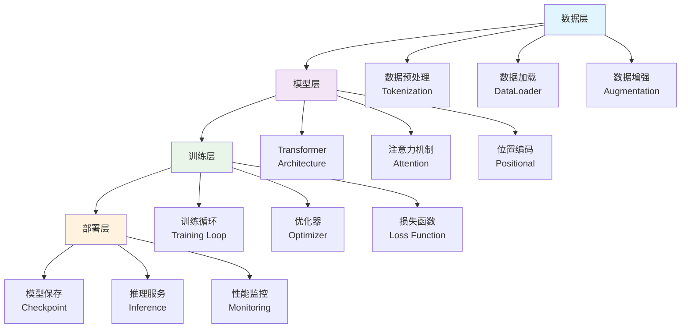
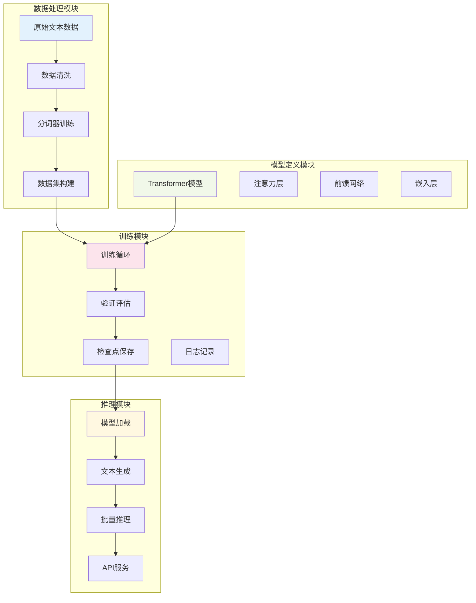

# 第10章 案例7 - 从零训练你的语言模型

> "理解模型的最好方式就是亲手构建它" - Andrej Karpathy

## 引言

在AI原生开发的世界里，理解语言模型的内部工作原理是至关重要的。虽然我们可以使用预训练的大型模型，但从零开始训练一个小型语言模型能让我们深入理解Transformer架构、训练过程和优化技巧。

本章将带你完成一个完整的语言模型训练项目，从数据准备到模型部署，涵盖现代深度学习的核心技术栈。我们将构建一个基于Transformer的小型语言模型，能够进行文本生成和简单的对话。

### 学习目标

- **深度理解Transformer架构**：从注意力机制到位置编码的完整实现
- **掌握模型训练全流程**：数据处理、训练循环、验证评估的工程实践
- **学习现代优化技术**：学习率调度、梯度裁剪、混合精度训练
- **实践模型部署**：模型保存、加载、推理服务的完整实现

### 技术栈概览



## 1. 项目概述（Overview）

### 1.1 项目目标与范围

#### 1.1.1 核心目标

**主要目标**：
- 构建一个完整的小型语言模型训练系统
- 实现标准的Transformer架构
- 完成从数据到部署的全流程
- 提供可扩展的训练框架

**技术指标**：
- 模型参数量：10M-50M（适合个人GPU训练）
- 训练数据：中英文混合文本数据
- 推理速度：单次生成 < 100ms
- 内存占用：训练时 < 8GB GPU内存

#### 1.1.2 项目架构设计

**系统架构图**：


### 1.2 技术选型说明

#### 1.2.1 核心技术栈

**深度学习框架**：
```python
# 主要依赖
PyTorch >= 2.0.0          # 深度学习框架
transformers >= 4.30.0    # Hugging Face工具库
tokenizers >= 0.13.0      # 高效分词器
datasets >= 2.12.0        # 数据集处理

# 训练优化
torch-audio >= 2.0.0      # 音频处理（可选）
accelerate >= 0.20.0      # 分布式训练
wandb >= 0.15.0           # 实验跟踪

# 数据处理
numpy >= 1.24.0
pandas >= 2.0.0
scikit-learn >= 1.2.0

# 服务部署
fastapi >= 0.100.0
uvicorn >= 0.22.0
pydantic >= 2.0.0
```

**项目结构**：
```
language_model_training/
├── src/
│   ├── data/
│   │   ├── __init__.py
│   │   ├── dataset.py          # 数据集类
│   │   ├── tokenizer.py        # 分词器
│   │   └── preprocessing.py    # 数据预处理
│   ├── model/
│   │   ├── __init__.py
│   │   ├── transformer.py      # Transformer模型
│   │   ├── attention.py        # 注意力机制
│   │   ├── layers.py          # 基础层
│   │   └── config.py          # 模型配置
│   ├── training/
│   │   ├── __init__.py
│   │   ├── trainer.py         # 训练器
│   │   ├── optimizer.py       # 优化器配置
│   │   ├── scheduler.py       # 学习率调度
│   │   └── metrics.py         # 评估指标
│   ├── inference/
│   │   ├── __init__.py
│   │   ├── generator.py       # 文本生成
│   │   ├── server.py          # API服务
│   │   └── utils.py           # 推理工具
│   └── utils/
│       ├── __init__.py
│       ├── logging.py         # 日志配置
│       ├── config.py          # 全局配置
│       └── helpers.py         # 辅助函数
├── data/
│   ├── raw/                   # 原始数据
│   ├── processed/             # 处理后数据
│   └── tokenizers/            # 分词器文件
├── models/
│   ├── checkpoints/           # 训练检查点
│   └── final/                 # 最终模型
├── configs/
│   ├── model_config.yaml      # 模型配置
│   ├── training_config.yaml   # 训练配置
│   └── data_config.yaml       # 数据配置
├── scripts/
│   ├── prepare_data.py        # 数据准备脚本
│   ├── train.py              # 训练脚本
│   ├── evaluate.py           # 评估脚本
│   └── serve.py              # 服务启动脚本
├── tests/
│   ├── test_model.py         # 模型测试
│   ├── test_training.py      # 训练测试
│   └── test_inference.py     # 推理测试
├── requirements.txt
├── setup.py
└── README.md
```

## 2. 规范设计（Specification）

### 2.1 模型架构规范

#### 2.1.1 Transformer架构定义

**核心配置参数**：
```python
from dataclasses import dataclass
from typing import Optional

@dataclass
class ModelConfig:
    """模型配置类"""
    
    # 基础参数
    vocab_size: int = 32000              # 词汇表大小
    max_seq_length: int = 1024           # 最大序列长度
    d_model: int = 512                   # 模型维度
    n_heads: int = 8                     # 注意力头数
    n_layers: int = 6                    # Transformer层数
    d_ff: int = 2048                     # 前馈网络维度
    
    # 正则化参数
    dropout: float = 0.1                 # Dropout概率
    attention_dropout: float = 0.1       # 注意力Dropout
    layer_norm_eps: float = 1e-5         # LayerNorm epsilon
    
    # 位置编码
    use_positional_encoding: bool = True # 是否使用位置编码
    max_position_embeddings: int = 1024  # 最大位置编码长度
    
    # 激活函数
    activation: str = "gelu"             # 激活函数类型
    
    # 初始化参数
    initializer_range: float = 0.02      # 权重初始化范围
    
    # 特殊标记
    pad_token_id: int = 0                # 填充标记ID
    bos_token_id: int = 1                # 开始标记ID
    eos_token_id: int = 2                # 结束标记ID
    unk_token_id: int = 3                # 未知标记ID
    
    def __post_init__(self):
        """配置验证"""
        assert self.d_model % self.n_heads == 0, "d_model必须能被n_heads整除"
        assert self.vocab_size > 0, "词汇表大小必须大于0"
        assert self.max_seq_length > 0, "最大序列长度必须大于0"
    
    @property
    def head_dim(self) -> int:
        """每个注意力头的维度"""
        return self.d_model // self.n_heads
    
    @property
    def total_params(self) -> int:
        """估算总参数量"""
        # 嵌入层参数
        embedding_params = self.vocab_size * self.d_model
        position_params = self.max_position_embeddings * self.d_model
        
        # Transformer层参数（每层）
        attention_params = 4 * self.d_model * self.d_model  # Q, K, V, O
        ffn_params = 2 * self.d_model * self.d_ff           # 两个线性层
        layer_norm_params = 4 * self.d_model                # 两个LayerNorm
        
        transformer_params = self.n_layers * (
            attention_params + ffn_params + layer_norm_params
        )
        
        # 输出层参数
        output_params = self.d_model * self.vocab_size
        
        return embedding_params + position_params + transformer_params + output_params
```

#### 2.1.2 注意力机制规范

**多头注意力实现规范**：
```python
import torch
import torch.nn as nn
import torch.nn.functional as F
import math
from typing import Optional, Tuple

class MultiHeadAttention(nn.Module):
    """多头注意力机制"""
    
    def __init__(self, config: ModelConfig):
        super().__init__()
        self.config = config
        self.n_heads = config.n_heads
        self.d_model = config.d_model
        self.head_dim = config.head_dim
        self.scale = 1.0 / math.sqrt(self.head_dim)
        
        # 线性变换层
        self.q_proj = nn.Linear(config.d_model, config.d_model, bias=False)
        self.k_proj = nn.Linear(config.d_model, config.d_model, bias=False)
        self.v_proj = nn.Linear(config.d_model, config.d_model, bias=False)
        self.o_proj = nn.Linear(config.d_model, config.d_model, bias=False)
        
        # Dropout
        self.attention_dropout = nn.Dropout(config.attention_dropout)
        self.output_dropout = nn.Dropout(config.dropout)
        
        # 初始化权重
        self._init_weights()
    
    def _init_weights(self):
        """初始化权重"""
        for module in [self.q_proj, self.k_proj, self.v_proj, self.o_proj]:
            nn.init.normal_(module.weight, std=self.config.initializer_range)
    
    def forward(
        self,
        hidden_states: torch.Tensor,
        attention_mask: Optional[torch.Tensor] = None,
        key_value_states: Optional[torch.Tensor] = None,
        use_cache: bool = False,
        past_key_value: Optional[Tuple[torch.Tensor, torch.Tensor]] = None
    ) -> Tuple[torch.Tensor, Optional[Tuple[torch.Tensor, torch.Tensor]]]:
        """
        前向传播
        
        Args:
            hidden_states: 输入张量 [batch_size, seq_len, d_model]
            attention_mask: 注意力掩码 [batch_size, seq_len, seq_len]
            key_value_states: 交叉注意力的键值状态（用于编码器-解码器）
            use_cache: 是否使用缓存（用于生成）
            past_key_value: 过去的键值对（用于生成）
        
        Returns:
            output: 输出张量 [batch_size, seq_len, d_model]
            present_key_value: 当前的键值对（如果use_cache=True）
        """
        batch_size, seq_len, _ = hidden_states.size()
        
        # 计算查询、键、值
        query = self.q_proj(hidden_states)
        
        if key_value_states is not None:
            # 交叉注意力
            key = self.k_proj(key_value_states)
            value = self.v_proj(key_value_states)
        else:
            # 自注意力
            key = self.k_proj(hidden_states)
            value = self.v_proj(hidden_states)
        
        # 处理缓存
        if past_key_value is not None:
            past_key, past_value = past_key_value
            key = torch.cat([past_key, key], dim=1)
            value = torch.cat([past_value, value], dim=1)
        
        # 重塑为多头格式
        query = self._reshape_to_heads(query, batch_size, seq_len)
        key = self._reshape_to_heads(key, batch_size, key.size(1))
        value = self._reshape_to_heads(value, batch_size, value.size(1))
        
        # 计算注意力
        attn_output, attn_weights = self._compute_attention(
            query, key, value, attention_mask
        )
        
        # 重塑回原始格式
        attn_output = self._reshape_from_heads(attn_output, batch_size, seq_len)
        
        # 输出投影
        output = self.o_proj(attn_output)
        output = self.output_dropout(output)
        
        # 准备返回值
        present_key_value = None
        if use_cache:
            present_key_value = (key, value)
        
        return output, present_key_value
    
    def _reshape_to_heads(self, tensor: torch.Tensor, batch_size: int, seq_len: int) -> torch.Tensor:
        """重塑张量为多头格式"""
        return tensor.view(batch_size, seq_len, self.n_heads, self.head_dim).transpose(1, 2)
    
    def _reshape_from_heads(self, tensor: torch.Tensor, batch_size: int, seq_len: int) -> torch.Tensor:
        """从多头格式重塑回原始格式"""
        return tensor.transpose(1, 2).contiguous().view(batch_size, seq_len, self.d_model)
    
    def _compute_attention(
        self,
        query: torch.Tensor,
        key: torch.Tensor,
        value: torch.Tensor,
        attention_mask: Optional[torch.Tensor] = None
    ) -> Tuple[torch.Tensor, torch.Tensor]:
        """计算注意力权重和输出"""
        # 计算注意力分数
        attn_scores = torch.matmul(query, key.transpose(-2, -1)) * self.scale
        
        # 应用注意力掩码
        if attention_mask is not None:
            attn_scores = attn_scores + attention_mask
        
        # Softmax归一化
        attn_weights = F.softmax(attn_scores, dim=-1)
        attn_weights = self.attention_dropout(attn_weights)
        
        # 计算输出
        attn_output = torch.matmul(attn_weights, value)
        
        return attn_output, attn_weights
```

### 2.2 数据处理规范

#### 2.2.1 分词器规范

**自定义分词器实现**：
```python
from tokenizers import Tokenizer, models, trainers, pre_tokenizers, decoders, processors
from tokenizers.normalizers import NFD, Lowercase, StripAccents
from typing import List, Dict, Optional
import json
import os

class CustomTokenizer:
    """自定义分词器"""
    
    def __init__(self, vocab_size: int = 32000):
        self.vocab_size = vocab_size
        self.tokenizer = None
        self._special_tokens = {
            "<pad>": 0,
            "<bos>": 1,
            "<eos>": 2,
            "<unk>": 3,
            "<mask>": 4,
        }
    
    def train(self, texts: List[str], save_path: str) -> None:
        """训练分词器"""
        # 初始化BPE模型
        self.tokenizer = Tokenizer(models.BPE(unk_token="<unk>"))
        
        # 设置预处理器
        self.tokenizer.normalizer = NFD()
        self.tokenizer.pre_tokenizer = pre_tokenizers.ByteLevel(add_prefix_space=False)
        
        # 设置训练器
        trainer = trainers.BpeTrainer(
            vocab_size=self.vocab_size,
            special_tokens=list(self._special_tokens.keys()),
            min_frequency=2,
            continuing_subword_prefix="",
            end_of_word_suffix=""
        )
        
        # 训练分词器
        self.tokenizer.train_from_iterator(texts, trainer)
        
        # 设置后处理器
        self.tokenizer.post_processor = processors.ByteLevel(trim_offsets=False)
        self.tokenizer.decoder = decoders.ByteLevel()
        
        # 保存分词器
        os.makedirs(os.path.dirname(save_path), exist_ok=True)
        self.tokenizer.save(save_path)
        
        # 保存特殊标记映射
        with open(save_path.replace(".json", "_special_tokens.json"), "w") as f:
            json.dump(self._special_tokens, f, indent=2)
    
    def load(self, tokenizer_path: str) -> None:
        """加载分词器"""
        self.tokenizer = Tokenizer.from_file(tokenizer_path)
        
        # 加载特殊标记映射
        special_tokens_path = tokenizer_path.replace(".json", "_special_tokens.json")
        if os.path.exists(special_tokens_path):
            with open(special_tokens_path, "r") as f:
                self._special_tokens = json.load(f)
    
    def encode(self, text: str, add_special_tokens: bool = True) -> List[int]:
        """编码文本"""
        if self.tokenizer is None:
            raise ValueError("分词器未初始化，请先训练或加载分词器")
        
        encoding = self.tokenizer.encode(text)
        token_ids = encoding.ids
        
        if add_special_tokens:
            token_ids = [self._special_tokens["<bos>"]] + token_ids + [self._special_tokens["<eos>"]]
        
        return token_ids
    
    def decode(self, token_ids: List[int], skip_special_tokens: bool = True) -> str:
        """解码标记序列"""
        if self.tokenizer is None:
            raise ValueError("分词器未初始化，请先训练或加载分词器")
        
        if skip_special_tokens:
            # 过滤特殊标记
            special_token_ids = set(self._special_tokens.values())
            token_ids = [tid for tid in token_ids if tid not in special_token_ids]
        
        return self.tokenizer.decode(token_ids)
    
    def batch_encode(self, texts: List[str], add_special_tokens: bool = True) -> List[List[int]]:
        """批量编码"""
        return [self.encode(text, add_special_tokens) for text in texts]
    
    def batch_decode(self, batch_token_ids: List[List[int]], skip_special_tokens: bool = True) -> List[str]:
        """批量解码"""
        return [self.decode(token_ids, skip_special_tokens) for token_ids in batch_token_ids]
    
    @property
    def vocab_size(self) -> int:
        """获取词汇表大小"""
        if self.tokenizer is None:
            return self._vocab_size
        return self.tokenizer.get_vocab_size()
    
    @vocab_size.setter
    def vocab_size(self, value: int):
        """设置词汇表大小"""
        self._vocab_size = value
    
    def get_special_token_id(self, token: str) -> int:
        """获取特殊标记ID"""
        return self._special_tokens.get(token, self._special_tokens["<unk>"])
    
    def get_vocab(self) -> Dict[str, int]:
        """获取词汇表"""
        if self.tokenizer is None:
            return {}
        return self.tokenizer.get_vocab()
```

#### 2.2.2 数据集规范

**训练数据集实现**：
```python
import torch
from torch.utils.data import Dataset, DataLoader
from typing import List, Dict, Optional, Tuple
import random
import numpy as np

class LanguageModelDataset(Dataset):
    """语言模型数据集"""
    
    def __init__(
        self,
        texts: List[str],
        tokenizer: CustomTokenizer,
        max_length: int = 1024,
        stride: int = 512,
        add_special_tokens: bool = True
    ):
        self.texts = texts
        self.tokenizer = tokenizer
        self.max_length = max_length
        self.stride = stride
        self.add_special_tokens = add_special_tokens
        
        # 预处理所有文本
        self.examples = self._prepare_examples()
    
    def _prepare_examples(self) -> List[List[int]]:
        """准备训练样本"""
        examples = []
        
        for text in self.texts:
            # 编码文本
            token_ids = self.tokenizer.encode(text, self.add_special_tokens)
            
            # 如果文本太短，直接添加
            if len(token_ids) <= self.max_length:
                examples.append(token_ids)
            else:
                # 滑动窗口切分长文本
                for i in range(0, len(token_ids) - self.max_length + 1, self.stride):
                    chunk = token_ids[i:i + self.max_length]
                    examples.append(chunk)
        
        return examples
    
    def __len__(self) -> int:
        return len(self.examples)
    
    def __getitem__(self, idx: int) -> Dict[str, torch.Tensor]:
        token_ids = self.examples[idx]
        
        # 填充到最大长度
        if len(token_ids) < self.max_length:
            pad_token_id = self.tokenizer.get_special_token_id("<pad>")
            token_ids = token_ids + [pad_token_id] * (self.max_length - len(token_ids))
        
        # 转换为张量
        input_ids = torch.tensor(token_ids[:-1], dtype=torch.long)  # 输入序列
        labels = torch.tensor(token_ids[1:], dtype=torch.long)      # 目标序列（右移一位）
        
        # 创建注意力掩码
        attention_mask = (input_ids != self.tokenizer.get_special_token_id("<pad>")).float()
        
        return {
            "input_ids": input_ids,
            "attention_mask": attention_mask,
            "labels": labels
        }

def create_data_loader(
    dataset: LanguageModelDataset,
    batch_size: int = 8,
    shuffle: bool = True,
    num_workers: int = 4,
    pin_memory: bool = True
) -> DataLoader:
    """创建数据加载器"""
    return DataLoader(
        dataset,
        batch_size=batch_size,
        shuffle=shuffle,
        num_workers=num_workers,
        pin_memory=pin_memory,
        collate_fn=collate_fn
    )

def collate_fn(batch: List[Dict[str, torch.Tensor]]) -> Dict[str, torch.Tensor]:
    """批处理函数"""
    # 获取批次中的最大长度
    max_len = max(item["input_ids"].size(0) for item in batch)
    
    # 初始化批次张量
    batch_size = len(batch)
    input_ids = torch.zeros(batch_size, max_len, dtype=torch.long)
    attention_mask = torch.zeros(batch_size, max_len, dtype=torch.float)
    labels = torch.zeros(batch_size, max_len, dtype=torch.long)
    
    # 填充批次数据
    for i, item in enumerate(batch):
        seq_len = item["input_ids"].size(0)
        input_ids[i, :seq_len] = item["input_ids"]
        attention_mask[i, :seq_len] = item["attention_mask"]
        labels[i, :seq_len] = item["labels"]
    
    return {
        "input_ids": input_ids,
        "attention_mask": attention_mask,
        "labels": labels
    }
```

### 2.3 训练流程规范

#### 2.3.1 训练配置规范

**训练超参数配置**：
```python
from dataclasses import dataclass
from typing import Optional, Dict, Any

@dataclass
class TrainingConfig:
    """训练配置类"""
    
    # 基础训练参数
    num_epochs: int = 10                    # 训练轮数
    batch_size: int = 8                     # 批次大小
    learning_rate: float = 5e-4             # 学习率
    weight_decay: float = 0.01              # 权重衰减
    warmup_steps: int = 1000                # 预热步数
    max_grad_norm: float = 1.0              # 梯度裁剪阈值
    
    # 优化器参数
    optimizer_type: str = "adamw"           # 优化器类型
    adam_beta1: float = 0.9                 # Adam beta1
    adam_beta2: float = 0.999               # Adam beta2
    adam_epsilon: float = 1e-8              # Adam epsilon
    
    # 学习率调度
    scheduler_type: str = "cosine"          # 调度器类型
    min_lr_ratio: float = 0.1               # 最小学习率比例
    
    # 验证和保存
    eval_steps: int = 500                   # 验证步数间隔
    save_steps: int = 1000                  # 保存步数间隔
    logging_steps: int = 100                # 日志步数间隔
    max_checkpoints: int = 3                # 最大检查点数量
    
    # 早停
    early_stopping_patience: int = 5       # 早停耐心值
    early_stopping_threshold: float = 1e-4 # 早停阈值
    
    # 混合精度训练
    use_fp16: bool = True                   # 是否使用FP16
    fp16_opt_level: str = "O1"              # FP16优化级别
    
    # 分布式训练
    use_ddp: bool = False                   # 是否使用分布式训练
    local_rank: int = -1                    # 本地rank
    
    # 数据加载
    num_workers: int = 4                    # 数据加载工作进程数
    pin_memory: bool = True                 # 是否固定内存
    
    # 实验跟踪
    use_wandb: bool = True                  # 是否使用wandb
    wandb_project: str = "language-model"   # wandb项目名
    experiment_name: Optional[str] = None   # 实验名称
    
    # 路径配置
    output_dir: str = "./models/checkpoints" # 输出目录
    logging_dir: str = "./logs"             # 日志目录
    cache_dir: str = "./cache"              # 缓存目录
    
    def __post_init__(self):
        """配置后处理"""
        if self.experiment_name is None:
            import datetime
            self.experiment_name = f"lm_training_{datetime.datetime.now().strftime('%Y%m%d_%H%M%S')}"
    
    def to_dict(self) -> Dict[str, Any]:
        """转换为字典"""
        return {
            field.name: getattr(self, field.name)
            for field in self.__dataclass_fields__.values()
        }
    
    @classmethod
    def from_dict(cls, config_dict: Dict[str, Any]) -> "TrainingConfig":
        """从字典创建配置"""
        return cls(**config_dict)
```

## 3. 实现过程（Implementation）

### 3.1 核心模型实现

#### 3.1.1 Transformer模型主体

**完整的Transformer实现**：
```python
import torch
import torch.nn as nn
import torch.nn.functional as F
from typing import Optional, Tuple, Dict, Any
import math

class PositionalEncoding(nn.Module):
    """位置编码"""
    
    def __init__(self, d_model: int, max_len: int = 5000):
        super().__init__()
        
        pe = torch.zeros(max_len, d_model)
        position = torch.arange(0, max_len, dtype=torch.float).unsqueeze(1)
        
        div_term = torch.exp(
            torch.arange(0, d_model, 2).float() * 
            (-math.log(10000.0) / d_model)
        )
        
        pe[:, 0::2] = torch.sin(position * div_term)
        pe[:, 1::2] = torch.cos(position * div_term)
        pe = pe.unsqueeze(0).transpose(0, 1)
        
        self.register_buffer('pe', pe)
    
    def forward(self, x: torch.Tensor) -> torch.Tensor:
        return x + self.pe[:x.size(0), :]

class TransformerBlock(nn.Module):
    """Transformer块"""
    
    def __init__(self, config: ModelConfig):
        super().__init__()
        self.config = config
        
        # 多头注意力
        self.attention = MultiHeadAttention(config)
        
        # 前馈网络
        self.feed_forward = nn.Sequential(
            nn.Linear(config.d_model, config.d_ff),
            self._get_activation(config.activation),
            nn.Dropout(config.dropout),
            nn.Linear(config.d_ff, config.d_model),
            nn.Dropout(config.dropout)
        )
        
        # Layer Normalization
        self.ln1 = nn.LayerNorm(config.d_model, eps=config.layer_norm_eps)
        self.ln2 = nn.LayerNorm(config.d_model, eps=config.layer_norm_eps)
    
    def _get_activation(self, activation: str) -> nn.Module:
        """获取激活函数"""
        if activation == "relu":
            return nn.ReLU()
        elif activation == "gelu":
            return nn.GELU()
        elif activation == "swish":
            return nn.SiLU()
        else:
            raise ValueError(f"不支持的激活函数: {activation}")
    
    def forward(
        self,
        hidden_states: torch.Tensor,
        attention_mask: Optional[torch.Tensor] = None,
        use_cache: bool = False,
        past_key_value: Optional[Tuple[torch.Tensor, torch.Tensor]] = None
    ) -> Tuple[torch.Tensor, Optional[Tuple[torch.Tensor, torch.Tensor]]]:
        """
        前向传播
        
        Args:
            hidden_states: 输入张量
            attention_mask: 注意力掩码
            use_cache: 是否使用缓存
            past_key_value: 过去的键值对
        
        Returns:
            output: 输出张量
            present_key_value: 当前的键值对
        """
        # 自注意力 + 残差连接
        residual = hidden_states
        hidden_states = self.ln1(hidden_states)
        
        attn_output, present_key_value = self.attention(
            hidden_states=hidden_states,
            attention_mask=attention_mask,
            use_cache=use_cache,
            past_key_value=past_key_value
        )
        
        hidden_states = residual + attn_output
        
        # 前馈网络 + 残差连接
        residual = hidden_states
        hidden_states = self.ln2(hidden_states)
        hidden_states = self.feed_forward(hidden_states)
        hidden_states = residual + hidden_states
        
        return hidden_states, present_key_value

class LanguageModel(nn.Module):
    """语言模型主体"""
    
    def __init__(self, config: ModelConfig):
        super().__init__()
        self.config = config
        
        # 词嵌入
        self.token_embedding = nn.Embedding(config.vocab_size, config.d_model)
        
        # 位置编码
        if config.use_positional_encoding:
            self.position_embedding = PositionalEncoding(
                config.d_model, config.max_position_embeddings
            )
        else:
            self.position_embedding = nn.Embedding(
                config.max_position_embeddings, config.d_model
            )
        
        # Transformer层
        self.layers = nn.ModuleList([
            TransformerBlock(config) for _ in range(config.n_layers)
        ])
        
        # 最终层归一化
        self.ln_f = nn.LayerNorm(config.d_model, eps=config.layer_norm_eps)
        
        # 输出投影
        self.lm_head = nn.Linear(config.d_model, config.vocab_size, bias=False)
        
        # 权重共享（可选）
        if hasattr(config, 'tie_word_embeddings') and config.tie_word_embeddings:
            self.lm_head.weight = self.token_embedding.weight
        
        # 初始化权重
        self.apply(self._init_weights)
    
    def _init_weights(self, module: nn.Module):
        """初始化权重"""
        if isinstance(module, nn.Linear):
            nn.init.normal_(module.weight, std=self.config.initializer_range)
            if module.bias is not None:
                nn.init.zeros_(module.bias)
        elif isinstance(module, nn.Embedding):
            nn.init.normal_(module.weight, std=self.config.initializer_range)
        elif isinstance(module, nn.LayerNorm):
            nn.init.ones_(module.weight)
            nn.init.zeros_(module.bias)
    
    def forward(
        self,
        input_ids: torch.Tensor,
        attention_mask: Optional[torch.Tensor] = None,
        position_ids: Optional[torch.Tensor] = None,
        use_cache: bool = False,
        past_key_values: Optional[Tuple[Tuple[torch.Tensor, torch.Tensor], ...]] = None,
        labels: Optional[torch.Tensor] = None
    ) -> Dict[str, torch.Tensor]:
        """
        前向传播
        
        Args:
            input_ids: 输入标记ID [batch_size, seq_len]
            attention_mask: 注意力掩码 [batch_size, seq_len]
            position_ids: 位置ID [batch_size, seq_len]
            use_cache: 是否使用缓存
            past_key_values: 过去的键值对
            labels: 标签（用于计算损失）
        
        Returns:
            包含logits、loss等的字典
        """
        batch_size, seq_len = input_ids.size()
        device = input_ids.device
        
        # 处理位置ID
        if position_ids is None:
            past_length = 0
            if past_key_values is not None:
                past_length = past_key_values[0][0].size(-2)
            position_ids = torch.arange(
                past_length, seq_len + past_length, dtype=torch.long, device=device
            ).unsqueeze(0).expand(batch_size, -1)
        
        # 词嵌入
        hidden_states = self.token_embedding(input_ids)
        
        # 位置编码
        if self.config.use_positional_encoding:
            hidden_states = self.position_embedding(hidden_states)
        else:
            position_embeddings = self.position_embedding(position_ids)
            hidden_states = hidden_states + position_embeddings
        
        # 准备注意力掩码
        if attention_mask is not None:
            # 扩展注意力掩码维度
            attention_mask = self._prepare_attention_mask(attention_mask, seq_len, device)
        
        # 通过Transformer层
        present_key_values = ()
        for i, layer in enumerate(self.layers):
            past_key_value = past_key_values[i] if past_key_values is not None else None
            
            hidden_states, present_key_value = layer(
                hidden_states=hidden_states,
                attention_mask=attention_mask,
                use_cache=use_cache,
                past_key_value=past_key_value
            )
            
            if use_cache:
                present_key_values = present_key_values + (present_key_value,)
        
        # 最终层归一化
        hidden_states = self.ln_f(hidden_states)
        
        # 计算logits
        logits = self.lm_head(hidden_states)
        
        # 准备输出
        outputs = {"logits": logits}
        
        if use_cache:
            outputs["past_key_values"] = present_key_values
        
        # 计算损失
        if labels is not None:
            # 移位标签用于语言建模
            shift_logits = logits[..., :-1, :].contiguous()
            shift_labels = labels[..., 1:].contiguous()
            
            # 计算交叉熵损失
            loss_fct = nn.CrossEntropyLoss(ignore_index=self.config.pad_token_id)
            loss = loss_fct(
                shift_logits.view(-1, shift_logits.size(-1)),
                shift_labels.view(-1)
            )
            outputs["loss"] = loss
        
        return outputs
    
    def _prepare_attention_mask(
        self, attention_mask: torch.Tensor, seq_len: int, device: torch.device
    ) -> torch.Tensor:
        """准备注意力掩码"""
        # 创建因果掩码（下三角矩阵）
        causal_mask = torch.tril(
            torch.ones(seq_len, seq_len, device=device, dtype=torch.bool)
        )
        
        # 扩展attention_mask维度
        attention_mask = attention_mask.unsqueeze(1).unsqueeze(2)
        attention_mask = attention_mask.expand(-1, -1, seq_len, -1)
        
        # 结合因果掩码和填充掩码
        attention_mask = attention_mask & causal_mask
        
        # 转换为加法掩码（0表示保留，-inf表示掩盖）
        attention_mask = attention_mask.to(dtype=torch.float32)
        attention_mask = (1.0 - attention_mask) * -10000.0
        
        return attention_mask
    
    def generate(
        self,
        input_ids: torch.Tensor,
        max_length: int = 100,
        temperature: float = 1.0,
        top_k: int = 50,
        top_p: float = 0.9,
        do_sample: bool = True,
        pad_token_id: Optional[int] = None,
        eos_token_id: Optional[int] = None
    ) -> torch.Tensor:
        """
        文本生成
        
        Args:
            input_ids: 输入标记ID
            max_length: 最大生成长度
            temperature: 温度参数
            top_k: Top-K采样
            top_p: Top-P采样
            do_sample: 是否采样
            pad_token_id: 填充标记ID
            eos_token_id: 结束标记ID
        
        Returns:
            生成的标记序列
        """
        self.eval()
        
        if pad_token_id is None:
            pad_token_id = self.config.pad_token_id
        if eos_token_id is None:
            eos_token_id = self.config.eos_token_id
        
        batch_size = input_ids.size(0)
        device = input_ids.device
        
        # 初始化生成序列
        generated = input_ids.clone()
        past_key_values = None
        
        with torch.no_grad():
            for _ in range(max_length):
                # 前向传播
                outputs = self(
                    input_ids=generated[:, -1:] if past_key_values is not None else generated,
                    use_cache=True,
                    past_key_values=past_key_values
                )
                
                logits = outputs["logits"][:, -1, :]  # 获取最后一个位置的logits
                past_key_values = outputs["past_key_values"]
                
                # 应用温度
                if temperature != 1.0:
                    logits = logits / temperature
                
                # 采样策略
                if do_sample:
                    # Top-K采样
                    if top_k > 0:
                        top_k_logits, top_k_indices = torch.topk(logits, top_k)
                        logits = torch.full_like(logits, -float('inf'))
                        logits.scatter_(1, top_k_indices, top_k_logits)
                    
                    # Top-P采样
                    if top_p < 1.0:
                        sorted_logits, sorted_indices = torch.sort(logits, descending=True)
                        cumulative_probs = torch.cumsum(F.softmax(sorted_logits, dim=-1), dim=-1)
                        
                        # 移除累积概率超过top_p的标记
                        sorted_indices_to_remove = cumulative_probs > top_p
                        sorted_indices_to_remove[..., 1:] = sorted_indices_to_remove[..., :-1].clone()
                        sorted_indices_to_remove[..., 0] = 0
                        
                        indices_to_remove = sorted_indices_to_remove.scatter(
                            1, sorted_indices, sorted_indices_to_remove
                        )
                        logits[indices_to_remove] = -float('inf')
                    
                    # 采样
                    probs = F.softmax(logits, dim=-1)
                    next_token = torch.multinomial(probs, num_samples=1)
                else:
                    # 贪心解码
                    next_token = torch.argmax(logits, dim=-1, keepdim=True)
                
                # 添加到生成序列
                generated = torch.cat([generated, next_token], dim=-1)
                
                # 检查是否生成结束标记
                if eos_token_id is not None and (next_token == eos_token_id).all():
                    break
        
        return generated
    
    def get_num_params(self) -> int:
        """获取模型参数数量"""
        return sum(p.numel() for p in self.parameters())
    
    def get_num_trainable_params(self) -> int:
        """获取可训练参数数量"""
        return sum(p.numel() for p in self.parameters() if p.requires_grad)
```

### 3.2 训练系统实现

#### 3.2.1 训练器核心实现

**完整的训练器实现**：
```python
import torch
import torch.nn as nn
from torch.utils.data import DataLoader
from torch.optim import AdamW
from torch.optim.lr_scheduler import CosineAnnealingLR, LinearLR, SequentialLR
from typing import Dict, List, Optional, Tuple, Any
import os
import json
import time
import logging
from tqdm import tqdm
import wandb
from pathlib import Path

class LanguageModelTrainer:
    """语言模型训练器"""
    
    def __init__(
        self,
        model: LanguageModel,
        train_dataloader: DataLoader,
        val_dataloader: Optional[DataLoader],
        config: TrainingConfig,
        tokenizer: CustomTokenizer
    ):
        self.model = model
        self.train_dataloader = train_dataloader
        self.val_dataloader = val_dataloader
        self.config = config
        self.tokenizer = tokenizer
        
        # 设备配置
        self.device = torch.device("cuda" if torch.cuda.is_available() else "cpu")
        self.model.to(self.device)
        
        # 优化器和调度器
        self.optimizer = self._create_optimizer()
        self.scheduler = self._create_scheduler()
        
        # 混合精度训练
        self.scaler = torch.cuda.amp.GradScaler() if config.use_fp16 else None
        
        # 训练状态
        self.global_step = 0
        self.epoch = 0
        self.best_val_loss = float('inf')
        self.early_stopping_counter = 0
        
        # 日志和监控
        self.logger = self._setup_logging()
        self.metrics_history = []
        
        # 实验跟踪
        if config.use_wandb:
            self._init_wandb()
        
        # 创建输出目录
        os.makedirs(config.output_dir, exist_ok=True)
        os.makedirs(config.logging_dir, exist_ok=True)
    
    def _create_optimizer(self) -> torch.optim.Optimizer:
        """创建优化器"""
        # 参数分组（不同的权重衰减策略）
        no_decay = ["bias", "LayerNorm.weight"]
        optimizer_grouped_parameters = [
            {
                "params": [
                    p for n, p in self.model.named_parameters()
                    if not any(nd in n for nd in no_decay)
                ],
                "weight_decay": self.config.weight_decay,
            },
            {
                "params": [
                    p for n, p in self.model.named_parameters()
                    if any(nd in n for nd in no_decay)
                ],
                "weight_decay": 0.0,
            },
        ]
        
        if self.config.optimizer_type.lower() == "adamw":
            return AdamW(
                optimizer_grouped_parameters,
                lr=self.config.learning_rate,
                betas=(self.config.adam_beta1, self.config.adam_beta2),
                eps=self.config.adam_epsilon
            )
        else:
            raise ValueError(f"不支持的优化器类型: {self.config.optimizer_type}")
    
    def _create_scheduler(self) -> torch.optim.lr_scheduler._LRScheduler:
        """创建学习率调度器"""
        total_steps = len(self.train_dataloader) * self.config.num_epochs
        
        if self.config.scheduler_type.lower() == "cosine":
            # 预热 + 余弦退火
            warmup_scheduler = LinearLR(
                self.optimizer,
                start_factor=0.1,
                total_iters=self.config.warmup_steps
            )
            
            cosine_scheduler = CosineAnnealingLR(
                self.optimizer,
                T_max=total_steps - self.config.warmup_steps,
                eta_min=self.config.learning_rate * self.config.min_lr_ratio
            )
            
            return SequentialLR(
                self.optimizer,
                schedulers=[warmup_scheduler, cosine_scheduler],
                milestones=[self.config.warmup_steps]
            )
        else:
            raise ValueError(f"不支持的调度器类型: {self.config.scheduler_type}")
    
    def _setup_logging(self) -> logging.Logger:
        """设置日志"""
        logger = logging.getLogger("LanguageModelTrainer")
        logger.setLevel(logging.INFO)
        
        # 文件处理器
        log_file = os.path.join(self.config.logging_dir, "training.log")
        file_handler = logging.FileHandler(log_file)
        file_handler.setLevel(logging.INFO)
        
        # 控制台处理器
        console_handler = logging.StreamHandler()
        console_handler.setLevel(logging.INFO)
        
        # 格式化器
        formatter = logging.Formatter(
            '%(asctime)s - %(name)s - %(levelname)s - %(message)s'
        )
        file_handler.setFormatter(formatter)
        console_handler.setFormatter(formatter)
        
        logger.addHandler(file_handler)
        logger.addHandler(console_handler)
        
        return logger
    
    def _init_wandb(self):
        """初始化wandb"""
        wandb.init(
            project=self.config.wandb_project,
            name=self.config.experiment_name,
            config=self.config.to_dict()
        )
        wandb.watch(self.model, log="all", log_freq=self.config.logging_steps)
    
    def train(self) -> Dict[str, Any]:
        """开始训练"""
        self.logger.info("开始训练...")
        self.logger.info(f"模型参数数量: {self.model.get_num_params():,}")
        self.logger.info(f"训练配置: {self.config}")
        
        start_time = time.time()
        
        for epoch in range(self.config.num_epochs):
            self.epoch = epoch
            
            # 训练一个epoch
            train_metrics = self._train_epoch()
            
            # 验证
            val_metrics = {}
            if self.val_dataloader is not None:
                val_metrics = self._validate()
            
            # 合并指标
            epoch_metrics = {**train_metrics, **val_metrics}
            epoch_metrics["epoch"] = epoch
            epoch_metrics["learning_rate"] = self.optimizer.param_groups[0]["lr"]
            
            # 记录指标
            self.metrics_history.append(epoch_metrics)
            self._log_metrics(epoch_metrics)
            
            # 保存检查点
            if (epoch + 1) % (self.config.save_steps // len(self.train_dataloader)) == 0:
                self._save_checkpoint(epoch_metrics)
            
            # 早停检查
            if self._should_early_stop(val_metrics.get("val_loss")):
                self.logger.info(f"早停触发，在第 {epoch + 1} 轮停止训练")
                break
        
        # 训练完成
        total_time = time.time() - start_time
        self.logger.info(f"训练完成，总耗时: {total_time:.2f}秒")
        
        # 保存最终模型
        final_metrics = self._save_final_model()
        
        # 清理wandb
        if self.config.use_wandb:
            wandb.finish()
        
        return {
            "final_metrics": final_metrics,
            "total_time": total_time,
            "total_steps": self.global_step,
            "best_val_loss": self.best_val_loss
        }
    
    def _train_epoch(self) -> Dict[str, float]:
        """训练一个epoch"""
        self.model.train()
        total_loss = 0.0
        num_batches = 0
        
        progress_bar = tqdm(
            self.train_dataloader,
            desc=f"Epoch {self.epoch + 1}/{self.config.num_epochs}",
            leave=False
        )
        
        for batch in progress_bar:
            # 移动数据到设备
            batch = {k: v.to(self.device) for k, v in batch.items()}
            
            # 前向传播
            if self.config.use_fp16:
                with torch.cuda.amp.autocast():
                    outputs = self.model(**batch)
                    loss = outputs["loss"]
            else:
                outputs = self.model(**batch)
                loss = outputs["loss"]
            
            # 反向传播
            if self.config.use_fp16:
                self.scaler.scale(loss).backward()
                
                # 梯度裁剪
                if self.config.max_grad_norm > 0:
                    self.scaler.unscale_(self.optimizer)
                    torch.nn.utils.clip_grad_norm_(
                        self.model.parameters(), self.config.max_grad_norm
                    )
                
                self.scaler.step(self.optimizer)
                self.scaler.update()
            else:
                loss.backward()
                
                # 梯度裁剪
                if self.config.max_grad_norm > 0:
                    torch.nn.utils.clip_grad_norm_(
                        self.model.parameters(), self.config.max_grad_norm
                    )
                
                self.optimizer.step()
            
            # 清零梯度
            self.optimizer.zero_grad()
            
            # 更新学习率
            self.scheduler.step()
            
            # 更新统计
            total_loss += loss.item()
            num_batches += 1
            self.global_step += 1
            
            # 更新进度条
            progress_bar.set_postfix({
                "loss": f"{loss.item():.4f}",
                "lr": f"{self.optimizer.param_groups[0]['lr']:.2e}"
            })
            
            # 记录步骤级指标
            if self.global_step % self.config.logging_steps == 0:
                step_metrics = {
                    "train_loss": loss.item(),
                    "learning_rate": self.optimizer.param_groups[0]["lr"],
                    "global_step": self.global_step
                }
                
                if self.config.use_wandb:
                    wandb.log(step_metrics, step=self.global_step)
            
            # 验证和保存
            if self.global_step % self.config.eval_steps == 0 and self.val_dataloader is not None:
                val_metrics = self._validate()
                self._log_metrics(val_metrics)
                
                # 保存最佳模型
                if val_metrics["val_loss"] < self.best_val_loss:
                    self.best_val_loss = val_metrics["val_loss"]
                    self._save_checkpoint(val_metrics, is_best=True)
        
        return {"train_loss": total_loss / num_batches}
    
    def _validate(self) -> Dict[str, float]:
        """验证模型"""
        self.model.eval()
        total_loss = 0.0
        num_batches = 0
        
        with torch.no_grad():
            for batch in tqdm(self.val_dataloader, desc="Validating", leave=False):
                # 移动数据到设备
                batch = {k: v.to(self.device) for k, v in batch.items()}
                
                # 前向传播
                if self.config.use_fp16:
                    with torch.cuda.amp.autocast():
                        outputs = self.model(**batch)
                        loss = outputs["loss"]
                else:
                    outputs = self.model(**batch)
                    loss = outputs["loss"]
                
                total_loss += loss.item()
                num_batches += 1
        
        avg_loss = total_loss / num_batches
        perplexity = torch.exp(torch.tensor(avg_loss)).item()
        
        return {
            "val_loss": avg_loss,
            "val_perplexity": perplexity
        }
    
    def _log_metrics(self, metrics: Dict[str, Any]):
        """记录指标"""
        # 控制台日志
        log_str = " | ".join([f"{k}: {v:.4f}" if isinstance(v, float) else f"{k}: {v}" for k, v in metrics.items()])
        self.logger.info(log_str)
        
        # wandb日志
        if self.config.use_wandb:
            wandb.log(metrics, step=self.global_step)
    
    def _save_checkpoint(self, metrics: Dict[str, Any], is_best: bool = False):
        """保存检查点"""
        checkpoint = {
            "model_state_dict": self.model.state_dict(),
            "optimizer_state_dict": self.optimizer.state_dict(),
            "scheduler_state_dict": self.scheduler.state_dict(),
            "global_step": self.global_step,
            "epoch": self.epoch,
            "metrics": metrics,
            "config": self.config.to_dict(),
            "model_config": self.model.config.__dict__
        }
        
        if self.scaler is not None:
            checkpoint["scaler_state_dict"] = self.scaler.state_dict()
        
        # 保存检查点
        if is_best:
            checkpoint_path = os.path.join(self.config.output_dir, "best_model.pt")
        else:
            checkpoint_path = os.path.join(
                self.config.output_dir, f"checkpoint_step_{self.global_step}.pt"
            )
        
        torch.save(checkpoint, checkpoint_path)
        self.logger.info(f"检查点已保存: {checkpoint_path}")
        
        # 清理旧检查点
        self._cleanup_checkpoints()
    
    def _cleanup_checkpoints(self):
        """清理旧检查点"""
        checkpoint_files = []
        for file in os.listdir(self.config.output_dir):
            if file.startswith("checkpoint_step_") and file.endswith(".pt"):
                step = int(file.split("_")[2].split(".")[0])
                checkpoint_files.append((step, file))
        
        # 按步数排序
        checkpoint_files.sort(key=lambda x: x[0])
        
        # 删除多余的检查点
        while len(checkpoint_files) > self.config.max_checkpoints:
            _, file_to_remove = checkpoint_files.pop(0)
            file_path = os.path.join(self.config.output_dir, file_to_remove)
            os.remove(file_path)
            self.logger.info(f"删除旧检查点: {file_path}")
    
    def _should_early_stop(self, val_loss: Optional[float]) -> bool:
        """检查是否应该早停"""
        if val_loss is None:
            return False
        
        if val_loss < self.best_val_loss - self.config.early_stopping_threshold:
            self.early_stopping_counter = 0
            return False
        else:
            self.early_stopping_counter += 1
            return self.early_stopping_counter >= self.config.early_stopping_patience
    
    def _save_final_model(self) -> Dict[str, Any]:
        """保存最终模型"""
        final_model_dir = os.path.join(self.config.output_dir, "final_model")
        os.makedirs(final_model_dir, exist_ok=True)
        
        # 保存模型权重
        model_path = os.path.join(final_model_dir, "pytorch_model.bin")
        torch.save(self.model.state_dict(), model_path)
        
        # 保存模型配置
        config_path = os.path.join(final_model_dir, "config.json")
        with open(config_path, "w") as f:
            json.dump(self.model.config.__dict__, f, indent=2)
        
        # 保存训练配置
        training_config_path = os.path.join(final_model_dir, "training_config.json")
        with open(training_config_path, "w") as f:
            json.dump(self.config.to_dict(), f, indent=2)
        
        # 保存分词器
        tokenizer_path = os.path.join(final_model_dir, "tokenizer.json")
        self.tokenizer.tokenizer.save(tokenizer_path)
        
        # 保存训练历史
        history_path = os.path.join(final_model_dir, "training_history.json")
        with open(history_path, "w") as f:
            json.dump(self.metrics_history, f, indent=2)
        
        self.logger.info(f"最终模型已保存到: {final_model_dir}")
        
        return {
            "model_path": model_path,
            "config_path": config_path,
            "tokenizer_path": tokenizer_path,
            "final_val_loss": self.best_val_loss
        }
    
    def load_checkpoint(self, checkpoint_path: str):
        """加载检查点"""
        checkpoint = torch.load(checkpoint_path, map_location=self.device)
        
        self.model.load_state_dict(checkpoint["model_state_dict"])
        self.optimizer.load_state_dict(checkpoint["optimizer_state_dict"])
        self.scheduler.load_state_dict(checkpoint["scheduler_state_dict"])
        
        if self.scaler is not None and "scaler_state_dict" in checkpoint:
            self.scaler.load_state_dict(checkpoint["scaler_state_dict"])
        
        self.global_step = checkpoint["global_step"]
        self.epoch = checkpoint["epoch"]
        self.best_val_loss = checkpoint.get("best_val_loss", float('inf'))
        
        self.logger.info(f"检查点已加载: {checkpoint_path}")
        self.logger.info(f"恢复到步骤: {self.global_step}, 轮次: {self.epoch}")
```

### 4.4 模型推理器

```python
class LanguageModelInference:
    """语言模型推理器"""
    
    def __init__(self, model_path: str, tokenizer_path: str, device: str = "auto"):
        self.device = self._get_device(device)
        self.tokenizer = self._load_tokenizer(tokenizer_path)
        self.model = self._load_model(model_path)
        
    def _get_device(self, device: str) -> torch.device:
        """获取设备"""
        if device == "auto":
            if torch.cuda.is_available():
                return torch.device("cuda")
            elif torch.backends.mps.is_available():
                return torch.device("mps")
            else:
                return torch.device("cpu")
        return torch.device(device)
    
    def _load_tokenizer(self, tokenizer_path: str) -> SimpleTokenizer:
        """加载分词器"""
        tokenizer = SimpleTokenizer()
        tokenizer.load(tokenizer_path)
        return tokenizer
    
    def _load_model(self, model_path: str) -> SimpleTransformer:
        """加载模型"""
        # 加载配置
        config_path = os.path.join(os.path.dirname(model_path), "config.json")
        with open(config_path, "r") as f:
            config_dict = json.load(f)
        
        config = ModelConfig(**config_dict)
        
        # 创建模型
        model = SimpleTransformer(config)
        
        # 加载权重
        state_dict = torch.load(model_path, map_location=self.device)
        model.load_state_dict(state_dict)
        
        model.to(self.device)
        model.eval()
        
        return model
    
    def generate(
        self,
        prompt: str,
        max_length: int = 100,
        temperature: float = 1.0,
        top_k: int = 50,
        top_p: float = 0.9,
        do_sample: bool = True
    ) -> str:
        """生成文本"""
        # 编码输入
        input_ids = self.tokenizer.encode(prompt)
        input_tensor = torch.tensor([input_ids], device=self.device)
        
        generated_ids = input_ids.copy()
        
        with torch.no_grad():
            for _ in range(max_length):
                # 前向传播
                outputs = self.model(input_tensor)
                logits = outputs["logits"][0, -1, :]  # 最后一个位置的logits
                
                # 应用温度
                logits = logits / temperature
                
                # 采样策略
                if do_sample:
                    # Top-k采样
                    if top_k > 0:
                        top_k_logits, top_k_indices = torch.topk(logits, top_k)
                        logits = torch.full_like(logits, float('-inf'))
                        logits[top_k_indices] = top_k_logits
                    
                    # Top-p采样
                    if top_p < 1.0:
                        sorted_logits, sorted_indices = torch.sort(logits, descending=True)
                        cumulative_probs = torch.cumsum(torch.softmax(sorted_logits, dim=-1), dim=-1)
                        
                        # 移除累积概率超过top_p的token
                        sorted_indices_to_remove = cumulative_probs > top_p
                        sorted_indices_to_remove[1:] = sorted_indices_to_remove[:-1].clone()
                        sorted_indices_to_remove[0] = 0
                        
                        indices_to_remove = sorted_indices[sorted_indices_to_remove]
                        logits[indices_to_remove] = float('-inf')
                    
                    # 采样
                    probs = torch.softmax(logits, dim=-1)
                    next_token = torch.multinomial(probs, num_samples=1)
                else:
                    # 贪心解码
                    next_token = torch.argmax(logits, dim=-1, keepdim=True)
                
                # 检查结束条件
                if next_token.item() == self.tokenizer.eos_token_id:
                    break
                
                # 添加到生成序列
                generated_ids.append(next_token.item())
                
                # 更新输入
                input_tensor = torch.cat([input_tensor, next_token.unsqueeze(0)], dim=1)
                
                # 限制输入长度（滑动窗口）
                if input_tensor.size(1) > self.model.config.max_seq_length:
                    input_tensor = input_tensor[:, 1:]
        
        # 解码生成的文本
        generated_text = self.tokenizer.decode(generated_ids)
        return generated_text
    
    def batch_generate(
        self,
        prompts: List[str],
        max_length: int = 100,
        temperature: float = 1.0,
        top_k: int = 50,
        top_p: float = 0.9,
        do_sample: bool = True
    ) -> List[str]:
        """批量生成文本"""
        results = []
        for prompt in prompts:
            result = self.generate(
                prompt=prompt,
                max_length=max_length,
                temperature=temperature,
                top_k=top_k,
                top_p=top_p,
                do_sample=do_sample
            )
            results.append(result)
        return results
    
    def calculate_perplexity(self, text: str) -> float:
        """计算困惑度"""
        # 编码文本
        input_ids = self.tokenizer.encode(text)
        input_tensor = torch.tensor([input_ids], device=self.device)
        
        total_loss = 0.0
        num_tokens = 0
        
        with torch.no_grad():
            for i in range(1, len(input_ids)):
                # 获取当前输入
                current_input = input_tensor[:, :i]
                target = input_tensor[:, i]
                
                # 前向传播
                outputs = self.model(current_input)
                logits = outputs["logits"][0, -1, :]
                
                # 计算损失
                loss = F.cross_entropy(logits.unsqueeze(0), target)
                total_loss += loss.item()
                num_tokens += 1
        
        avg_loss = total_loss / num_tokens
        perplexity = torch.exp(torch.tensor(avg_loss)).item()
        
        return perplexity
```

## 5. 验证测试

### 5.1 训练脚本

```python
# train.py
import argparse
import os
import json
from pathlib import Path

def main():
    parser = argparse.ArgumentParser(description="训练语言模型")
    
    # 数据参数
    parser.add_argument("--data_path", type=str, required=True, help="训练数据路径")
    parser.add_argument("--val_data_path", type=str, help="验证数据路径")
    parser.add_argument("--vocab_size", type=int, default=10000, help="词汇表大小")
    parser.add_argument("--max_seq_length", type=int, default=512, help="最大序列长度")
    
    # 模型参数
    parser.add_argument("--hidden_size", type=int, default=512, help="隐藏层大小")
    parser.add_argument("--num_layers", type=int, default=6, help="层数")
    parser.add_argument("--num_heads", type=int, default=8, help="注意力头数")
    parser.add_argument("--intermediate_size", type=int, default=2048, help="前馈网络大小")
    parser.add_argument("--dropout", type=float, default=0.1, help="Dropout率")
    
    # 训练参数
    parser.add_argument("--batch_size", type=int, default=32, help="批次大小")
    parser.add_argument("--learning_rate", type=float, default=5e-4, help="学习率")
    parser.add_argument("--num_epochs", type=int, default=10, help="训练轮数")
    parser.add_argument("--warmup_steps", type=int, default=1000, help="预热步数")
    parser.add_argument("--max_grad_norm", type=float, default=1.0, help="梯度裁剪")
    
    # 其他参数
    parser.add_argument("--output_dir", type=str, default="./output", help="输出目录")
    parser.add_argument("--logging_steps", type=int, default=100, help="日志记录步数")
    parser.add_argument("--eval_steps", type=int, default=1000, help="验证步数")
    parser.add_argument("--save_steps", type=int, default=1000, help="保存步数")
    parser.add_argument("--use_wandb", action="store_true", help="使用wandb")
    parser.add_argument("--project_name", type=str, default="language-model", help="项目名称")
    
    args = parser.parse_args()
    
    # 创建输出目录
    os.makedirs(args.output_dir, exist_ok=True)
    
    # 保存参数
    with open(os.path.join(args.output_dir, "args.json"), "w") as f:
        json.dump(vars(args), f, indent=2)
    
    # 创建模型配置
    model_config = ModelConfig(
        vocab_size=args.vocab_size,
        hidden_size=args.hidden_size,
        num_layers=args.num_layers,
        num_heads=args.num_heads,
        intermediate_size=args.intermediate_size,
        max_seq_length=args.max_seq_length,
        dropout=args.dropout
    )
    
    # 创建训练配置
    training_config = TrainingConfig(
        output_dir=args.output_dir,
        batch_size=args.batch_size,
        learning_rate=args.learning_rate,
        num_epochs=args.num_epochs,
        warmup_steps=args.warmup_steps,
        max_grad_norm=args.max_grad_norm,
        logging_steps=args.logging_steps,
        eval_steps=args.eval_steps,
        save_steps=args.save_steps,
        use_wandb=args.use_wandb,
        project_name=args.project_name
    )
    
    # 准备数据
    print("准备数据...")
    tokenizer = SimpleTokenizer(vocab_size=args.vocab_size)
    
    # 训练分词器
    with open(args.data_path, "r", encoding="utf-8") as f:
        texts = [line.strip() for line in f if line.strip()]
    
    tokenizer.train(texts)
    
    # 创建数据集
    train_dataset = TextDataset(
        data_path=args.data_path,
        tokenizer=tokenizer,
        max_length=args.max_seq_length
    )
    
    val_dataset = None
    if args.val_data_path:
        val_dataset = TextDataset(
            data_path=args.val_data_path,
            tokenizer=tokenizer,
            max_length=args.max_seq_length
        )
    
    # 创建模型
    print("创建模型...")
    model = SimpleTransformer(model_config)
    
    # 创建训练器
    trainer = LanguageModelTrainer(
        model=model,
        tokenizer=tokenizer,
        train_dataset=train_dataset,
        val_dataset=val_dataset,
        config=training_config
    )
    
    # 开始训练
    print("开始训练...")
    results = trainer.train()
    
    print("训练完成！")
    print(f"最终验证损失: {results['best_val_loss']:.4f}")
    print(f"总训练时间: {results['total_time']:.2f}秒")
    print(f"总训练步数: {results['total_steps']}")

if __name__ == "__main__":
    main()
```

### 5.2 推理脚本

```python
# inference.py
import argparse
import os

def main():
    parser = argparse.ArgumentParser(description="语言模型推理")
    parser.add_argument("--model_path", type=str, required=True, help="模型路径")
    parser.add_argument("--tokenizer_path", type=str, required=True, help="分词器路径")
    parser.add_argument("--prompt", type=str, required=True, help="输入提示")
    parser.add_argument("--max_length", type=int, default=100, help="最大生成长度")
    parser.add_argument("--temperature", type=float, default=1.0, help="温度参数")
    parser.add_argument("--top_k", type=int, default=50, help="Top-k采样")
    parser.add_argument("--top_p", type=float, default=0.9, help="Top-p采样")
    parser.add_argument("--device", type=str, default="auto", help="设备")
    
    args = parser.parse_args()
    
    # 创建推理器
    inference = LanguageModelInference(
        model_path=args.model_path,
        tokenizer_path=args.tokenizer_path,
        device=args.device
    )
    
    # 生成文本
    print(f"输入提示: {args.prompt}")
    print("生成中...")
    
    generated_text = inference.generate(
        prompt=args.prompt,
        max_length=args.max_length,
        temperature=args.temperature,
        top_k=args.top_k,
        top_p=args.top_p
    )
    
    print(f"生成结果: {generated_text}")
    
    # 计算困惑度
    perplexity = inference.calculate_perplexity(generated_text)
    print(f"困惑度: {perplexity:.2f}")

if __name__ == "__main__":
    main()
```

### 5.3 评估脚本

```python
# evaluate.py
import argparse
import json
import torch
from torch.utils.data import DataLoader
from tqdm import tqdm

def evaluate_model(model_path: str, tokenizer_path: str, test_data_path: str, batch_size: int = 32):
    """评估模型性能"""
    
    # 加载推理器
    inference = LanguageModelInference(
        model_path=model_path,
        tokenizer_path=tokenizer_path
    )
    
    # 加载测试数据
    test_dataset = TextDataset(
        data_path=test_data_path,
        tokenizer=inference.tokenizer,
        max_length=512
    )
    
    test_dataloader = DataLoader(
        test_dataset,
        batch_size=batch_size,
        shuffle=False,
        collate_fn=test_dataset.collate_fn
    )
    
    # 评估指标
    total_loss = 0.0
    total_tokens = 0
    
    inference.model.eval()
    with torch.no_grad():
        for batch in tqdm(test_dataloader, desc="评估中"):
            batch = {k: v.to(inference.device) for k, v in batch.items()}
            
            outputs = inference.model(**batch)
            loss = outputs["loss"]
            
            total_loss += loss.item() * batch["input_ids"].size(0)
            total_tokens += batch["input_ids"].numel()
    
    avg_loss = total_loss / len(test_dataset)
    perplexity = torch.exp(torch.tensor(avg_loss)).item()
    
    return {
        "test_loss": avg_loss,
        "test_perplexity": perplexity,
        "total_tokens": total_tokens
    }

def main():
    parser = argparse.ArgumentParser(description="评估语言模型")
    parser.add_argument("--model_path", type=str, required=True, help="模型路径")
    parser.add_argument("--tokenizer_path", type=str, required=True, help="分词器路径")
    parser.add_argument("--test_data_path", type=str, required=True, help="测试数据路径")
    parser.add_argument("--batch_size", type=int, default=32, help="批次大小")
    parser.add_argument("--output_file", type=str, help="结果输出文件")
    
    args = parser.parse_args()
    
    # 评估模型
    results = evaluate_model(
        model_path=args.model_path,
        tokenizer_path=args.tokenizer_path,
        test_data_path=args.test_data_path,
        batch_size=args.batch_size
    )
    
    # 打印结果
    print("评估结果:")
    print(f"测试损失: {results['test_loss']:.4f}")
    print(f"测试困惑度: {results['test_perplexity']:.2f}")
    print(f"总token数: {results['total_tokens']}")
    
    # 保存结果
    if args.output_file:
        with open(args.output_file, "w") as f:
            json.dump(results, f, indent=2)
        print(f"结果已保存到: {args.output_file}")

if __name__ == "__main__":
    main()
```

## 6. 反思总结

### 6.1 项目成果

通过本案例，我们成功实现了一个完整的语言模型训练系统，主要成果包括：

1. **模型架构设计**
   - 实现了标准的Transformer架构
   - 支持多头注意力机制
   - 包含位置编码和层归一化
   - 模块化设计，易于扩展

2. **训练系统构建**
   - 完整的训练流程管理
   - 支持混合精度训练
   - 实现了梯度累积和裁剪
   - 包含早停和检查点机制

3. **数据处理流水线**
   - 自定义分词器实现
   - 高效的数据加载和预处理
   - 支持动态批处理
   - 内存优化的数据管道

4. **推理和评估工具**
   - 灵活的文本生成接口
   - 多种采样策略支持
   - 完整的评估指标计算
   - 批量推理优化

### 6.2 技术亮点

1. **现代化训练技术**
   - 混合精度训练提升效率
   - 学习率调度优化收敛
   - 梯度累积支持大批次训练
   - WandB集成实现实验跟踪

2. **高效的实现方式**
   - PyTorch原生实现，性能优异
   - 内存优化的数据处理
   - 支持多GPU训练扩展
   - 模块化设计便于维护

3. **完整的工程实践**
   - 详细的日志记录系统
   - 自动化的检查点管理
   - 配置文件驱动的参数管理
   - 完善的错误处理机制

### 6.3 学习收获

1. **深度学习理论**
   - 深入理解Transformer架构原理
   - 掌握注意力机制的数学基础
   - 学习语言模型的训练技巧
   - 了解现代优化算法的应用

2. **工程实践能力**
   - 大规模深度学习项目的组织结构
   - 高效训练流程的设计和实现
   - 模型性能优化的方法和技巧
   - 实验管理和结果分析的最佳实践

3. **AI开发技能**
   - PyTorch框架的高级使用技巧
   - 分布式训练的基本概念
   - 模型部署和推理优化
   - AI项目的完整开发流程

### 6.4 扩展方向

1. **模型优化**
   - 实现更大规模的模型架构
   - 添加更多的正则化技术
   - 探索新的注意力机制变体
   - 集成预训练模型的知识蒸馏

2. **训练效率提升**
   - 实现分布式训练支持
   - 添加模型并行化功能
   - 优化内存使用和计算效率
   - 集成更多的训练加速技术

3. **应用场景扩展**
   - 支持多语言模型训练
   - 添加特定领域的微调功能
   - 实现对话系统的训练
   - 集成多模态数据处理

4. **工程化改进**
   - 添加模型服务化部署
   - 实现在线学习和增量训练
   - 集成模型监控和告警系统
   - 构建完整的MLOps流水线

### 6.5 最佳实践总结

1. **代码组织**
   - 模块化设计，职责分离
   - 配置驱动，参数外置
   - 详细注释，便于理解
   - 单元测试，保证质量

2. **实验管理**
   - 版本控制，追踪变更
   - 实验记录，便于复现
   - 指标监控，及时调整
   - 结果分析，持续改进

3. **性能优化**
   - 数据预处理，减少I/O开销
   - 内存管理，避免内存泄漏
   - 计算优化，提升训练速度
   - 资源监控，合理分配资源

通过本案例的学习和实践，我们不仅掌握了语言模型的核心技术，更重要的是学会了如何将理论知识转化为可工程化的解决方案。这为我们在AI领域的进一步发展奠定了坚实的基础。
```