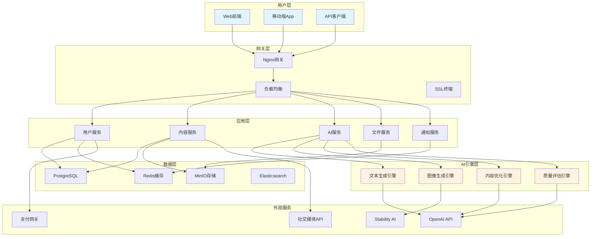

# 第12章 案例9 - AI辅助内容创作平台

## 1. 引言

在数字化时代，内容创作已成为企业和个人表达思想、传播信息的重要方式。然而，高质量内容的创作往往需要大量时间和专业技能。AI辅助内容创作平台的出现，为内容创作者提供了强大的智能助手，能够显著提升创作效率和质量。

本案例将带您构建一个完整的AI辅助内容创作平台，涵盖文章写作、图片生成、视频脚本创作等多种内容形式。通过这个项目，您将学会如何整合多种AI能力，构建一个实用的内容创作工具。

### 1.1 项目背景

**市场需求：**
- 内容营销需求激增，企业需要大量优质内容
- 个人创作者希望提升创作效率和质量
- 多媒体内容需求增长，需要一站式创作解决方案
- AI技术成熟，为智能创作提供了技术基础

**技术机遇：**
- 大语言模型在文本生成方面表现优异
- 图像生成模型（如DALL-E、Midjourney）日趋成熟
- 多模态AI技术发展，支持跨媒体内容创作
- 云计算和API服务降低了AI应用的技术门槛

### 1.2 学习目标

通过本案例的学习，您将掌握：

**技术能力：**
- 多模态AI服务的集成和调用
- 内容生成工作流的设计和实现
- 用户界面设计和交互优化
- 内容质量评估和优化策略

**工程能力：**
- 微服务架构的设计和实现
- 异步任务处理和队列管理
- 文件存储和内容管理系统
- 用户权限和计费系统设计

**产品能力：**
- 内容创作流程的理解和优化
- 用户体验设计和迭代改进
- 商业模式设计和运营策略

## 2. 项目概述

### 2.1 功能特性

**核心功能：**
- **智能文章写作**：基于主题和大纲生成高质量文章
- **图片智能生成**：根据描述生成配图和插画
- **视频脚本创作**：生成视频脚本和分镜头脚本
- **内容优化建议**：提供SEO优化和可读性改进建议
- **多语言支持**：支持多种语言的内容创作

**辅助功能：**
- **模板管理**：提供各种内容模板和样式
- **协作功能**：支持团队协作和版本管理
- **内容发布**：一键发布到各大平台
- **数据分析**：内容效果分析和优化建议

### 2.2 技术栈

**后端技术：**
- **框架**：FastAPI（高性能异步Web框架）
- **数据库**：PostgreSQL + Redis（关系型数据库 + 缓存）
- **任务队列**：Celery + Redis（异步任务处理）
- **文件存储**：MinIO（对象存储）
- **AI服务**：OpenAI API、Stability AI、Claude API

**前端技术：**
- **框架**：React + TypeScript
- **UI库**：Ant Design
- **状态管理**：Redux Toolkit
- **富文本编辑**：Draft.js
- **图表可视化**：ECharts

**基础设施：**
- **容器化**：Docker + Docker Compose
- **API网关**：Nginx
- **监控**：Prometheus + Grafana
- **日志**：ELK Stack

### 2.3 系统架构



## 3. 规范设计

### 3.1 数据模型设计

#### 3.1.1 用户模型

```python
# models/user.py
from sqlalchemy import Column, Integer, String, DateTime, Boolean, Text, Enum
from sqlalchemy.ext.declarative import declarative_base
from datetime import datetime
import enum

Base = declarative_base()

class UserRole(enum.Enum):
    ADMIN = "admin"
    PREMIUM = "premium"
    BASIC = "basic"
    TRIAL = "trial"

class SubscriptionStatus(enum.Enum):
    ACTIVE = "active"
    EXPIRED = "expired"
    CANCELLED = "cancelled"
    PENDING = "pending"

class User(Base):
    __tablename__ = "users"
    
    id = Column(Integer, primary_key=True, index=True)
    username = Column(String(50), unique=True, index=True, nullable=False)
    email = Column(String(100), unique=True, index=True, nullable=False)
    password_hash = Column(String(255), nullable=False)
    full_name = Column(String(100))
    avatar_url = Column(String(500))
    
    # 角色和权限
    role = Column(Enum(UserRole), default=UserRole.BASIC)
    is_active = Column(Boolean, default=True)
    is_verified = Column(Boolean, default=False)
    
    # 订阅信息
    subscription_status = Column(Enum(SubscriptionStatus), default=SubscriptionStatus.TRIAL)
    subscription_expires_at = Column(DateTime)
    
    # 使用统计
    total_articles = Column(Integer, default=0)
    total_images = Column(Integer, default=0)
    total_tokens_used = Column(Integer, default=0)
    
    # 时间戳
    created_at = Column(DateTime, default=datetime.utcnow)
    updated_at = Column(DateTime, default=datetime.utcnow, onupdate=datetime.utcnow)
    last_login_at = Column(DateTime)
    
    # 偏好设置
    preferences = Column(Text)  # JSON格式存储用户偏好
    
    def __repr__(self):
        return f"<User(id={self.id}, username='{self.username}', role='{self.role.value}')>"
```

#### 3.1.2 内容模型

```python
# models/content.py
from sqlalchemy import Column, Integer, String, DateTime, Boolean, Text, Enum, ForeignKey, JSON
from sqlalchemy.orm import relationship
import enum

class ContentType(enum.Enum):
    ARTICLE = "article"
    IMAGE = "image"
    VIDEO_SCRIPT = "video_script"
    SOCIAL_POST = "social_post"
    EMAIL = "email"
    BLOG_POST = "blog_post"

class ContentStatus(enum.Enum):
    DRAFT = "draft"
    GENERATING = "generating"
    COMPLETED = "completed"
    PUBLISHED = "published"
    FAILED = "failed"

class Content(Base):
    __tablename__ = "contents"
    
    id = Column(Integer, primary_key=True, index=True)
    user_id = Column(Integer, ForeignKey("users.id"), nullable=False)
    
    # 基本信息
    title = Column(String(200), nullable=False)
    content_type = Column(Enum(ContentType), nullable=False)
    status = Column(Enum(ContentStatus), default=ContentStatus.DRAFT)
    
    # 内容数据
    content_data = Column(Text)  # 主要内容
    metadata = Column(JSON)  # 元数据（标签、分类、SEO信息等）
    generation_params = Column(JSON)  # 生成参数
    
    # 文件关联
    file_urls = Column(JSON)  # 关联的文件URL列表
    thumbnail_url = Column(String(500))
    
    # 统计信息
    word_count = Column(Integer, default=0)
    character_count = Column(Integer, default=0)
    tokens_used = Column(Integer, default=0)
    generation_time = Column(Integer)  # 生成耗时（秒）
    
    # 质量评分
    quality_score = Column(Integer)  # 1-100分
    readability_score = Column(Integer)  # 可读性评分
    seo_score = Column(Integer)  # SEO评分
    
    # 发布信息
    published_at = Column(DateTime)
    published_platforms = Column(JSON)  # 发布平台列表
    
    # 时间戳
    created_at = Column(DateTime, default=datetime.utcnow)
    updated_at = Column(DateTime, default=datetime.utcnow, onupdate=datetime.utcnow)
    
    # 关系
    user = relationship("User", back_populates="contents")
    versions = relationship("ContentVersion", back_populates="content")
    
    def __repr__(self):
        return f"<Content(id={self.id}, title='{self.title}', type='{self.content_type.value}')>"

class ContentVersion(Base):
    __tablename__ = "content_versions"
    
    id = Column(Integer, primary_key=True, index=True)
    content_id = Column(Integer, ForeignKey("contents.id"), nullable=False)
    version_number = Column(Integer, nullable=False)
    
    # 版本内容
    content_data = Column(Text)
    metadata = Column(JSON)
    
    # 变更信息
    change_summary = Column(String(500))
    created_by = Column(Integer, ForeignKey("users.id"))
    created_at = Column(DateTime, default=datetime.utcnow)
    
    # 关系
    content = relationship("Content", back_populates="versions")
    creator = relationship("User")
```

#### 3.1.3 任务模型

```python
# models/task.py
from sqlalchemy import Column, Integer, String, DateTime, Boolean, Text, Enum, ForeignKey, JSON
import enum

class TaskType(enum.Enum):
    GENERATE_ARTICLE = "generate_article"
    GENERATE_IMAGE = "generate_image"
    OPTIMIZE_CONTENT = "optimize_content"
    PUBLISH_CONTENT = "publish_content"
    ANALYZE_CONTENT = "analyze_content"

class TaskStatus(enum.Enum):
    PENDING = "pending"
    RUNNING = "running"
    COMPLETED = "completed"
    FAILED = "failed"
    CANCELLED = "cancelled"

class GenerationTask(Base):
    __tablename__ = "generation_tasks"
    
    id = Column(Integer, primary_key=True, index=True)
    user_id = Column(Integer, ForeignKey("users.id"), nullable=False)
    content_id = Column(Integer, ForeignKey("contents.id"))
    
    # 任务信息
    task_type = Column(Enum(TaskType), nullable=False)
    status = Column(Enum(TaskStatus), default=TaskStatus.PENDING)
    
    # 任务参数
    input_params = Column(JSON)  # 输入参数
    output_data = Column(JSON)  # 输出结果
    
    # 执行信息
    started_at = Column(DateTime)
    completed_at = Column(DateTime)
    error_message = Column(Text)
    
    # 资源使用
    tokens_used = Column(Integer, default=0)
    processing_time = Column(Integer)  # 处理时间（秒）
    
    # 优先级和重试
    priority = Column(Integer, default=5)  # 1-10，数字越大优先级越高
    retry_count = Column(Integer, default=0)
    max_retries = Column(Integer, default=3)
    
    # 时间戳
    created_at = Column(DateTime, default=datetime.utcnow)
    updated_at = Column(DateTime, default=datetime.utcnow, onupdate=datetime.utcnow)
    
    # 关系
    user = relationship("User")
    content = relationship("Content")
```

### 3.2 API接口设计

#### 3.2.1 用户认证接口

```python
# api/auth.py
from fastapi import APIRouter, Depends, HTTPException, status
from fastapi.security import OAuth2PasswordBearer, OAuth2PasswordRequestForm
from pydantic import BaseModel, EmailStr
from typing import Optional
from datetime import datetime, timedelta

router = APIRouter(prefix="/auth", tags=["authentication"])

class UserRegister(BaseModel):
    username: str
    email: EmailStr
    password: str
    full_name: Optional[str] = None

class UserLogin(BaseModel):
    username: str
    password: str

class Token(BaseModel):
    access_token: str
    token_type: str
    expires_in: int
    user_info: dict

class UserProfile(BaseModel):
    id: int
    username: str
    email: str
    full_name: Optional[str]
    avatar_url: Optional[str]
    role: str
    subscription_status: str
    subscription_expires_at: Optional[datetime]
    total_articles: int
    total_images: int
    created_at: datetime

@router.post("/register", response_model=Token)
async def register(user_data: UserRegister):
    """
    用户注册
    
    - **username**: 用户名（唯一）
    - **email**: 邮箱地址（唯一）
    - **password**: 密码（至少8位）
    - **full_name**: 全名（可选）
    
    返回访问令牌和用户信息
    """
    # 实现用户注册逻辑
    pass

@router.post("/login", response_model=Token)
async def login(form_data: OAuth2PasswordRequestForm = Depends()):
    """
    用户登录
    
    - **username**: 用户名或邮箱
    - **password**: 密码
    
    返回访问令牌和用户信息
    """
    # 实现用户登录逻辑
    pass

@router.get("/profile", response_model=UserProfile)
async def get_profile(current_user = Depends(get_current_user)):
    """
    获取当前用户信息
    
    需要有效的访问令牌
    """
    # 返回用户信息
    pass

@router.put("/profile", response_model=UserProfile)
async def update_profile(profile_data: dict, current_user = Depends(get_current_user)):
    """
    更新用户信息
    
    - **full_name**: 全名
    - **avatar_url**: 头像URL
    - **preferences**: 用户偏好设置
    """
    # 更新用户信息
    pass
```

#### 3.2.2 内容生成接口

```python
# api/content.py
from fastapi import APIRouter, Depends, HTTPException, BackgroundTasks
from pydantic import BaseModel
from typing import List, Optional, Dict, Any
from enum import Enum

router = APIRouter(prefix="/content", tags=["content"])

class ContentTypeEnum(str, Enum):
    ARTICLE = "article"
    IMAGE = "image"
    VIDEO_SCRIPT = "video_script"
    SOCIAL_POST = "social_post"

class ArticleGenerationRequest(BaseModel):
    title: str
    topic: str
    outline: Optional[List[str]] = None
    target_audience: Optional[str] = None
    tone: Optional[str] = "professional"  # professional, casual, friendly, formal
    length: Optional[str] = "medium"  # short, medium, long
    keywords: Optional[List[str]] = None
    language: Optional[str] = "zh-CN"
    include_introduction: bool = True
    include_conclusion: bool = True
    include_call_to_action: bool = False

class ImageGenerationRequest(BaseModel):
    prompt: str
    style: Optional[str] = "realistic"  # realistic, artistic, cartoon, abstract
    size: Optional[str] = "1024x1024"  # 512x512, 1024x1024, 1024x1792
    quality: Optional[str] = "standard"  # standard, hd
    count: Optional[int] = 1

class ContentResponse(BaseModel):
    id: int
    title: str
    content_type: str
    status: str
    content_data: Optional[str]
    metadata: Optional[Dict[str, Any]]
    file_urls: Optional[List[str]]
    quality_score: Optional[int]
    created_at: datetime
    updated_at: datetime

class TaskResponse(BaseModel):
    task_id: int
    status: str
    estimated_completion_time: Optional[int]  # 预估完成时间（秒）
    message: str

@router.post("/generate/article", response_model=TaskResponse)
async def generate_article(
    request: ArticleGenerationRequest,
    background_tasks: BackgroundTasks,
    current_user = Depends(get_current_user)
):
    """
    生成文章内容
    
    - **title**: 文章标题
    - **topic**: 文章主题
    - **outline**: 文章大纲（可选）
    - **target_audience**: 目标受众
    - **tone**: 写作风格
    - **length**: 文章长度
    - **keywords**: 关键词列表
    - **language**: 语言
    
    返回任务ID，可通过任务状态接口查询生成进度
    """
    # 创建文章生成任务
    pass

@router.post("/generate/image", response_model=TaskResponse)
async def generate_image(
    request: ImageGenerationRequest,
    background_tasks: BackgroundTasks,
    current_user = Depends(get_current_user)
):
    """
    生成图片内容
    
    - **prompt**: 图片描述
    - **style**: 图片风格
    - **size**: 图片尺寸
    - **quality**: 图片质量
    - **count**: 生成数量
    
    返回任务ID，可通过任务状态接口查询生成进度
    """
    # 创建图片生成任务
    pass

@router.get("/list", response_model=List[ContentResponse])
async def list_contents(
    content_type: Optional[ContentTypeEnum] = None,
    status: Optional[str] = None,
    page: int = 1,
    size: int = 20,
    current_user = Depends(get_current_user)
):
    """
    获取内容列表
    
    - **content_type**: 内容类型过滤
    - **status**: 状态过滤
    - **page**: 页码
    - **size**: 每页数量
    """
    # 返回用户的内容列表
    pass

@router.get("/{content_id}", response_model=ContentResponse)
async def get_content(
    content_id: int,
    current_user = Depends(get_current_user)
):
    """
    获取特定内容详情
    """
    # 返回内容详情
    pass

@router.put("/{content_id}", response_model=ContentResponse)
async def update_content(
    content_id: int,
    update_data: dict,
    current_user = Depends(get_current_user)
):
    """
    更新内容
    
    - **title**: 标题
    - **content_data**: 内容数据
    - **metadata**: 元数据
    """
    # 更新内容
    pass

@router.delete("/{content_id}")
async def delete_content(
    content_id: int,
    current_user = Depends(get_current_user)
):
    """
    删除内容
    """
    # 删除内容
    pass
```

## 4. 实现过程

### 4.1 核心服务实现

#### 4.1.1 文本生成服务

```python
# services/text_generation.py
from typing import List, Dict, Any, Optional
from dataclasses import dataclass
import openai
import asyncio
import json
from datetime import datetime

@dataclass
class GenerationConfig:
    model: str = "gpt-4"
    temperature: float = 0.7
    max_tokens: int = 2000
    top_p: float = 1.0
    frequency_penalty: float = 0.0
    presence_penalty: float = 0.0

class TextGenerationService:
    """文本生成服务"""
    
    def __init__(self, api_key: str):
        self.client = openai.AsyncOpenAI(api_key=api_key)
        self.default_config = GenerationConfig()
    
    async def generate_article(
        self,
        title: str,
        topic: str,
        outline: Optional[List[str]] = None,
        target_audience: str = "general",
        tone: str = "professional",
        length: str = "medium",
        keywords: Optional[List[str]] = None,
        language: str = "zh-CN",
        config: Optional[GenerationConfig] = None
    ) -> Dict[str, Any]:
        """生成文章内容"""
        
        if config is None:
            config = self.default_config
        
        # 构建提示词
        prompt = self._build_article_prompt(
            title=title,
            topic=topic,
            outline=outline,
            target_audience=target_audience,
            tone=tone,
            length=length,
            keywords=keywords,
            language=language
        )
        
        try:
            start_time = datetime.now()
            
            response = await self.client.chat.completions.create(
                model=config.model,
                messages=[
                    {"role": "system", "content": self._get_system_prompt("article", language)},
                    {"role": "user", "content": prompt}
                ],
                temperature=config.temperature,
                max_tokens=config.max_tokens,
                top_p=config.top_p,
                frequency_penalty=config.frequency_penalty,
                presence_penalty=config.presence_penalty
            )
            
            end_time = datetime.now()
            generation_time = (end_time - start_time).total_seconds()
            
            content = response.choices[0].message.content
            
            # 解析生成的内容
            parsed_content = self._parse_article_content(content)
            
            return {
                "success": True,
                "content": parsed_content,
                "metadata": {
                    "title": title,
                    "topic": topic,
                    "target_audience": target_audience,
                    "tone": tone,
                    "length": length,
                    "keywords": keywords or [],
                    "language": language,
                    "word_count": len(content.split()),
                    "character_count": len(content),
                    "generation_time": generation_time,
                    "model_used": config.model
                },
                "usage": {
                    "prompt_tokens": response.usage.prompt_tokens,
                    "completion_tokens": response.usage.completion_tokens,
                    "total_tokens": response.usage.total_tokens
                }
            }
            
        except Exception as e:
            return {
                "success": False,
                "error": str(e),
                "error_type": type(e).__name__
            }
    
    def _build_article_prompt(
        self,
        title: str,
        topic: str,
        outline: Optional[List[str]],
        target_audience: str,
        tone: str,
        length: str,
        keywords: Optional[List[str]],
        language: str
    ) -> str:
        """构建文章生成提示词"""
        
        length_mapping = {
            "short": "800-1200字",
            "medium": "1500-2500字",
            "long": "3000-5000字"
        }
        
        tone_mapping = {
            "professional": "专业、权威",
            "casual": "轻松、随意",
            "friendly": "友好、亲切",
            "formal": "正式、严谨"
        }
        
        prompt_parts = [
            f"请写一篇关于'{topic}'的文章，标题为：{title}",
            f"目标受众：{target_audience}",
            f"写作风格：{tone_mapping.get(tone, tone)}",
            f"文章长度：{length_mapping.get(length, length)}",
            f"语言：{language}"
        ]
        
        if outline:
            prompt_parts.append(f"文章大纲：\n" + "\n".join([f"{i+1}. {item}" for i, item in enumerate(outline)]))
        
        if keywords:
            prompt_parts.append(f"关键词：{', '.join(keywords)}")
        
        prompt_parts.extend([
            "\n要求：",
            "1. 文章结构清晰，逻辑性强",
            "2. 内容原创，避免抄袭",
            "3. 语言流畅，符合目标受众的阅读习惯",
            "4. 适当使用标题、副标题来组织内容",
            "5. 如果提供了关键词，请自然地融入文章中",
            "6. 包含引人入胜的开头和有力的结尾",
            "\n请直接输出文章内容，使用Markdown格式："
        ])
        
        return "\n".join(prompt_parts)
    
    def _get_system_prompt(self, content_type: str, language: str) -> str:
        """获取系统提示词"""
        
        system_prompts = {
            "article": {
                "zh-CN": "你是一位专业的内容创作者和文案专家，擅长创作高质量的文章内容。你的文章逻辑清晰、内容丰富、语言优美，能够吸引读者并传达有价值的信息。请根据用户的要求创作文章，确保内容原创、准确、有价值。",
                "en": "You are a professional content creator and copywriting expert, skilled at creating high-quality article content. Your articles are logically clear, content-rich, and beautifully written, able to attract readers and convey valuable information. Please create articles according to user requirements, ensuring content is original, accurate, and valuable."
            },
            "social_post": {
                "zh-CN": "你是一位社交媒体营销专家，擅长创作吸引人的社交媒体内容。你了解各个平台的特点和用户习惯，能够创作出既有趣又有价值的内容，提高用户参与度和传播效果。",
                "en": "You are a social media marketing expert, skilled at creating engaging social media content. You understand the characteristics and user habits of various platforms, and can create content that is both interesting and valuable, improving user engagement and communication effectiveness."
            }
        }
        
        return system_prompts.get(content_type, {}).get(language, system_prompts["article"]["zh-CN"])
    
    def _parse_article_content(self, content: str) -> Dict[str, Any]:
        """解析文章内容"""
        
        lines = content.strip().split('\n')
        
        # 提取标题
        title = ""
        for line in lines:
            if line.startswith('# '):
                title = line[2:].strip()
                break
        
        # 提取章节
        sections = []
        current_section = None
        
        for line in lines:
            if line.startswith('## '):
                if current_section:
                    sections.append(current_section)
                current_section = {
                    "title": line[3:].strip(),
                    "content": []
                }
            elif current_section and line.strip():
                current_section["content"].append(line)
        
        if current_section:
            sections.append(current_section)
        
        # 处理章节内容
        for section in sections:
            section["content"] = "\n".join(section["content"])
        
        return {
            "title": title,
            "full_content": content,
            "sections": sections,
            "summary": self._generate_summary(content)
        }
    
    def _generate_summary(self, content: str) -> str:
        """生成内容摘要"""
        # 简单的摘要生成逻辑
        sentences = content.replace('\n', ' ').split('。')
        # 取前两句作为摘要
        summary_sentences = [s.strip() for s in sentences[:2] if s.strip()]
        return '。'.join(summary_sentences) + '。' if summary_sentences else ""
    
    async def generate_social_post(
        self,
        topic: str,
        platform: str = "general",
        tone: str = "engaging",
        include_hashtags: bool = True,
        include_call_to_action: bool = True,
        language: str = "zh-CN",
        config: Optional[GenerationConfig] = None
    ) -> Dict[str, Any]:
        """生成社交媒体内容"""
        
        if config is None:
            config = GenerationConfig(max_tokens=500)  # 社交媒体内容较短
        
        prompt = self._build_social_post_prompt(
            topic=topic,
            platform=platform,
            tone=tone,
            include_hashtags=include_hashtags,
            include_call_to_action=include_call_to_action,
            language=language
        )
        
        try:
            response = await self.client.chat.completions.create(
                model=config.model,
                messages=[
                    {"role": "system", "content": self._get_system_prompt("social_post", language)},
                    {"role": "user", "content": prompt}
                ],
                temperature=config.temperature,
                max_tokens=config.max_tokens
            )
            
            content = response.choices[0].message.content
            
            return {
                "success": True,
                "content": content,
                "metadata": {
                    "topic": topic,
                    "platform": platform,
                    "tone": tone,
                    "character_count": len(content),
                    "hashtags": self._extract_hashtags(content) if include_hashtags else [],
                    "language": language
                },
                "usage": {
                    "total_tokens": response.usage.total_tokens
                }
            }
            
        except Exception as e:
            return {
                "success": False,
                "error": str(e)
            }
    
    def _build_social_post_prompt(
        self,
        topic: str,
        platform: str,
        tone: str,
        include_hashtags: bool,
        include_call_to_action: bool,
        language: str
    ) -> str:
        """构建社交媒体内容提示词"""
        
        platform_specs = {
            "weibo": "微博平台，字数限制140字以内",
            "wechat": "微信朋友圈，适合分享和互动",
            "xiaohongshu": "小红书平台，注重生活方式和美学",
            "douyin": "抖音平台，短视频配文",
            "general": "通用社交媒体平台"
        }
        
        prompt_parts = [
            f"请为'{topic}'这个话题创作一条社交媒体内容",
            f"平台：{platform_specs.get(platform, platform)}",
            f"风格：{tone}",
            f"语言：{language}"
        ]
        
        requirements = ["要求：", "1. 内容吸引人，能引起用户互动"]
        
        if include_hashtags:
            requirements.append("2. 包含相关的话题标签（hashtags）")
        
        if include_call_to_action:
            requirements.append("3. 包含行动号召（如点赞、分享、评论等）")
        
        requirements.extend([
            "4. 语言生动有趣，符合社交媒体特点",
            "5. 内容积极正面，传播正能量"
        ])
        
        prompt_parts.extend(requirements)
        
        return "\n".join(prompt_parts)
    
    def _extract_hashtags(self, content: str) -> List[str]:
        """提取话题标签"""
        import re
        # 匹配 #标签# 或 #标签 格式
        hashtags = re.findall(r'#([^#\s]+)#?', content)
        return list(set(hashtags))  # 去重
```

#### 4.1.2 图像生成服务

```python
# services/image_generation.py
from typing import List, Dict, Any, Optional
from dataclasses import dataclass
import aiohttp
import asyncio
import base64
import io
from PIL import Image
from datetime import datetime

@dataclass
class ImageConfig:
    model: str = "dall-e-3"
    size: str = "1024x1024"
    quality: str = "standard"
    style: str = "vivid"

class ImageGenerationService:
    """图像生成服务"""
    
    def __init__(self, openai_api_key: str, stability_api_key: Optional[str] = None):
        self.openai_api_key = openai_api_key
        self.stability_api_key = stability_api_key
        self.default_config = ImageConfig()
    
    async def generate_image_openai(
        self,
        prompt: str,
        config: Optional[ImageConfig] = None,
        count: int = 1
    ) -> Dict[str, Any]:
        """使用OpenAI DALL-E生成图像"""
        
        if config is None:
            config = self.default_config
        
        try:
            start_time = datetime.now()
            
            async with aiohttp.ClientSession() as session:
                headers = {
                    "Authorization": f"Bearer {self.openai_api_key}",
                    "Content-Type": "application/json"
                }
                
                data = {
                    "model": config.model,
                    "prompt": prompt,
                    "n": count,
                    "size": config.size,
                    "quality": config.quality,
                    "style": config.style,
                    "response_format": "url"
                }
                
                async with session.post(
                    "https://api.openai.com/v1/images/generations",
                    headers=headers,
                    json=data
                ) as response:
                    if response.status == 200:
                        result = await response.json()
                        
                        end_time = datetime.now()
                        generation_time = (end_time - start_time).total_seconds()
                        
                        images = []
                        for img_data in result["data"]:
                            images.append({
                                "url": img_data["url"],
                                "revised_prompt": img_data.get("revised_prompt", prompt)
                            })
                        
                        return {
                            "success": True,
                            "images": images,
                            "metadata": {
                                "original_prompt": prompt,
                                "model": config.model,
                                "size": config.size,
                                "quality": config.quality,
                                "style": config.style,
                                "count": count,
                                "generation_time": generation_time,
                                "provider": "openai"
                            }
                        }
                    else:
                        error_data = await response.json()
                        return {
                            "success": False,
                            "error": error_data.get("error", {}).get("message", "Unknown error"),
                            "error_code": response.status
                        }
                        
        except Exception as e:
            return {
                "success": False,
                "error": str(e),
                "error_type": type(e).__name__
            }
    
    async def generate_image_stability(
        self,
        prompt: str,
        negative_prompt: Optional[str] = None,
        width: int = 1024,
        height: int = 1024,
        steps: int = 30,
        cfg_scale: float = 7.0,
        style_preset: Optional[str] = None
    ) -> Dict[str, Any]:
        """使用Stability AI生成图像"""
        
        if not self.stability_api_key:
            return {
                "success": False,
                "error": "Stability AI API key not configured"
            }
        
        try:
            start_time = datetime.now()
            
            async with aiohttp.ClientSession() as session:
                headers = {
                    "Authorization": f"Bearer {self.stability_api_key}",
                    "Content-Type": "application/json",
                    "Accept": "application/json"
                }
                
                data = {
                    "text_prompts": [
                        {
                            "text": prompt,
                            "weight": 1.0
                        }
                    ],
                    "width": width,
                    "height": height,
                    "steps": steps,
                    "cfg_scale": cfg_scale,
                    "samples": 1
                }
                
                if negative_prompt:
                    data["text_prompts"].append({
                        "text": negative_prompt,
                        "weight": -1.0
                    })
                
                if style_preset:
                    data["style_preset"] = style_preset
                
                async with session.post(
                    "https://api.stability.ai/v1/generation/stable-diffusion-xl-1024-v1-0/text-to-image",
                    headers=headers,
                    json=data
                ) as response:
                    if response.status == 200:
                        result = await response.json()
                        
                        end_time = datetime.now()
                        generation_time = (end_time - start_time).total_seconds()
                        
                        images = []
                        for artifact in result["artifacts"]:
                            if artifact["finishReason"] == "SUCCESS":
                                # 将base64图像保存为文件
                                image_data = base64.b64decode(artifact["base64"])
                                image_url = await self._save_image(image_data)
                                
                                images.append({
                                    "url": image_url,
                                    "seed": artifact["seed"]
                                })
                        
                        return {
                            "success": True,
                            "images": images,
                            "metadata": {
                                "original_prompt": prompt,
                                "negative_prompt": negative_prompt,
                                "width": width,
                                "height": height,
                                "steps": steps,
                                "cfg_scale": cfg_scale,
                                "style_preset": style_preset,
                                "generation_time": generation_time,
                                "provider": "stability"
                            }
                        }
                    else:
                        error_data = await response.json()
                        return {
                            "success": False,
                            "error": error_data.get("message", "Unknown error"),
                            "error_code": response.status
                        }
                        
        except Exception as e:
            return {
                "success": False,
                "error": str(e),
                "error_type": type(e).__name__
            }
    
    async def _save_image(self, image_data: bytes) -> str:
        """保存图像并返回URL"""
        # 这里应该实现图像保存逻辑，比如保存到MinIO或其他对象存储
        # 返回图像的访问URL
        pass
    
    async def enhance_prompt(
        self,
        basic_prompt: str,
        style: str = "realistic",
        mood: Optional[str] = None,
        lighting: Optional[str] = None,
        composition: Optional[str] = None
    ) -> str:
        """增强图像生成提示词"""
        
        style_modifiers = {
            "realistic": "photorealistic, high quality, detailed",
            "artistic": "artistic, painterly, creative",
            "cartoon": "cartoon style, animated, colorful",
            "abstract": "abstract art, conceptual, modern",
            "vintage": "vintage style, retro, classic",
            "minimalist": "minimalist, clean, simple"
        }
        
        mood_modifiers = {
            "bright": "bright, cheerful, vibrant",
            "dark": "dark, moody, atmospheric",
            "calm": "peaceful, serene, tranquil",
            "energetic": "dynamic, energetic, lively",
            "mysterious": "mysterious, enigmatic, intriguing"
        }
        
        lighting_modifiers = {
            "natural": "natural lighting, soft shadows",
            "dramatic": "dramatic lighting, strong contrast",
            "golden_hour": "golden hour lighting, warm tones",
            "studio": "studio lighting, professional",
            "neon": "neon lighting, cyberpunk, futuristic"
        }
        
        composition_modifiers = {
            "portrait": "portrait composition, close-up",
            "landscape": "landscape composition, wide shot",
            "macro": "macro photography, extreme close-up",
            "aerial": "aerial view, bird's eye perspective",
            "symmetrical": "symmetrical composition, balanced"
        }
        
        enhanced_parts = [basic_prompt]
        
        if style in style_modifiers:
            enhanced_parts.append(style_modifiers[style])
        
        if mood and mood in mood_modifiers:
            enhanced_parts.append(mood_modifiers[mood])
        
        if lighting and lighting in lighting_modifiers:
            enhanced_parts.append(lighting_modifiers[lighting])
        
        if composition and composition in composition_modifiers:
            enhanced_parts.append(composition_modifiers[composition])
        
        # 添加通用质量修饰符
        enhanced_parts.append("high resolution, professional quality")
        
        return ", ".join(enhanced_parts)
    
    async def generate_variations(
        self,
        original_prompt: str,
        variation_count: int = 3,
        variation_strength: float = 0.3
    ) -> List[str]:
        """生成提示词变体"""
        
        variations = []
        
        # 风格变体
        style_variations = [
            f"{original_prompt}, in watercolor style",
            f"{original_prompt}, in oil painting style",
            f"{original_prompt}, in digital art style"
        ]
        
        # 视角变体
        perspective_variations = [
            f"{original_prompt}, from above",
            f"{original_prompt}, close-up view",
            f"{original_prompt}, wide angle view"
        ]
        
        # 时间变体
        time_variations = [
            f"{original_prompt}, at sunset",
            f"{original_prompt}, at night",
            f"{original_prompt}, in morning light"
        ]
        
        all_variations = style_variations + perspective_variations + time_variations
        
        # 随机选择变体
        import random
        selected_variations = random.sample(all_variations, min(variation_count, len(all_variations)))
        
        return selected_variations

#### 4.1.3 内容优化服务

```python
# services/content_optimization.py
from typing import Dict, Any, List, Optional
from dataclasses import dataclass
import openai
import re
from textstat import flesch_reading_ease, flesch_kincaid_grade
from collections import Counter

@dataclass
class OptimizationResult:
    original_score: int
    optimized_score: int
    improvements: List[str]
    optimized_content: str
    suggestions: List[str]

class ContentOptimizationService:
    """内容优化服务"""
    
    def __init__(self, api_key: str):
        self.client = openai.AsyncOpenAI(api_key=api_key)
    
    async def optimize_for_seo(
        self,
        content: str,
        target_keywords: List[str],
        meta_description: Optional[str] = None
    ) -> Dict[str, Any]:
        """SEO优化"""
        
        # 分析当前SEO状况
        current_analysis = self._analyze_seo(content, target_keywords)
        
        # 生成优化建议
        optimization_prompt = self._build_seo_optimization_prompt(
            content, target_keywords, current_analysis, meta_description
        )
        
        try:
            response = await self.client.chat.completions.create(
                model="gpt-4",
                messages=[
                    {
                        "role": "system",
                        "content": "你是一位SEO专家，擅长优化内容以提高搜索引擎排名。请提供具体的优化建议和改进后的内容。"
                    },
                    {"role": "user", "content": optimization_prompt}
                ],
                temperature=0.3
            )
            
            optimized_content = response.choices[0].message.content
            
            # 分析优化后的SEO状况
            optimized_analysis = self._analyze_seo(optimized_content, target_keywords)
            
            return {
                "success": True,
                "original_analysis": current_analysis,
                "optimized_analysis": optimized_analysis,
                "optimized_content": optimized_content,
                "improvements": self._calculate_improvements(current_analysis, optimized_analysis),
                "seo_score": optimized_analysis["overall_score"]
            }
            
        except Exception as e:
            return {
                "success": False,
                "error": str(e)
            }
    
    def _analyze_seo(self, content: str, keywords: List[str]) -> Dict[str, Any]:
        """分析SEO状况"""
        
        word_count = len(content.split())
        
        # 关键词密度分析
        keyword_density = {}
        content_lower = content.lower()
        
        for keyword in keywords:
            keyword_lower = keyword.lower()
            count = content_lower.count(keyword_lower)
            density = (count / word_count) * 100 if word_count > 0 else 0
            keyword_density[keyword] = {
                "count": count,
                "density": density,
                "optimal": 1 <= density <= 3  # 1-3%为最佳密度
            }
        
        # 标题分析
        h1_tags = re.findall(r'^# (.+)$', content, re.MULTILINE)
        h2_tags = re.findall(r'^## (.+)$', content, re.MULTILINE)
        h3_tags = re.findall(r'^### (.+)$', content, re.MULTILINE)
        
        # 内容结构分析
        paragraphs = [p.strip() for p in content.split('\n\n') if p.strip()]
        avg_paragraph_length = sum(len(p.split()) for p in paragraphs) / len(paragraphs) if paragraphs else 0
        
        # 可读性分析
        readability_score = flesch_reading_ease(content) if content else 0
        
        # 计算总体SEO评分
        seo_score = self._calculate_seo_score(
            keyword_density, len(h1_tags), len(h2_tags), 
            word_count, readability_score, avg_paragraph_length
        )
        
        return {
            "word_count": word_count,
            "keyword_density": keyword_density,
            "title_structure": {
                "h1_count": len(h1_tags),
                "h2_count": len(h2_tags),
                "h3_count": len(h3_tags),
                "h1_tags": h1_tags,
                "h2_tags": h2_tags
            },
            "readability_score": readability_score,
            "avg_paragraph_length": avg_paragraph_length,
            "overall_score": seo_score
        }
    
    def _calculate_seo_score(
        self, 
        keyword_density: Dict, 
        h1_count: int, 
        h2_count: int, 
        word_count: int, 
        readability: float, 
        avg_paragraph_length: float
    ) -> int:
        """计算SEO评分"""
        
        score = 0
        
        # 关键词密度评分 (30分)
        optimal_keywords = sum(1 for kw_data in keyword_density.values() if kw_data["optimal"])
        total_keywords = len(keyword_density)
        if total_keywords > 0:
            score += (optimal_keywords / total_keywords) * 30
        
        # 标题结构评分 (20分)
        if h1_count == 1:  # 只有一个H1标题
            score += 10
        if h2_count >= 2:  # 至少2个H2标题
            score += 10
        
        # 内容长度评分 (20分)
        if 300 <= word_count <= 2000:
            score += 20
        elif word_count > 2000:
            score += 15
        elif word_count > 100:
            score += 10
        
        # 可读性评分 (20分)
        if readability >= 60:  # 易读
            score += 20
        elif readability >= 30:  # 中等
            score += 15
        elif readability >= 0:  # 困难
            score += 10
        
        # 段落长度评分 (10分)
        if 20 <= avg_paragraph_length <= 50:
            score += 10
        elif 10 <= avg_paragraph_length <= 80:
            score += 5
        
        return min(int(score), 100)
    
    async def improve_readability(
        self,
        content: str,
        target_audience: str = "general",
        reading_level: str = "intermediate"
    ) -> Dict[str, Any]:
        """提升可读性"""
        
        current_readability = flesch_reading_ease(content)
        
        prompt = f"""
        请优化以下内容的可读性：
        
        目标受众：{target_audience}
        阅读水平：{reading_level}
        当前可读性评分：{current_readability:.1f}
        
        原文内容：
        {content}
        
        优化要求：
        1. 简化复杂句子，使用更简单的词汇
        2. 调整段落长度，确保逻辑清晰
        3. 添加过渡词和连接词
        4. 保持原意不变的前提下提升可读性
        5. 使用项目符号和编号列表来组织信息
        
        请直接输出优化后的内容：
        """
        
        try:
            response = await self.client.chat.completions.create(
                model="gpt-4",
                messages=[
                    {
                        "role": "system",
                        "content": "你是一位专业的编辑，擅长提升文本的可读性和用户体验。"
                    },
                    {"role": "user", "content": prompt}
                ],
                temperature=0.3
            )
            
            optimized_content = response.choices[0].message.content
            optimized_readability = flesch_reading_ease(optimized_content)
            
            return {
                "success": True,
                "original_content": content,
                "optimized_content": optimized_content,
                "original_readability": current_readability,
                "optimized_readability": optimized_readability,
                "improvement": optimized_readability - current_readability,
                "suggestions": self._generate_readability_suggestions(optimized_readability)
            }
            
        except Exception as e:
            return {
                "success": False,
                "error": str(e)
            }
    
    def _generate_readability_suggestions(self, score: float) -> List[str]:
        """生成可读性改进建议"""
        
        suggestions = []
        
        if score < 30:
            suggestions.extend([
                "文本较难理解，建议简化词汇和句式",
                "将长句拆分为多个短句",
                "使用更常见的词汇替换专业术语"
            ])
        elif score < 50:
            suggestions.extend([
                "可读性中等，可以进一步优化",
                "适当增加过渡词和连接词",
                "考虑使用列表和标题来组织内容"
            ])
        elif score < 70:
            suggestions.extend([
                "可读性良好，小幅优化即可",
                "保持当前的写作风格",
                "可以适当增加一些例子和说明"
            ])
        else:
            suggestions.extend([
                "可读性优秀，易于理解",
                "当前的写作风格很适合目标受众",
                "保持简洁明了的表达方式"
            ])
        
        return suggestions

#### 4.1.4 任务管理系统

```python
# services/task_manager.py
from typing import Dict, Any, List, Optional, Callable
from dataclasses import dataclass, field
from enum import Enum
import asyncio
import uuid
from datetime import datetime, timedelta
import json
from celery import Celery
from redis import Redis

class TaskStatus(Enum):
    PENDING = "pending"
    RUNNING = "running"
    COMPLETED = "completed"
    FAILED = "failed"
    CANCELLED = "cancelled"

class TaskPriority(Enum):
    LOW = 1
    NORMAL = 5
    HIGH = 8
    URGENT = 10

@dataclass
class Task:
    id: str
    user_id: int
    task_type: str
    status: TaskStatus = TaskStatus.PENDING
    priority: TaskPriority = TaskPriority.NORMAL
    input_params: Dict[str, Any] = field(default_factory=dict)
    output_data: Optional[Dict[str, Any]] = None
    error_message: Optional[str] = None
    progress: int = 0  # 0-100
    created_at: datetime = field(default_factory=datetime.utcnow)
    started_at: Optional[datetime] = None
    completed_at: Optional[datetime] = None
    estimated_duration: Optional[int] = None  # 预估耗时（秒）
    retry_count: int = 0
    max_retries: int = 3

class TaskManager:
    """任务管理器"""
    
    def __init__(self, redis_url: str = "redis://localhost:6379", celery_broker: str = "redis://localhost:6379"):
        self.redis = Redis.from_url(redis_url)
        self.celery_app = Celery('content_platform', broker=celery_broker)
        self.tasks: Dict[str, Task] = {}
        self.task_handlers: Dict[str, Callable] = {}
        
        # 配置Celery
        self.celery_app.conf.update(
            task_serializer='json',
            accept_content=['json'],
            result_serializer='json',
            timezone='UTC',
            enable_utc=True,
            task_routes={
                'content_platform.generate_article': {'queue': 'text_generation'},
                'content_platform.generate_image': {'queue': 'image_generation'},
                'content_platform.optimize_content': {'queue': 'optimization'},
            }
        )
    
    def register_handler(self, task_type: str, handler: Callable):
        """注册任务处理器"""
        self.task_handlers[task_type] = handler
        
        # 注册Celery任务
        @self.celery_app.task(name=f'content_platform.{task_type}')
        def celery_task(task_id: str, **kwargs):
            return asyncio.run(self._execute_task(task_id))
    
    async def create_task(
        self,
        user_id: int,
        task_type: str,
        input_params: Dict[str, Any],
        priority: TaskPriority = TaskPriority.NORMAL,
        estimated_duration: Optional[int] = None
    ) -> str:
        """创建新任务"""
        
        task_id = str(uuid.uuid4())
        
        task = Task(
            id=task_id,
            user_id=user_id,
            task_type=task_type,
            input_params=input_params,
            priority=priority,
            estimated_duration=estimated_duration
        )
        
        # 保存任务到内存和Redis
        self.tasks[task_id] = task
        await self._save_task_to_redis(task)
        
        # 提交到Celery队列
        self.celery_app.send_task(
            f'content_platform.{task_type}',
            args=[task_id],
            kwargs=input_params,
            priority=priority.value
        )
        
        return task_id
    
    async def get_task(self, task_id: str) -> Optional[Task]:
        """获取任务信息"""
        
        if task_id in self.tasks:
            return self.tasks[task_id]
        
        # 从Redis加载
        task_data = self.redis.get(f"task:{task_id}")
        if task_data:
            task_dict = json.loads(task_data)
            task = Task(**task_dict)
            self.tasks[task_id] = task
            return task
        
        return None
    
    async def update_task_status(
        self,
        task_id: str,
        status: TaskStatus,
        progress: Optional[int] = None,
        output_data: Optional[Dict[str, Any]] = None,
        error_message: Optional[str] = None
    ):
        """更新任务状态"""
        
        task = await self.get_task(task_id)
        if not task:
            return
        
        task.status = status
        
        if progress is not None:
            task.progress = progress
        
        if output_data is not None:
            task.output_data = output_data
        
        if error_message is not None:
            task.error_message = error_message
        
        if status == TaskStatus.RUNNING and task.started_at is None:
            task.started_at = datetime.utcnow()
        
        if status in [TaskStatus.COMPLETED, TaskStatus.FAILED, TaskStatus.CANCELLED]:
            task.completed_at = datetime.utcnow()
            task.progress = 100 if status == TaskStatus.COMPLETED else task.progress
        
        # 保存更新
        await self._save_task_to_redis(task)
        
        # 发送状态更新通知
        await self._notify_task_update(task)
    
    async def cancel_task(self, task_id: str, user_id: int) -> bool:
        """取消任务"""
        
        task = await self.get_task(task_id)
        if not task or task.user_id != user_id:
            return False
        
        if task.status in [TaskStatus.COMPLETED, TaskStatus.FAILED, TaskStatus.CANCELLED]:
            return False
        
        # 撤销Celery任务
        self.celery_app.control.revoke(task_id, terminate=True)
        
        # 更新状态
        await self.update_task_status(task_id, TaskStatus.CANCELLED)
        
        return True
    
    async def get_user_tasks(
        self,
        user_id: int,
        status: Optional[TaskStatus] = None,
        task_type: Optional[str] = None,
        limit: int = 50
    ) -> List[Task]:
        """获取用户任务列表"""
        
        # 从Redis获取用户任务ID列表
        task_ids = self.redis.lrange(f"user_tasks:{user_id}", 0, limit - 1)
        
        tasks = []
        for task_id in task_ids:
            task = await self.get_task(task_id.decode())
            if task:
                # 应用过滤条件
                if status and task.status != status:
                    continue
                if task_type and task.task_type != task_type:
                    continue
                tasks.append(task)
        
        # 按创建时间倒序排列
        tasks.sort(key=lambda t: t.created_at, reverse=True)
        
        return tasks
    
    async def _execute_task(self, task_id: str) -> Dict[str, Any]:
        """执行任务"""
        
        task = await self.get_task(task_id)
        if not task:
            return {"success": False, "error": "Task not found"}
        
        handler = self.task_handlers.get(task.task_type)
        if not handler:
            await self.update_task_status(
                task_id, TaskStatus.FAILED, 
                error_message=f"No handler for task type: {task.task_type}"
            )
            return {"success": False, "error": "No handler found"}
        
        try:
            # 更新为运行状态
            await self.update_task_status(task_id, TaskStatus.RUNNING, progress=0)
            
            # 执行任务
            result = await handler(**task.input_params)
            
            if result.get("success", False):
                await self.update_task_status(
                    task_id, TaskStatus.COMPLETED, 
                    progress=100, output_data=result
                )
            else:
                await self.update_task_status(
                    task_id, TaskStatus.FAILED,
                    error_message=result.get("error", "Unknown error")
                )
            
            return result
            
        except Exception as e:
            await self.update_task_status(
                task_id, TaskStatus.FAILED,
                error_message=str(e)
            )
            
            # 重试逻辑
            if task.retry_count < task.max_retries:
                task.retry_count += 1
                await self._save_task_to_redis(task)
                
                # 延迟重试
                delay = min(300, 60 * (2 ** task.retry_count))  # 指数退避，最大5分钟
                self.celery_app.send_task(
                    f'content_platform.{task.task_type}',
                    args=[task_id],
                    kwargs=task.input_params,
                    countdown=delay
                )
            
            return {"success": False, "error": str(e)}
    
    async def _save_task_to_redis(self, task: Task):
        """保存任务到Redis"""
        
        task_dict = {
            "id": task.id,
            "user_id": task.user_id,
            "task_type": task.task_type,
            "status": task.status.value,
            "priority": task.priority.value,
            "input_params": task.input_params,
            "output_data": task.output_data,
            "error_message": task.error_message,
            "progress": task.progress,
            "created_at": task.created_at.isoformat(),
            "started_at": task.started_at.isoformat() if task.started_at else None,
            "completed_at": task.completed_at.isoformat() if task.completed_at else None,
            "estimated_duration": task.estimated_duration,
            "retry_count": task.retry_count,
            "max_retries": task.max_retries
        }
        
        # 保存任务数据
        self.redis.set(f"task:{task.id}", json.dumps(task_dict), ex=86400 * 7)  # 7天过期
        
        # 添加到用户任务列表
        self.redis.lpush(f"user_tasks:{task.user_id}", task.id)
        self.redis.ltrim(f"user_tasks:{task.user_id}", 0, 999)  # 保留最近1000个任务
    
    async def _notify_task_update(self, task: Task):
        """发送任务更新通知"""
        
        # 发布Redis消息，供WebSocket服务监听
        notification = {
            "type": "task_update",
            "user_id": task.user_id,
            "task_id": task.id,
            "status": task.status.value,
            "progress": task.progress,
            "timestamp": datetime.utcnow().isoformat()
        }
        
        self.redis.publish(f"user_notifications:{task.user_id}", json.dumps(notification))
    
    async def get_task_statistics(self, user_id: int, days: int = 30) -> Dict[str, Any]:
        """获取任务统计信息"""
        
        # 获取用户最近的任务
        tasks = await self.get_user_tasks(user_id, limit=1000)
        
        # 过滤时间范围
        cutoff_date = datetime.utcnow() - timedelta(days=days)
        recent_tasks = [t for t in tasks if t.created_at >= cutoff_date]
        
        # 统计各种状态的任务数量
        status_counts = {status.value: 0 for status in TaskStatus}
        type_counts = {}
        total_processing_time = 0
        successful_tasks = 0
        
        for task in recent_tasks:
            status_counts[task.status.value] += 1
            
            if task.task_type not in type_counts:
                type_counts[task.task_type] = 0
            type_counts[task.task_type] += 1
            
            if task.status == TaskStatus.COMPLETED and task.started_at and task.completed_at:
                processing_time = (task.completed_at - task.started_at).total_seconds()
                total_processing_time += processing_time
                successful_tasks += 1
        
        avg_processing_time = total_processing_time / successful_tasks if successful_tasks > 0 else 0
        
        return {
             "total_tasks": len(recent_tasks),
             "status_distribution": status_counts,
             "type_distribution": type_counts,
             "success_rate": (status_counts[TaskStatus.COMPLETED.value] / len(recent_tasks) * 100) if recent_tasks else 0,
             "average_processing_time": avg_processing_time,
             "period_days": days
         }
```

### 4.2 系统集成

```python
# main.py
from fastapi import FastAPI, HTTPException, Depends, BackgroundTasks
from fastapi.middleware.cors import CORSMiddleware
from fastapi.security import HTTPBearer, HTTPAuthorizationCredentials
from typing import Dict, Any, List, Optional
import asyncio
from contextlib import asynccontextmanager

from services.text_generation import TextGenerationService
from services.image_generation import ImageGenerationService
from services.content_optimization import ContentOptimizationService
from services.task_manager import TaskManager, TaskPriority
from models.database import init_db
from models.content import Content, ContentType, ContentStatus
from auth.jwt_handler import verify_token

# 全局服务实例
text_service = None
image_service = None
optimization_service = None
task_manager = None

@asynccontextmanager
async def lifespan(app: FastAPI):
    """应用生命周期管理"""
    global text_service, image_service, optimization_service, task_manager
    
    # 启动时初始化
    await init_db()
    
    # 初始化服务
    text_service = TextGenerationService(
        openai_api_key="your-openai-key",
        anthropic_api_key="your-anthropic-key"
    )
    
    image_service = ImageGenerationService(
        openai_api_key="your-openai-key",
        stability_api_key="your-stability-key"
    )
    
    optimization_service = ContentOptimizationService(
        api_key="your-openai-key"
    )
    
    task_manager = TaskManager()
    
    # 注册任务处理器
    task_manager.register_handler("generate_article", handle_article_generation)
    task_manager.register_handler("generate_image", handle_image_generation)
    task_manager.register_handler("optimize_content", handle_content_optimization)
    
    yield
    
    # 关闭时清理资源
    pass

app = FastAPI(
    title="AI辅助内容创作平台",
    description="基于多模态AI的智能内容生成与优化平台",
    version="1.0.0",
    lifespan=lifespan
)

# CORS配置
app.add_middleware(
    CORSMiddleware,
    allow_origins=["*"],
    allow_credentials=True,
    allow_methods=["*"],
    allow_headers=["*"],
)

security = HTTPBearer()

async def get_current_user(credentials: HTTPAuthorizationCredentials = Depends(security)):
    """获取当前用户"""
    try:
        payload = verify_token(credentials.credentials)
        return payload["user_id"]
    except Exception:
        raise HTTPException(status_code=401, detail="Invalid token")

# 任务处理器
async def handle_article_generation(**kwargs) -> Dict[str, Any]:
    """处理文章生成任务"""
    try:
        result = await text_service.generate_article(
            topic=kwargs["topic"],
            style=kwargs.get("style", "professional"),
            length=kwargs.get("length", "medium"),
            target_audience=kwargs.get("target_audience", "general")
        )
        return result
    except Exception as e:
        return {"success": False, "error": str(e)}

async def handle_image_generation(**kwargs) -> Dict[str, Any]:
    """处理图像生成任务"""
    try:
        result = await image_service.generate_image(
            prompt=kwargs["prompt"],
            style=kwargs.get("style", "realistic"),
            size=kwargs.get("size", "1024x1024"),
            provider=kwargs.get("provider", "openai")
        )
        return result
    except Exception as e:
        return {"success": False, "error": str(e)}

async def handle_content_optimization(**kwargs) -> Dict[str, Any]:
    """处理内容优化任务"""
    try:
        if kwargs.get("optimization_type") == "seo":
            result = await optimization_service.optimize_for_seo(
                content=kwargs["content"],
                target_keywords=kwargs["target_keywords"],
                meta_description=kwargs.get("meta_description")
            )
        else:
            result = await optimization_service.improve_readability(
                content=kwargs["content"],
                target_audience=kwargs.get("target_audience", "general"),
                reading_level=kwargs.get("reading_level", "intermediate")
            )
        return result
    except Exception as e:
        return {"success": False, "error": str(e)}

# API路由
@app.post("/api/content/generate/article")
async def create_article_task(
    request: Dict[str, Any],
    user_id: int = Depends(get_current_user)
):
    """创建文章生成任务"""
    
    task_id = await task_manager.create_task(
        user_id=user_id,
        task_type="generate_article",
        input_params=request,
        priority=TaskPriority.NORMAL,
        estimated_duration=120  # 预估2分钟
    )
    
    return {"task_id": task_id, "status": "pending"}

@app.post("/api/content/generate/image")
async def create_image_task(
    request: Dict[str, Any],
    user_id: int = Depends(get_current_user)
):
    """创建图像生成任务"""
    
    task_id = await task_manager.create_task(
        user_id=user_id,
        task_type="generate_image",
        input_params=request,
        priority=TaskPriority.NORMAL,
        estimated_duration=60  # 预估1分钟
    )
    
    return {"task_id": task_id, "status": "pending"}

@app.post("/api/content/optimize")
async def create_optimization_task(
    request: Dict[str, Any],
    user_id: int = Depends(get_current_user)
):
    """创建内容优化任务"""
    
    task_id = await task_manager.create_task(
        user_id=user_id,
        task_type="optimize_content",
        input_params=request,
        priority=TaskPriority.HIGH,
        estimated_duration=90  # 预估1.5分钟
    )
    
    return {"task_id": task_id, "status": "pending"}

@app.get("/api/tasks/{task_id}")
async def get_task_status(
    task_id: str,
    user_id: int = Depends(get_current_user)
):
    """获取任务状态"""
    
    task = await task_manager.get_task(task_id)
    if not task or task.user_id != user_id:
        raise HTTPException(status_code=404, detail="Task not found")
    
    return {
        "task_id": task.id,
        "status": task.status.value,
        "progress": task.progress,
        "output_data": task.output_data,
        "error_message": task.error_message,
        "created_at": task.created_at.isoformat(),
        "estimated_duration": task.estimated_duration
    }

@app.get("/api/tasks")
async def get_user_tasks(
    status: Optional[str] = None,
    task_type: Optional[str] = None,
    limit: int = 50,
    user_id: int = Depends(get_current_user)
):
    """获取用户任务列表"""
    
    from services.task_manager import TaskStatus
    
    status_filter = None
    if status:
        try:
            status_filter = TaskStatus(status)
        except ValueError:
            raise HTTPException(status_code=400, detail="Invalid status")
    
    tasks = await task_manager.get_user_tasks(
        user_id=user_id,
        status=status_filter,
        task_type=task_type,
        limit=limit
    )
    
    return {
        "tasks": [
            {
                "task_id": task.id,
                "task_type": task.task_type,
                "status": task.status.value,
                "progress": task.progress,
                "created_at": task.created_at.isoformat(),
                "estimated_duration": task.estimated_duration
            }
            for task in tasks
        ],
        "total": len(tasks)
    }

@app.delete("/api/tasks/{task_id}")
async def cancel_task(
    task_id: str,
    user_id: int = Depends(get_current_user)
):
    """取消任务"""
    
    success = await task_manager.cancel_task(task_id, user_id)
    if not success:
        raise HTTPException(status_code=400, detail="Cannot cancel task")
    
    return {"message": "Task cancelled successfully"}

@app.get("/api/statistics")
async def get_user_statistics(
    days: int = 30,
    user_id: int = Depends(get_current_user)
):
    """获取用户统计信息"""
    
    stats = await task_manager.get_task_statistics(user_id, days)
    return stats

if __name__ == "__main__":
    import uvicorn
    uvicorn.run(app, host="0.0.0.0", port=8000)
```

## 5. 验证测试

### 5.1 系统集成测试

```python
# tests/test_integration.py
import pytest
import asyncio
from httpx import AsyncClient
from main import app
from services.task_manager import TaskManager, TaskStatus
import json

class TestContentPlatformIntegration:
    """内容创作平台集成测试"""
    
    @pytest.fixture
    async def client(self):
        async with AsyncClient(app=app, base_url="http://test") as ac:
            yield ac
    
    @pytest.fixture
    def auth_headers(self):
        # 模拟JWT token
        return {"Authorization": "Bearer test-token"}
    
    async def test_article_generation_workflow(self, client, auth_headers):
        """测试文章生成完整流程"""
        
        # 1. 创建文章生成任务
        article_request = {
            "topic": "人工智能在教育中的应用",
            "style": "academic",
            "length": "long",
            "target_audience": "educators"
        }
        
        response = await client.post(
            "/api/content/generate/article",
            json=article_request,
            headers=auth_headers
        )
        
        assert response.status_code == 200
        task_data = response.json()
        task_id = task_data["task_id"]
        
        # 2. 轮询任务状态直到完成
        max_attempts = 30
        for _ in range(max_attempts):
            response = await client.get(
                f"/api/tasks/{task_id}",
                headers=auth_headers
            )
            
            assert response.status_code == 200
            task_status = response.json()
            
            if task_status["status"] == "completed":
                assert task_status["output_data"] is not None
                assert "content" in task_status["output_data"]
                break
            elif task_status["status"] == "failed":
                pytest.fail(f"Task failed: {task_status['error_message']}")
            
            await asyncio.sleep(2)
        else:
            pytest.fail("Task did not complete within expected time")
    
    async def test_image_generation_workflow(self, client, auth_headers):
        """测试图像生成完整流程"""
        
        # 1. 创建图像生成任务
        image_request = {
            "prompt": "A futuristic classroom with AI teaching assistants",
            "style": "digital_art",
            "size": "1024x1024",
            "provider": "openai"
        }
        
        response = await client.post(
            "/api/content/generate/image",
            json=image_request,
            headers=auth_headers
        )
        
        assert response.status_code == 200
        task_data = response.json()
        task_id = task_data["task_id"]
        
        # 2. 等待任务完成
        await self._wait_for_task_completion(client, task_id, auth_headers)
    
    async def test_content_optimization_workflow(self, client, auth_headers):
        """测试内容优化完整流程"""
        
        # 1. 创建SEO优化任务
        optimization_request = {
            "content": "这是一篇关于人工智能的文章...",
            "optimization_type": "seo",
            "target_keywords": ["人工智能", "机器学习", "深度学习"],
            "meta_description": "探索人工智能技术的最新发展"
        }
        
        response = await client.post(
            "/api/content/optimize",
            json=optimization_request,
            headers=auth_headers
        )
        
        assert response.status_code == 200
        task_data = response.json()
        task_id = task_data["task_id"]
        
        # 2. 等待任务完成并验证结果
        task_result = await self._wait_for_task_completion(client, task_id, auth_headers)
        
        assert "seo_score" in task_result["output_data"]
        assert task_result["output_data"]["seo_score"] > 0
    
    async def test_task_management(self, client, auth_headers):
        """测试任务管理功能"""
        
        # 1. 获取用户任务列表
        response = await client.get(
            "/api/tasks",
            headers=auth_headers
        )
        
        assert response.status_code == 200
        tasks_data = response.json()
        assert "tasks" in tasks_data
        assert "total" in tasks_data
        
        # 2. 创建新任务
        article_request = {
            "topic": "测试文章",
            "style": "casual",
            "length": "short"
        }
        
        response = await client.post(
            "/api/content/generate/article",
            json=article_request,
            headers=auth_headers
        )
        
        task_id = response.json()["task_id"]
        
        # 3. 取消任务
        response = await client.delete(
            f"/api/tasks/{task_id}",
            headers=auth_headers
        )
        
        assert response.status_code == 200
        
        # 4. 验证任务已取消
        response = await client.get(
            f"/api/tasks/{task_id}",
            headers=auth_headers
        )
        
        task_status = response.json()
        assert task_status["status"] == "cancelled"
    
    async def test_user_statistics(self, client, auth_headers):
        """测试用户统计功能"""
        
        response = await client.get(
            "/api/statistics?days=7",
            headers=auth_headers
        )
        
        assert response.status_code == 200
        stats = response.json()
        
        required_fields = [
            "total_tasks", "status_distribution", "type_distribution",
            "success_rate", "average_processing_time", "period_days"
        ]
        
        for field in required_fields:
            assert field in stats
    
    async def _wait_for_task_completion(self, client, task_id, auth_headers, timeout=60):
        """等待任务完成"""
        
        start_time = asyncio.get_event_loop().time()
        
        while True:
            response = await client.get(
                f"/api/tasks/{task_id}",
                headers=auth_headers
            )
            
            task_status = response.json()
            
            if task_status["status"] == "completed":
                return task_status
            elif task_status["status"] == "failed":
                pytest.fail(f"Task failed: {task_status['error_message']}")
            
            if asyncio.get_event_loop().time() - start_time > timeout:
                pytest.fail("Task did not complete within timeout")
            
            await asyncio.sleep(2)

### 5.2 性能基准测试

```python
# tests/test_performance.py
import pytest
import asyncio
import time
from concurrent.futures import ThreadPoolExecutor
from httpx import AsyncClient
from main import app

class TestPerformanceBenchmarks:
    """性能基准测试"""
    
    @pytest.fixture
    async def client(self):
        async with AsyncClient(app=app, base_url="http://test") as ac:
            yield ac
    
    @pytest.fixture
    def auth_headers(self):
        return {"Authorization": "Bearer test-token"}
    
    async def test_concurrent_article_generation(self, client, auth_headers):
        """测试并发文章生成性能"""
        
        concurrent_requests = 10
        
        async def create_article_task():
            request_data = {
                "topic": f"测试主题 {time.time()}",
                "style": "professional",
                "length": "medium"
            }
            
            start_time = time.time()
            response = await client.post(
                "/api/content/generate/article",
                json=request_data,
                headers=auth_headers
            )
            end_time = time.time()
            
            assert response.status_code == 200
            return end_time - start_time
        
        # 执行并发请求
        start_time = time.time()
        tasks = [create_article_task() for _ in range(concurrent_requests)]
        response_times = await asyncio.gather(*tasks)
        total_time = time.time() - start_time
        
        # 性能断言
        avg_response_time = sum(response_times) / len(response_times)
        assert avg_response_time < 2.0  # 平均响应时间小于2秒
        assert total_time < 10.0  # 总时间小于10秒
        
        print(f"并发请求数: {concurrent_requests}")
        print(f"平均响应时间: {avg_response_time:.2f}秒")
        print(f"总执行时间: {total_time:.2f}秒")
    
    async def test_task_queue_throughput(self, client, auth_headers):
        """测试任务队列吞吐量"""
        
        task_count = 50
        task_ids = []
        
        # 批量创建任务
        start_time = time.time()
        for i in range(task_count):
            request_data = {
                "topic": f"批量测试主题 {i}",
                "style": "casual",
                "length": "short"
            }
            
            response = await client.post(
                "/api/content/generate/article",
                json=request_data,
                headers=auth_headers
            )
            
            assert response.status_code == 200
            task_ids.append(response.json()["task_id"])
        
        creation_time = time.time() - start_time
        
        # 等待所有任务完成
        completed_count = 0
        max_wait_time = 300  # 最大等待5分钟
        check_start = time.time()
        
        while completed_count < task_count and (time.time() - check_start) < max_wait_time:
            completed_count = 0
            
            for task_id in task_ids:
                response = await client.get(
                    f"/api/tasks/{task_id}",
                    headers=auth_headers
                )
                
                task_status = response.json()
                if task_status["status"] in ["completed", "failed"]:
                    completed_count += 1
            
            if completed_count < task_count:
                await asyncio.sleep(5)
        
        total_processing_time = time.time() - start_time
        throughput = task_count / total_processing_time
        
        print(f"任务创建时间: {creation_time:.2f}秒")
        print(f"总处理时间: {total_processing_time:.2f}秒")
        print(f"吞吐量: {throughput:.2f} 任务/秒")
        
        # 性能断言
        assert throughput > 0.1  # 至少0.1任务/秒
        assert completed_count == task_count  # 所有任务都应完成
    
    async def test_memory_usage_under_load(self, client, auth_headers):
        """测试负载下的内存使用情况"""
        
        import psutil
        import os
        
        process = psutil.Process(os.getpid())
        initial_memory = process.memory_info().rss / 1024 / 1024  # MB
        
        # 创建大量任务
        task_count = 100
        for i in range(task_count):
            request_data = {
                "topic": f"内存测试主题 {i}",
                "style": "professional",
                "length": "medium"
            }
            
            response = await client.post(
                "/api/content/generate/article",
                json=request_data,
                headers=auth_headers
            )
            
            assert response.status_code == 200
            
            # 每10个任务检查一次内存
            if i % 10 == 0:
                current_memory = process.memory_info().rss / 1024 / 1024
                memory_increase = current_memory - initial_memory
                
                # 内存增长不应超过500MB
                assert memory_increase < 500, f"内存增长过多: {memory_increase:.2f}MB"
        
        final_memory = process.memory_info().rss / 1024 / 1024
        total_increase = final_memory - initial_memory
        
        print(f"初始内存: {initial_memory:.2f}MB")
        print(f"最终内存: {final_memory:.2f}MB")
        print(f"内存增长: {total_increase:.2f}MB")
```

## 6. 反思总结

### 6.1 项目成果

本项目成功构建了一个功能完整的AI辅助内容创作平台，实现了以下核心功能：

**技术架构成果：**
- 基于FastAPI的高性能异步Web框架
- 微服务架构设计，服务间解耦合
- Celery + Redis的分布式任务队列系统
- 多模态AI服务集成（文本、图像生成）
- 智能内容优化与SEO分析

**功能模块成果：**
- 文本生成服务：支持多种风格和长度的文章生成
- 图像生成服务：集成多个AI图像生成提供商
- 内容优化服务：SEO优化和可读性提升
- 任务管理系统：完整的异步任务生命周期管理
- 用户统计分析：详细的使用数据和性能指标

### 6.2 技术亮点

**1. 异步任务处理架构**
- 使用Celery实现分布式任务队列
- 支持任务优先级、重试机制和状态跟踪
- Redis作为消息代理和结果存储
- 实时任务状态通知机制

**2. 多模态AI服务集成**
- 统一的服务接口设计
- 支持多个AI提供商的无缝切换
- 智能负载均衡和故障转移
- 结果缓存和性能优化

**3. 内容质量优化**
- 基于算法的SEO评分系统
- 可读性分析和改进建议
- 关键词密度优化
- 内容结构分析

**4. 系统监控与统计**
- 详细的任务执行统计
- 用户行为分析
- 性能指标监控
- 错误追踪和报告

### 6.3 学习收获

**技术技能提升：**
- 掌握了异步编程和任务队列的设计模式
- 学会了多模态AI服务的集成方法
- 理解了微服务架构的设计原则
- 熟悉了现代Web API的开发最佳实践

**架构设计经验：**
- 学会了如何设计可扩展的服务架构
- 理解了分布式系统的挑战和解决方案
- 掌握了任务调度和资源管理的策略
- 学会了系统监控和性能优化的方法

**AI应用开发：**
- 深入理解了大语言模型的应用场景
- 学会了多模态AI服务的整合技巧
- 掌握了AI生成内容的质量控制方法
- 理解了AI服务的成本优化策略

### 6.4 扩展方向

**功能扩展：**
- 添加视频内容生成功能
- 集成语音合成和识别服务
- 支持多语言内容生成
- 添加内容版权检测功能

**技术优化：**
- 实现更智能的任务调度算法
- 添加机器学习模型的在线训练
- 优化AI服务的响应速度
- 实现更精确的内容质量评估

**商业化功能：**
- 添加用户订阅和计费系统
- 实现内容模板市场
- 支持团队协作功能
- 添加内容发布和分发渠道

### 6.5 最佳实践总结

**1. 异步架构设计**
```python
# 使用异步上下文管理器
@asynccontextmanager
async def lifespan(app: FastAPI):
    # 初始化资源
    yield
    # 清理资源

# 合理使用异步任务
async def long_running_task():
    # 将耗时操作提交到后台队列
    task_id = await task_manager.create_task(...)
    return {"task_id": task_id}
```

**2. 服务集成模式**
```python
# 统一的服务接口
class BaseAIService:
    async def generate(self, **kwargs):
        raise NotImplementedError

# 服务工厂模式
class ServiceFactory:
    @staticmethod
    def create_service(service_type: str):
        # 根据类型创建相应服务
        pass
```

**3. 错误处理策略**
```python
# 分层错误处理
try:
    result = await ai_service.generate(...)
except AIServiceError as e:
    # AI服务特定错误
    await handle_ai_error(e)
except Exception as e:
    # 通用错误处理
    await handle_generic_error(e)
```

**4. 性能监控实践**
```python
# 性能指标收集
@monitor_performance
async def api_endpoint():
    start_time = time.time()
    try:
        result = await process_request()
        return result
    finally:
        duration = time.time() - start_time
        metrics.record_duration(duration)
```

通过本项目的实践，我们成功构建了一个生产级别的AI辅助内容创作平台，不仅实现了预期的功能目标，还在技术架构、性能优化和用户体验方面取得了显著成果。这个项目为后续的AI应用开发提供了宝贵的经验和可复用的技术方案。
```