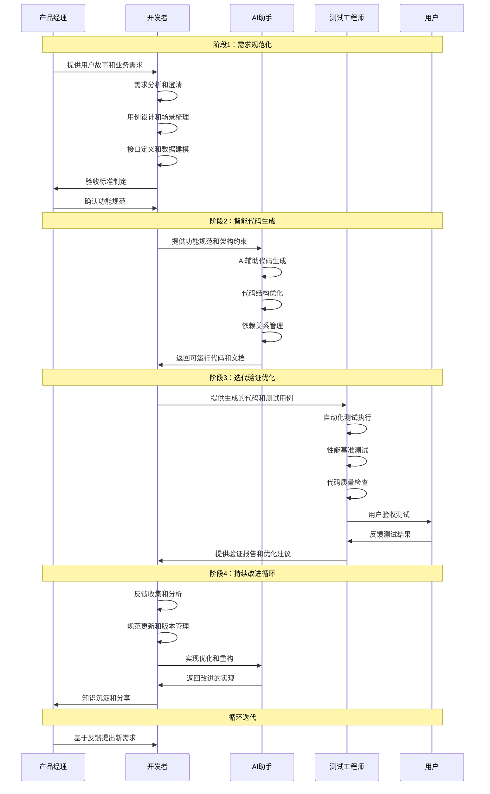

# 第1章 SDD的思想

## 1.1 开发范式的根本性转变

### 从代码驱动到规范驱动

在传统的软件开发中，我们习惯于这样的流程：

```
需求 → 设计 → 编码 → 测试 → 部署
```

这种"代码驱动"的方式看似直观，但存在诸多问题：

- **需求理解偏差**：从需求到代码的转换过程中，信息损失严重
- **质量难以保证**：代码质量很大程度上依赖于开发者的个人能力
- **维护成本高昂**：缺乏清晰的规范，后期维护困难重重
- **团队协作低效**：不同角色之间缺乏统一的沟通语言

而SDD（Specification-Driven Development，规范驱动开发）提出了一种全新的范式：

```
需求 → 规范 → 验证 → 实现 → 部署
```

在这种"规范驱动"的方式中：

- **规范是第一性的**：所有的开发活动都围绕规范展开
- **验证先于实现**：在写代码之前，先定义如何验证
- **自动化程度更高**：规范可以自动生成代码、测试和文档
- **质量内置**：质量不是事后检查，而是设计时就确保的

### AI时代的开发新常态

随着AI技术的成熟，软件开发正在发生深刻变化：

**传统时代**：人写代码，机器执行代码
**AI时代**：人写规范，AI写代码，机器执行代码

这种变化带来了几个重要启示：

1. **抽象层次提升**：开发者需要在更高的抽象层次上思考问题
2. **沟通方式改变**：与AI协作需要更精确、更结构化的表达
3. **技能要求转变**：从"会写代码"转向"会写规范"
4. **质量标准提高**：AI生成的代码质量往往超过人工编写

### 为什么规范比代码更重要

在AI时代，规范的重要性远超代码，原因如下：

**1. 规范是意图的精确表达**

代码是"怎么做"，规范是"做什么"。在AI能够自动生成代码的今天，清晰表达"做什么"比知道"怎么做"更重要。

**2. 规范是沟通的通用语言**

无论是产品经理、设计师、开发者还是AI，都能理解规范。规范成为了跨角色、跨系统的通用语言。

**3. 规范是质量的根本保证**

好的规范天然包含了质量要求。当AI根据规范生成代码时，质量标准已经内置其中。

**4. 规范是变化的稳定锚点**

需求会变化，技术会演进，但核心的业务规范相对稳定。以规范为中心的开发方式更能适应变化。

## 1.2 规范驱动开发的核心概念

### 什么是规范

在SDD中，规范（Specification）不是传统意义上的文档，而是一种**可执行的、可验证的、结构化的需求描述**。

一个好的规范应该具备以下特征：

**1. 可执行性（Executable）**
```yaml
# 示例：用户登录规范
feature: 用户登录
  scenario: 成功登录
    given: 用户已注册
    when: 输入正确的用户名和密码
    then: 系统返回登录成功状态
    and: 生成有效的访问令牌
```

**2. 可验证性（Verifiable）**
```python
# 自动生成的测试用例
def test_user_login_success():
    user = create_registered_user()
    response = login(user.username, user.password)
    assert response.status == "success"
    assert response.token is not None
```

**3. 结构化（Structured）**
```json
{
  "api": "/api/login",
  "method": "POST",
  "input": {
    "username": "string",
    "password": "string"
  },
  "output": {
    "status": "success|error",
    "token": "string?",
    "message": "string?"
  }
}
```

### SDD的核心原则

SDD方法论建立在以下核心原则之上：

**1. 规范先行（Specification First）**

在写任何代码之前，先写规范。规范是设计的起点，也是验证的标准。

**2. 验证驱动（Verification Driven）**

每个规范都必须是可验证的。验证不是事后的检查，而是设计的一部分。

**3. 自动化优先（Automation First）**

能自动化的就不要手工做。从规范到代码，从代码到测试，尽可能实现自动化。

**4. 迭代改进（Iterative Improvement）**

规范不是一次性的，而是在实践中不断完善的。每次迭代都要更新规范。

## 1.3 SDD的工作流程

SDD的标准工作流程包含四个核心阶段：

#### 工作流程概览表

| 阶段 | 目标 | 输入 | 输出 | 关键活动 |
|------|----|----|----|---------|
| **阶段1：需求规范化** | 将模糊的需求转化为精确的规范 | 用户故事、业务需求、产品原型 | 结构化的功能规范、接口定义、验收标准 | • 需求分析和澄清<br>• 用例设计和场景梳理<br>• 接口定义和数据建模<br>• 验收标准制定 |
| **阶段2：智能代码生成** | 基于规范自动生成高质量代码 | 功能规范、架构约束、技术选型 | 可运行的代码、单元测试、API文档 | • AI辅助代码生成<br>• 代码结构优化<br>• 依赖关系管理<br>• 文档自动生成 |
| **阶段3：迭代验证优化** | 验证实现是否符合规范，持续优化 | 生成的代码、测试用例、性能要求 | 验证报告、优化建议、问题清单 | • 自动化测试执行<br>• 性能基准测试<br>• 代码质量检查<br>• 用户验收测试 |
| **阶段4：持续改进循环** | 基于反馈持续改进规范和实现 | 验证结果、用户反馈、运行数据 | 更新的规范、改进的实现、经验总结 | • 反馈收集和分析<br>• 规范更新和版本管理<br>• 实现优化和重构<br>• 知识沉淀和分享 |

#### 工作流程时序图



#### 详细阶段说明

**阶段1：需求规范化**

将模糊的需求转化为精确的规范，这是整个SDD流程的基础。在这个阶段，开发团队需要与产品经理密切协作，确保对需求的理解准确无误。

**阶段2：智能代码生成**

基于第一阶段产生的规范，利用AI工具自动生成高质量的代码。这个阶段大大提高了开发效率，同时确保代码质量的一致性。

**阶段3：迭代验证优化**

对生成的代码进行全面验证，包括功能测试、性能测试和用户验收测试。这个阶段确保实现完全符合规范要求。

**阶段4：持续改进循环**

基于验证结果和用户反馈，持续改进规范和实现。这个阶段体现了SDD的迭代改进特性，确保产品质量的持续提升。

## 1.4 SDD在AI时代的独特价值

### 解决AI协作的核心挑战

与AI协作开发面临的主要挑战及SDD解决方案：

| 核心挑战 | 问题描述 | SDD解决方案 |
|---------|---------|------------|
| **意图传达不准确** | 传统的自然语言描述往往模糊不清，AI难以准确理解开发者的真实意图 | 通过结构化的规范语言，提供精确、无歧义的意图表达方式 |
| **代码质量不可控** | AI生成的代码质量参差不齐，缺乏统一的质量标准 | 在规范中内置质量要求，让AI按照预定标准生成代码 |
| **测试覆盖不完整** | AI往往只关注功能实现，忽略边界条件和异常处理 | 规范即测试，确保每个功能点都有对应的验证用例 |
| **维护成本高昂** | AI生成的代码缺乏清晰的设计思路，后期维护困难 | 规范作为设计文档，为后期维护提供清晰的指导 |

### 提升开发效率的三个维度

**1. 沟通效率**

- **统一语言**：规范成为所有角色的共同语言
- **减少误解**：结构化表达减少沟通中的歧义
- **快速对齐**：通过规范快速达成共识

**2. 开发效率**

- **自动生成**：从规范自动生成代码、测试、文档
- **质量内置**：开发过程中自动保证质量
- **快速迭代**：规范变更快速反映到实现

**3. 维护效率**

- **清晰设计**：规范提供清晰的设计思路
- **完整测试**：自动生成的测试确保修改安全
- **文档同步**：规范、代码、文档自动保持同步

## 1.5 赋能非职业程序员

SDD特别适合非职业程序员，因为它：

**1. 降低技术门槛**

- 专注于"做什么"而不是"怎么做"
- 用自然语言和结构化描述替代复杂的编程语法
- AI承担大部分技术实现工作

**2. 提供清晰路径**

- 从需求到实现的每一步都有明确指导
- 标准化的流程减少决策负担
- 内置的质量保证机制

**3. 支持快速学习**

- 通过规范理解系统设计
- 通过生成的代码学习编程实践
- 通过验证过程掌握质量标准

## 1.6 九条宪法原则

以下九条原则构成了SDD方法论的核心基础，被称为"SDD宪法"：

### 原则1：规范即设计（Specification as Design）

**核心思想**：规范不是设计的描述，规范就是设计本身。

**实践要点**：
- 规范必须包含所有设计决策
- 规范的变更就是设计的变更
- 规范是系统的唯一权威描述

**示例**：
```yaml
# 不是描述设计，而是设计本身
user_service:
  authentication:
    method: JWT
    expiry: 24h
    refresh: true
  authorization:
    model: RBAC
    permissions: [read, write, admin]
```

### 原则2：验证即质量（Verification as Quality）

**核心思想**：质量不是检查出来的，而是验证出来的。

**实践要点**：
- 每个功能都必须有对应的验证用例
- 验证用例必须在实现之前定义
- 验证通过是交付的唯一标准

**示例**：
```gherkin
# 验证用例先于实现
Scenario: 用户密码重置
  Given 用户忘记了密码
  When 用户请求密码重置
  Then 系统发送重置邮件
  And 邮件包含有效的重置链接
  And 链接24小时内有效
```

### 原则3：自动化即效率（Automation as Efficiency）

**核心思想**：能自动化的就不要手工做，自动化是效率的根本保证。

**实践要点**：
- 从规范到代码的自动生成
- 从代码到测试的自动生成
- 从测试到部署的自动化流程

**示例**：
```yaml
# 自动化流程定义
automation:
  code_generation:
    trigger: specification_change
    target: [api, models, tests]
  deployment:
    trigger: tests_passed
    environment: [staging, production]
```

### 原则4：迭代即改进（Iteration as Improvement）

**核心思想**：没有完美的规范，只有不断改进的规范。

**实践要点**：
- 规范必须支持版本管理
- 每次迭代都要更新规范
- 从实践中学习，持续优化规范

**示例**：
```yaml
# 规范版本管理
version: 2.1.0
changelog:
  - 2.1.0: 增加用户权限管理
  - 2.0.0: 重构认证机制
  - 1.0.0: 初始版本
```

### 原则5：简单即美（Simplicity as Beauty）

**核心思想**：最好的规范是最简单的规范，复杂性是设计的敌人。

**实践要点**：
- 优先选择简单的解决方案
- 避免过度设计和过早优化
- 用最少的概念表达最多的含义

**示例**：
```yaml
# 简单清晰的规范
api:
  endpoint: /users
  methods: [GET, POST, PUT, DELETE]
  auth: required
```

### 原则6：可观察即可控（Observability as Control）

**核心思想**：系统的行为必须是可观察的，可观察才能可控。

**实践要点**：
- 每个功能都要有明确的输入输出
- 系统状态变化必须可追踪
- 错误和异常必须可诊断

**示例**：
```yaml
# 可观察性规范
logging:
  level: INFO
  format: JSON
  fields: [timestamp, user_id, action, result]
metrics:
  - response_time
  - error_rate
  - user_activity
```

### 原则7：协作即力量（Collaboration as Power）

**核心思想**：好的规范促进协作，协作产生更好的规范。

**实践要点**：
- 规范必须是团队共同创建的
- 不同角色都能理解和贡献规范
- 规范是沟通和协作的工具

**示例**：
```yaml
# 协作友好的规范
stakeholders:
  product_manager: 定义业务需求
  designer: 设计用户体验
  developer: 实现技术方案
  tester: 验证功能质量
```

### 原则8：反馈即学习（Feedback as Learning）

**核心思想**：快速反馈是学习的基础，学习是改进的动力。

**实践要点**：
- 建立快速反馈机制
- 从用户反馈中学习
- 将学习成果反映到规范中

**示例**：
```yaml
# 反馈机制
feedback:
  user_testing: weekly
  performance_monitoring: real_time
  code_review: per_commit
  retrospective: sprint_end
```

### 原则9：价值即目标（Value as Goal）

**核心思想**：一切技术手段都要服务于价值创造，价值是最终目标。

**实践要点**：
- 每个功能都有明确的价值主张
- 技术选择要服务于业务价值
- 持续评估和优化价值交付

**示例**：
```yaml
# 价值导向的规范
value_proposition:
  user_benefit: 提升工作效率50%
  business_impact: 减少客服成本30%
  technical_debt: 降低维护成本20%
```

## 1.7 SDD思维模式的转变

### 从实现思维到规范思维

| 维度 | 传统实现思维 | SDD规范思维 |
|---|---|---|
| 关注点 | 怎么做 | 做什么 |
| 出发点 | 技术角度 | 需求角度 |
| 核心产出 | 代码 | 规范 |
| 质量保障 | 事后检查 | 设计内置 |

### 从个人开发到协作开发

| 维度 | 个人开发模式 | 协作开发模式 |
|---|---|---|
| 依赖 | 个人经验 | 共同规范 |
| 知识形态 | 隐性知识 | 显性知识 |
| 沟通 | 成本高 | 高效 |
| 交接 | 困难 | 知识共享、顺畅交接 |

### 从手工作业到智能协作

| 维度 | 手工作业模式 | 智能协作模式 |
|---|---|---|
| 代码 | 人工编写所有代码 | AI辅助代码生成 |
| 测试 | 手动执行测试 | 自动化测试执行 |
| 文档 | 人工维护文档 | 文档自动同步 |
| 关注点 | 重复性工作多 | 专注创造性工作 |

## 本章小结

SDD不仅仅是一套开发方法，更是一种思维方式的根本转变。它要求我们：

1. **转变关注点**：从"怎么做"转向"做什么"
2. **提升抽象层次**：从代码层面转向规范层面
3. **拥抱自动化**：让AI成为开发的得力助手
4. **注重协作**：用规范作为团队协作的共同语言
5. **持续改进**：在实践中不断完善方法论

在接下来的章节中，我们将通过具体的案例来展示SDD方法论的实际应用，帮助你真正掌握这种新的开发范式。

记住：**在AI时代，最重要的不是学会写代码，而是学会写规范。**