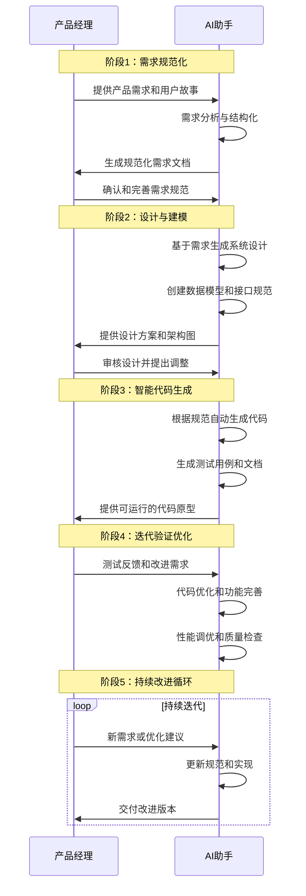
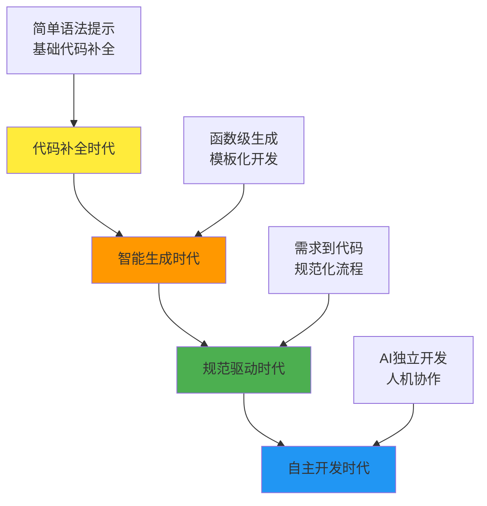
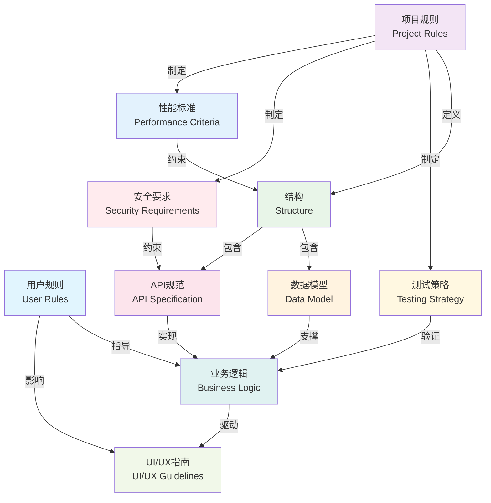
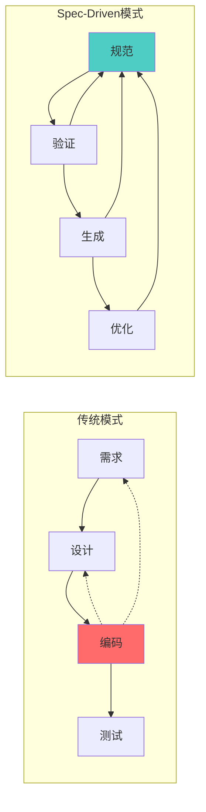
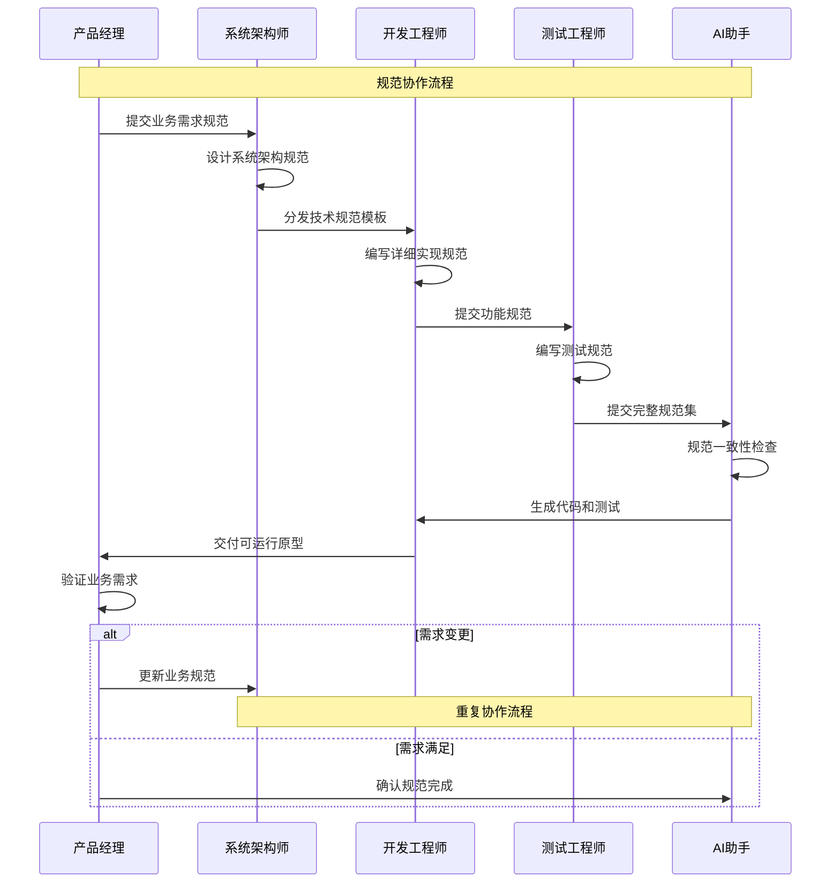

# 第2章 AI IDE时代的开发革命

## 2.1 SDD开发流程与工具生态

### SDD标准开发流程

在AI IDE时代，SDD（规范驱动开发）重新定义了软件开发的标准流程。与传统的瀑布式或敏捷开发不同，SDD强调"规范先行"的理念，通过清晰的规范定义来驱动整个开发过程。

#### SDD核心开发流程



#### SDD流程的核心特点

**1. 需求规范化（Requirement Specification）**
- **目标**：将模糊的业务需求转化为清晰、可执行的技术规范
- **输入**：用户故事、业务需求、功能描述
- **输出**：结构化需求文档、用例规范、验收标准
- **关键活动**：
  - 需求澄清和细化
  - 用户故事标准化（WHO-GIVEN-WHEN-THEN-SHALL框架）
  - 功能边界定义
  - 非功能性需求识别

**2. 智能代码生成（Intelligent Code Generation）**
- **目标**：基于规范自动生成高质量、可维护的代码
- **输入**：技术规范、设计文档、接口定义
- **输出**：可运行代码、单元测试、API文档
- **关键活动**：
  - 架构设计自动化
  - 代码模板生成
  - 测试用例自动创建
  - 文档同步生成

**3. 迭代验证优化（Iterative Validation & Optimization）**
- **目标**：通过快速迭代确保产品质量和用户体验
- **输入**：用户反馈、测试结果、性能数据
- **输出**：优化后的代码、改进的功能、更新的文档
- **关键活动**：
  - 功能验证测试
  - 用户体验评估
  - 性能优化调整
  - 代码质量提升

**4. 持续改进循环（Continuous Improvement Loop）**
- **目标**：建立可持续的产品演进机制
- **输入**：市场反馈、技术演进、业务变化
- **输出**：产品路线图、技术债务清理、能力提升
- **关键活动**：
  - 需求变更管理
  - 技术栈升级
  - 团队能力建设
  - 知识积累沉淀

### 主流AI IDE工具对比

在SDD开发流程中，选择合适的AI IDE工具至关重要。以下是当前主流AI IDE工具的详细对比：

#### 工具对比矩阵

| 特性/工具 | Trae AI | Cursor | GitHub Copilot | Replit | CodeWhisperer |
|-----------|---------|--------|----------------|--------|--------------|
| **SDD支持度** | ⭐⭐⭐⭐⭐ | ⭐⭐⭐⭐ | ⭐⭐⭐ | ⭐⭐⭐ | ⭐⭐⭐ |
| **规范驱动** | 原生支持 | 部分支持 | 需配置 | 基础支持 | 需配置 |
| **代码生成质量** | ⭐⭐⭐⭐⭐ | ⭐⭐⭐⭐ | ⭐⭐⭐⭐ | ⭐⭐⭐ | ⭐⭐⭐⭐ |
| **多语言支持** | ⭐⭐⭐⭐⭐ | ⭐⭐⭐⭐ | ⭐⭐⭐⭐⭐ | ⭐⭐⭐⭐ | ⭐⭐⭐⭐ |
| **学习曲线** | 中等 | 简单 | 简单 | 简单 | 中等 |
| **团队协作** | ⭐⭐⭐⭐⭐ | ⭐⭐⭐ | ⭐⭐⭐ | ⭐⭐⭐⭐ | ⭐⭐⭐ |
| **定制化程度** | ⭐⭐⭐⭐⭐ | ⭐⭐⭐ | ⭐⭐ | ⭐⭐⭐ | ⭐⭐⭐ |
| **价格** | 合理 | 中等 | 低 | 低 | 中等 |

#### 详细工具分析

**Trae AI**
- **优势**：
  - 原生支持SDD开发流程
  - 强大的规范解析和代码生成能力
  - 优秀的团队协作功能
  - 高度可定制的开发环境
- **适用场景**：企业级项目、复杂系统开发、团队协作
- **最佳实践**：适合需要严格规范管理的项目

**Cursor**
- **优势**：
  - 用户界面友好，学习成本低
  - 强大的代码补全和重构能力
  - 良好的VS Code兼容性
- **适用场景**：个人开发、中小型项目、快速原型
- **最佳实践**：适合传统开发者转向AI辅助开发

**GitHub Copilot**
- **优势**：
  - 广泛的语言和框架支持
  - 与GitHub生态深度集成
  - 成本相对较低
- **适用场景**：开源项目、个人学习、代码补全
- **最佳实践**：适合作为代码补全工具使用

### 传统IDE vs AI IDE的核心差异

#### 开发范式对比

| 维度 | 传统IDE | AI IDE |
|------|---------|--------|
| **核心理念** | 代码编写工具 | 智能开发伙伴 |
| **工作方式** | 手动编码 | 规范驱动+AI生成 |
| **质量保证** | 人工审查+测试 | AI辅助+自动化验证 |
| **学习曲线** | 语法+框架+最佳实践 | 规范编写+AI协作 |
| **生产效率** | 线性增长 | 指数级提升 |
| **错误处理** | 调试+修复 | 预防+智能修复 |
| **知识管理** | 个人经验 | AI知识库+团队共享 |

#### 具体差异分析

**1. 代码编写方式**
- **传统IDE**：开发者逐行编写代码，依赖语法高亮、代码补全等基础功能
- **AI IDE**：开发者描述需求和规范，AI自动生成大段代码，开发者进行审查和调整

**2. 错误预防机制**
- **传统IDE**：主要依靠编译器检查和单元测试发现问题
- **AI IDE**：在代码生成阶段就融入最佳实践，主动避免常见错误

**3. 知识获取方式**
- **传统IDE**：开发者需要查阅文档、搜索解决方案
- **AI IDE**：AI助手提供即时的技术建议和解决方案

**4. 团队协作模式**
- **传统IDE**：通过版本控制和代码审查进行协作
- **AI IDE**：通过共享规范和AI辅助实现更高效的协作

### AI辅助编程的发展趋势

#### 技术演进路径



#### 未来发展方向

**1. 更智能的需求理解**
- 自然语言需求解析能力持续提升
- 多模态输入支持（语音、图像、手势）
- 上下文感知和意图推理

**2. 更高质量的代码生成**
- 架构级代码生成能力
- 性能优化自动化
- 安全性内置保障

**3. 更完善的开发生态**
- AI驱动的测试自动化
- 智能化的部署和运维
- 持续学习和改进机制

**4. 更深度的人机协作**
- AI作为开发团队成员
- 个性化的开发助手
- 知识传承和技能提升

#### 对开发者的影响

**技能要求变化**
- 从"会写代码"到"会写规范"
- 从"技术实现"到"需求分析"
- 从"个人能力"到"协作能力"

**工作方式转变**
- 更多时间用于思考和设计
- 更少时间用于重复性编码
- 更强调创新和问题解决

**职业发展路径**
- 规范架构师
- AI协作专家
- 产品技术融合角色

### 小结

SDD开发流程与AI IDE工具的结合，正在重新定义软件开发的未来。通过规范驱动的方式，我们可以：

1. **提升开发效率**：从需求到代码的转换更加直接和高效
2. **保证代码质量**：AI生成的代码往往遵循最佳实践
3. **降低技术门槛**：非技术背景的人员也能参与开发过程
4. **促进团队协作**：统一的规范语言让沟通更加顺畅

在下一节中，我们将深入探讨SDD的核心概念体系，帮助您更好地理解和应用这一革命性的开发方法论。

## 2.2 SDD核心概念体系

### SDD十大核心概念

SDD（规范驱动开发）建立在十个核心概念之上，这些概念构成了完整的开发方法论体系。理解和掌握这些概念是成功实施SDD的关键。

#### 1. User Rules（用户规则）

**定义**：用户规则是描述用户行为、权限和交互方式的规范集合。

**核心要素**：
- **用户角色定义**：明确不同用户类型及其特征
- **权限边界**：定义用户可以执行的操作范围
- **交互规范**：规定用户与系统的交互方式
- **行为约束**：限制用户的不当操作

**示例**：
```yaml
用户规则:
  管理员:
    权限:
      - 创建用户
      - 删除用户
      - 修改系统设置
    约束:
      - 不能删除自己
      - 关键操作需要双重验证
  
  普通用户:
    权限:
      - 查看个人数据
      - 编辑个人资料
    约束:
      - 不能访问管理面板
      - API调用有频率限制
```

#### 2. Project Rules（项目规则）

**定义**：项目规则定义了项目的整体约束、标准和治理机制。

**核心要素**：
- **代码规范**：编码风格、命名约定、文件组织
- **质量标准**：测试覆盖率、性能指标、安全要求
- **流程规范**：开发流程、审查机制、发布标准
- **技术约束**：技术栈选择、架构原则、依赖管理

**示例**：
```yaml
项目规则:
  代码标准:
    命名规范: "驼峰命名法"
    函数最大长度: 50
    测试覆盖率最低要求: 80
  
  架构:
    模式: "微服务"
    数据库: "postgresql"
    缓存: "redis"
  
  安全:
    身份验证: "jwt"
    加密方式: "aes-256"
    审计日志: true
```

#### 3. Structure（结构）

**定义**：Structure定义了系统的组织架构和组件关系。

**核心要素**：
- **模块划分**：系统功能模块的划分和边界
- **层次结构**：系统的分层架构设计
- **依赖关系**：模块间的依赖和调用关系
- **接口定义**：模块间的通信接口规范

**示例**：
```yaml
结构:
  分层:
    - 表现层: "网页界面, 移动应用"
    - 业务层: "用户服务, 订单服务"
    - 数据层: "用户仓储, 订单仓储"
    - 基础设施层: "数据库, 缓存, 消息队列"
  
  模块:
    用户服务:
      依赖: ["用户仓储", "认证服务"]
      接口: ["用户API", "用户事件"]
    
    订单服务:
      依赖: ["订单仓储", "支付服务"]
      接口: ["订单API", "订单事件"]
```

#### 4. Data Model（数据模型）

**定义**：Data Model描述了系统中数据的结构、关系和约束。

**核心要素**：
- **实体定义**：业务实体的属性和特征
- **关系映射**：实体间的关联关系
- **约束规则**：数据完整性和业务规则
- **生命周期**：数据的创建、更新、删除规则

**示例**：
```yaml
数据模型:
  实体:
    用户:
      属性:
        编号: {类型: "uuid", 主键: true}
        邮箱: {类型: "string", 唯一: true, 必填: true}
        创建时间: {类型: "timestamp", 自动生成: true}
      
      关系:
        订单: {类型: "一对多", 目标: "订单"}
    
    订单:
      属性:
        编号: {类型: "uuid", 主键: true}
        用户编号: {类型: "uuid", 外键: "用户.编号"}
        总金额: {类型: "decimal", 精度: 10, 小数位: 2}
      
      约束:
        - 总金额为正: "总金额 > 0"
```

#### 5. API Specification（API规范）

**定义**：API Specification定义了系统对外提供的接口规范。

**核心要素**：
- **端点定义**：API路径、方法、参数
- **数据格式**：请求和响应的数据结构
- **错误处理**：错误码和错误信息规范
- **认证授权**：API访问控制机制

**示例**：
```yaml
API规范:
  端点:
    创建用户:
      方法: POST
      路径: "/api/users"
      请求体:
        类型: "object"
        属性:
          邮箱: {类型: "string", 格式: "email"}
          密码: {类型: "string", 最小长度: 8}
      
      响应:
        201:
          描述: "用户创建成功"
          内容:
            类型: "object"
            属性:
              编号: {类型: "string"}
              邮箱: {类型: "string"}
        
        400:
          描述: "输入无效"
          内容:
            类型: "object"
            属性:
              错误: {类型: "string"}
```

#### 6. Business Logic（业务逻辑）

**定义**：Business Logic描述了系统的核心业务规则和处理流程。

**核心要素**：
- **业务规则**：核心业务约束和计算逻辑
- **工作流程**：业务处理的步骤和条件
- **决策规则**：业务决策的判断标准
- **异常处理**：业务异常的处理机制

**示例**：
```yaml
业务逻辑:
  订单处理:
    规则:
      - 库存检查: "产品.库存 >= 订单.数量"
      - 支付验证: "支付.金额 == 订单.总额"
      - 折扣计算: "如果 用户.VIP 则 折扣 = 0.1 否则 折扣 = 0"
    
    工作流程:
      1. 验证订单数据
      2. 检查库存
      3. 计算总额
      4. 处理支付
      5. 更新库存
      6. 发送确认
    
    异常:
      库存不足:
        操作: "拒绝订单"
        消息: "产品缺货"
      
      支付失败:
        操作: "暂停订单"
        消息: "支付处理失败"
```

#### 7. UI/UX Guidelines（用户界面/用户体验指南）

**定义**：UI/UX Guidelines定义了用户界面设计和用户体验的标准。

**核心要素**：
- **设计原则**：界面设计的基本原则和理念
- **组件规范**：UI组件的样式和行为标准
- **交互模式**：用户交互的标准模式
- **可访问性**：无障碍设计要求

**示例**：
```yaml
界面体验指南:
  设计原则:
    - 简洁性: "保持界面清洁整齐"
    - 一致性: "在应用中使用一致的模式"
    - 反馈性: "为用户操作提供清晰反馈"
  
  组件:
    按钮:
      主要:
        背景色: "#007bff"
        文字色: "#ffffff"
        圆角: "4px"
      
      次要:
        背景色: "#6c757d"
        文字色: "#ffffff"
        圆角: "4px"
  
  交互:
    表单验证:
      实时验证: true
      错误显示: "内联"
      成功反馈: "勾选图标"
```

#### 8. Testing Strategy（测试策略）

**定义**：Testing Strategy定义了系统测试的方法、标准和流程。

**核心要素**：
- **测试层次**：单元测试、集成测试、系统测试
- **测试类型**：功能测试、性能测试、安全测试
- **覆盖率要求**：代码覆盖率和功能覆盖率标准
- **自动化策略**：测试自动化的范围和方法

**示例**：
```yaml
测试策略:
  层次:
    单元测试:
      覆盖率目标: 90
      工具: ["jest", "pytest"]
      运行频率: "每次提交"
    
    集成测试:
      覆盖率目标: 80
      工具: ["postman", "cypress"]
      运行频率: "拉取请求时"
    
    端到端测试:
      覆盖率目标: 70
      工具: ["selenium", "playwright"]
      运行频率: "发布前"
  
  自动化:
    持续集成集成: true
    并行执行: true
    测试数据管理: "自动化"
```

#### 9. Security Requirements（安全要求）

**定义**：Security Requirements定义了系统的安全标准和防护措施。

**核心要素**：
- **认证机制**：用户身份验证方法
- **授权控制**：访问权限管理
- **数据保护**：数据加密和隐私保护
- **安全监控**：安全事件检测和响应

**示例**：
```yaml
安全要求:
  身份验证:
    方法: "多重验证"
    会话超时: 3600
    密码策略:
      最小长度: 12
      需要特殊字符: true
      需要数字: true
  
  授权:
    模型: "基于角色的访问控制"
    原则: "最小权限"
    审计跟踪: true
  
  数据保护:
    静态加密: "aes_256"
    传输加密: "tls_1_3"
    个人信息处理: "GDPR合规"
  
  监控:
    入侵检测: true
    漏洞扫描: "每周"
    安全日志: "全面"
```

#### 10. Performance Criteria（性能标准）

**定义**：Performance Criteria定义了系统的性能要求和优化目标。

**核心要素**：
- **响应时间**：系统响应的时间要求
- **吞吐量**：系统处理能力的指标
- **资源利用**：CPU、内存、存储的使用标准
- **可扩展性**：系统扩展能力的要求

**示例**：
```yaml
性能标准:
  响应时间:
    API端点: "< 200ms"
    数据库查询: "< 100ms"
    页面加载: "< 2s"
  
  吞吐量:
    并发用户: 10000
    每秒请求数: 5000
    每分钟事务数: 50000
  
  资源利用:
    CPU使用率: "< 70%"
    内存使用率: "< 80%"
    磁盘IO: "< 60%"
  
  可扩展性:
    水平扩展: true
    自动扩展触发器:
      CPU阈值: 70
      内存阈值: 80
```

### 概念间的关系和协作

#### 概念关系图



#### 协作机制

**1. 规范驱动的开发流程**
- User Rules和Project Rules作为顶层约束
- Structure提供架构框架
- Data Model和API Specification定义接口
- Business Logic实现核心功能
- 其他概念提供质量保障

**2. 一致性保证机制**
- 所有概念都必须与User Rules和Project Rules保持一致
- Data Model的变更会影响API Specification和Business Logic
- Performance Criteria会影响Structure的设计决策

**3. 变更传播机制**
- 任何概念的变更都会触发相关概念的检查和更新
- AI助手会自动识别变更影响范围
- 提供变更建议和冲突解决方案

### 实际应用指南

#### 概念应用的最佳实践

**1. 渐进式定义**
- 从核心概念开始（User Rules, Project Rules）
- 逐步细化具体概念（Data Model, API Specification）
- 最后完善质量概念（Testing Strategy, Security Requirements）

**2. 迭代式完善**
- 初期定义基本框架
- 在开发过程中不断细化和调整
- 基于反馈持续优化概念定义

**3. 团队协作**
- 不同角色负责不同概念的定义
- 定期进行概念一致性检查
- 建立概念变更的沟通机制

#### 常见问题和解决方案

**问题1：概念定义过于复杂**
- **解决方案**：采用分层定义，先定义核心要素，再逐步细化
- **最佳实践**：使用模板和示例指导概念定义

**问题2：概念间存在冲突**
- **解决方案**：建立概念优先级机制，高层概念优先
- **最佳实践**：使用自动化工具检测概念冲突

**问题3：概念更新不及时**
- **解决方案**：建立概念变更通知机制
- **最佳实践**：将概念更新纳入开发流程

## 2.3 Kiro的Spec-Driven开发最佳实践

### 权力倒置：从代码驱动到规范驱动

#### 传统开发模式的局限性

在传统的软件开发中，代码往往是项目的核心和真理的唯一来源。这种"代码即真理"的模式存在诸多问题：

**1. 需求理解偏差**
- 开发者对需求的理解可能与产品经理的意图存在差异
- 需求变更时，代码修改的成本高昂
- 缺乏统一的需求表达语言

**2. 沟通效率低下**
- 非技术人员难以理解代码逻辑
- 技术讨论往往局限在代码层面
- 业务逻辑与技术实现混杂

**3. 质量控制困难**
- 代码质量依赖个人经验和技能
- 缺乏统一的质量标准
- 技术债务积累难以控制

#### Spec-Driven的权力倒置理念

Kiro提出的Spec-Driven开发实现了真正的"权力倒置"：



**核心转变**：
- **权力中心**：从代码转移到规范
- **真理来源**：规范成为系统行为的唯一定义
- **开发流程**：规范驱动代码生成，而非代码驱动需求理解

#### 权力倒置的具体实现

**1. 规范优先原则**
```yaml
# 示例：用户注册功能规范
用户注册规范:
  描述: "用户通过邮箱和密码注册账户"
  
  输入:
    邮箱:
      类型: "string"
      格式: "email"
      必填: true
      验证: "系统中必须唯一"
    
    密码:
      类型: "string"
      最小长度: 8
      必填: true
      验证: "必须包含大写、小写、数字"
  
  输出:
    成功:
      用户ID: "uuid"
      消息: "注册成功"
    
    失败:
      错误代码: "string"
      错误消息: "string"
  
  业务规则:
    - "邮箱在系统中必须唯一"
    - "密码必须满足安全要求"
    - "用户账户创建时状态为'待验证'"
    - "自动发送验证邮件"
  
  副作用:
    - "在数据库中创建用户记录"
    - "发送验证邮件"
    - "记录注册尝试日志"
```

**2. 规范验证机制**
```python
# 自动生成的验证代码
def validate_user_registration_spec(email, password):
    """
    根据规范自动生成的验证函数
    """
    errors = []
    
    # 邮箱格式验证
    if not is_valid_email(email):
        errors.append("Invalid email format")
    
    # 邮箱唯一性验证
    if user_exists(email):
        errors.append("Email already registered")
    
    # 密码强度验证
    if not meets_password_requirements(password):
        errors.append("Password does not meet security requirements")
    
    return errors
```

**3. 代码生成策略**
```python
# 根据规范自动生成的API端点
@app.route('/api/users/register', methods=['POST'])
def register_user():
    """
    用户注册API - 根据user_registration_spec自动生成
    """
    data = request.get_json()
    
    # 输入验证（根据规范生成）
    validation_errors = validate_user_registration_spec(
        data.get('email'), 
        data.get('password')
    )
    
    if validation_errors:
        return jsonify({
            'error_code': 'VALIDATION_FAILED',
            'error_message': '; '.join(validation_errors)
        }), 400
    
    # 业务逻辑执行（根据规范生成）
    try:
        user_id = create_user(data['email'], data['password'])
        send_verification_email(data['email'])
        log_registration_attempt(data['email'], 'SUCCESS')
        
        return jsonify({
            'user_id': user_id,
            'message': 'Registration successful'
        }), 201
        
    except Exception as e:
        log_registration_attempt(data['email'], 'FAILED')
        return jsonify({
            'error_code': 'REGISTRATION_FAILED',
            'error_message': str(e)
        }), 500
```

### 可执行规范的编写技巧

#### 什么是可执行规范

可执行规范是指能够被AI直接理解和转换为代码的规范文档。它具有以下特征：

**1. 结构化表达**
- 使用标准化的格式（YAML、JSON等）
- 明确的字段定义和类型约束
- 层次化的信息组织

**2. 语义明确性**
- 避免歧义的表达
- 使用精确的业务术语
- 提供充分的上下文信息

**3. 完整性保证**
- 覆盖所有必要的业务场景
- 包含异常处理逻辑
- 定义清晰的边界条件

#### 可执行规范的编写框架

**1. GIVEN-WHEN-THEN-SHALL框架**

这是Kiro推荐的规范编写框架，确保规范的完整性和可执行性：

```yaml
规范模板:
  名称: "功能名称"
  描述: "功能描述"
  
  给定:
    # 前置条件和上下文
    前置条件: []
    上下文: {}
    假设: []
  
  当:
    # 触发条件和输入
    触发器: ""
    输入: {}
    用户操作: []
  
  那么:
    # 期望的输出和行为
    输出: {}
    副作用: []
    状态变化: []
  
  应当:
    # 必须满足的约束和规则
    业务规则: []
    质量要求: []
    合规要求: []
```

**2. 实际应用示例**

```yaml
# 电商订单处理规范
订单处理规范:
  名称: "订单处理"
  描述: "用户提交订单后的完整处理流程"
  
  给定:
    前置条件:
      - "用户已登录"
      - "购物车中有商品"
      - "商品库存充足"
    
    上下文:
      用户类型: "注册用户"
      购物车状态: "非空"
      库存状态: "可用"
    
    假设:
      - "支付系统正常运行"
      - "库存数据实时更新"
  
  当:
    触发器: "用户点击'提交订单'按钮"
    
    输入:
      收货地址:
        类型: "object"
        必填: true
        属性:
          街道: {类型: "string", 必填: true}
          城市: {类型: "string", 必填: true}
          邮政编码: {类型: "string", 必填: true}
      
      支付方式:
        类型: "string"
        枚举: ["信用卡", "支付宝", "银行转账"]
        必填: true
      
      配送选项:
        类型: "string"
        枚举: ["标准", "快递", "隔夜"]
        默认: "标准"
    
    用户操作:
      - "填写配送地址"
      - "选择支付方式"
      - "确认订单信息"
  
  那么:
    输出:
      成功情况:
        订单编号: {类型: "uuid"}
        订单状态: {值: "已确认"}
        预计送达: {类型: "datetime"}
        总金额: {类型: "decimal"}
      
      失败情况:
        错误代码: {类型: "string"}
        错误消息: {类型: "string"}
        建议操作: {类型: "string"}
    
    副作用:
      - "减少商品库存"
      - "创建订单记录"
      - "发送确认邮件"
      - "通知仓库备货"
      - "记录用户行为日志"
    
    状态变化:
      - "购物车状态：清空"
      - "用户状态：有待处理订单"
      - "商品状态：库存减少"
  
  应当:
    业务规则:
      - "订单总金额必须大于0"
      - "配送地址必须在服务范围内"
      - "支付金额必须等于订单总金额"
      - "库存不足时必须拒绝订单"
    
    质量要求:
      - "订单处理时间不超过5秒"
      - "系统可用性99.9%"
      - "数据一致性保证"
    
    合规要求:
      - "符合PCI DSS支付安全标准"
      - "遵守GDPR数据保护规定"
      - "满足税务合规要求"
```

#### 规范编写的最佳实践

**1. 使用标准化模板**

为不同类型的功能创建标准化模板：

```yaml
# API端点规范模板
API端点模板:
  端点: "/api/resource"
  方法: "POST|GET|PUT|DELETE"
  
  身份验证:
    必需: true|false
    类型: "bearer|basic|oauth"
  
  授权:
    角色: []
    权限: []
  
  请求:
    头部: {}
    参数: {}
    主体: {}
  
  响应:
    成功: {}
    错误: {}
  
  验证:
    输入规则: []
    业务规则: []
  
  性能:
    最大响应时间: "200ms"
    速率限制: "100/minute"
```

**2. 分层规范定义**

```yaml
# 分层规范示例
用户管理系统:
  # 系统级规范
  系统级:
    架构: "微服务"
    数据库: "postgresql"
    身份验证: "jwt"
  
  # 服务级规范
  服务级:
    用户服务:
      职责: ["用户增删改查", "身份验证"]
      依赖: ["数据库", "邮件服务"]
      接口: ["用户API"]
  
  # 功能级规范
  功能级:
    用户注册:
      # 详细的功能规范
      规范: "..."
    
    用户登录:
      # 详细的功能规范
      规范: "..."
```

**3. 规范版本管理**

```yaml
# 规范版本控制
规范元数据:
  版本: "1.2.0"
  创建者: "产品经理"
  创建时间: "2024-01-15"
  最后修改: "2024-01-20"
  
  变更日志:
    "1.2.0":
      - "添加了新的支付方式"
      - "优化了错误处理逻辑"
    
    "1.1.0":
      - "增加了订单取消功能"
      - "改进了库存检查机制"
  
  dependencies:
    - "user_service_spec >= 2.0.0"
    - "payment_service_spec >= 1.5.0"
```

### 团队协作中的规范管理

#### 角色分工和职责

**1. 产品经理（Product Manager）**
- **职责**：定义业务需求和用户故事
- **输出**：高层业务规范和用户体验要求
- **工具**：业务规范模板、用户故事框架

**2. 系统架构师（System Architect）**
- **职责**：设计系统架构和技术规范
- **输出**：系统架构规范、技术约束定义
- **工具**：架构设计模板、技术规范框架

**3. 开发工程师（Developer）**
- **职责**：细化技术实现规范
- **输出**：API规范、数据模型定义
- **工具**：API设计工具、代码生成器

**4. 测试工程师（QA Engineer）**
- **职责**：定义测试规范和质量标准
- **输出**：测试用例规范、质量门禁定义
- **工具**：测试规范模板、自动化测试框架

#### 协作流程设计



#### 规范质量保证机制

**1. 规范审查流程**

```yaml
规范评审流程:
  阶段:
    初始评审:
      评审员: ["技术负责人", "产品负责人"]
      标准:
        - "业务需求完整性"
        - "技术可行性"
        - "规范格式正确性"
      
      通过阈值: "2/2"
    
    详细评审:
      评审员: ["高级开发者", "测试负责人", "架构师"]
      标准:
        - "技术实现细节"
        - "测试覆盖度"
        - "性能要求合理性"
        - "安全要求完备性"
      
      通过阈值: "2/3"
    
    最终批准:
      评审员: ["项目经理"]
      标准:
        - "整体一致性"
        - "资源投入合理性"
        - "时间计划可行性"
      
      通过阈值: "1/1"
```

**2. 自动化质量检查**

```python
# 规范质量检查工具
class SpecQualityChecker:
    def __init__(self):
        self.rules = [
            self.check_completeness,
            self.check_consistency,
            self.check_format,
            self.check_dependencies
        ]
    
    def check_completeness(self, spec):
        """检查规范完整性"""
        required_fields = ['given', 'when', 'then', 'shall']
        missing_fields = []
        
        for field in required_fields:
            if field not in spec:
                missing_fields.append(field)
        
        return {
            'passed': len(missing_fields) == 0,
            'issues': missing_fields
        }
    
    def check_consistency(self, spec):
        """检查规范一致性"""
        issues = []
        
        # 检查输入输出一致性
        inputs = spec.get('when', {}).get('inputs', {})
        outputs = spec.get('then', {}).get('outputs', {})
        
        # 检查业务规则与实现的一致性
        business_rules = spec.get('shall', {}).get('business_rules', [])
        
        return {
            'passed': len(issues) == 0,
            'issues': issues
        }
    
    def validate_spec(self, spec):
        """执行完整的规范验证"""
        results = []
        
        for rule in self.rules:
            result = rule(spec)
            results.append(result)
        
        overall_passed = all(r['passed'] for r in results)
        
        return {
            'passed': overall_passed,
            'detailed_results': results
        }
```

**3. 规范变更管理**

```yaml
规范变更管理:
  变更类型:
    破坏性变更:
      定义: "影响现有API或数据结构的变更"
      需要批准: ["技术负责人", "产品负责人", "架构师"]
      通知范围: "所有利益相关者"
      
    功能新增:
      定义: "新增功能或能力"
      需要批准: ["技术负责人", "产品负责人"]
      通知范围: "开发团队"
    
    缺陷修复:
      定义: "修复现有功能的问题"
      需要批准: ["技术负责人"]
      通知范围: "开发团队"
  
  变更流程:
    1. "提交变更请求"
    2. "影响分析评估"
    3. "相关方审批"
    4. "实施变更"
    5. "验证变更效果"
    6. "更新相关文档"
```

### 小结

Kiro的Spec-Driven开发最佳实践为我们提供了一套完整的方法论：

**1. 权力倒置的核心理念**
- 规范成为开发的核心驱动力
- 代码从规范中自动生成
- 业务逻辑与技术实现分离

**2. 可执行规范的编写技巧**
- 使用GIVEN-WHEN-THEN-SHALL框架
- 采用结构化和标准化的表达方式
- 确保规范的完整性和一致性

**3. 团队协作的规范管理**
- 明确的角色分工和职责
- 系统化的协作流程
- 完善的质量保证机制

通过这些最佳实践，团队可以实现真正的规范驱动开发，提高开发效率，保证产品质量，并建立可持续的开发流程。

在下一章中，我们将介绍如何搭建和配置Trae AI IDE环境，让您能够立即开始体验SDD开发的强大威力。