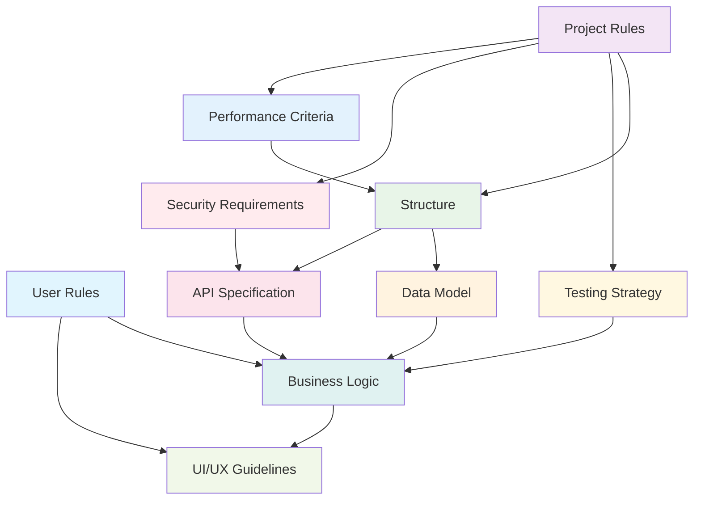

# 第2章 AI IDE时代的开发革命

## 2.1 SDD开发流程与工具生态

### SDD标准开发流程

在AI IDE时代，SDD（规范驱动开发）重新定义了软件开发的标准流程。与传统的瀑布式或敏捷开发不同，SDD强调"规范先行"的理念，通过清晰的规范定义来驱动整个开发过程。

#### SDD核心开发流程


#### SDD流程的核心特点

**1. 需求规范化（Requirement Specification）**
- **目标**：将模糊的业务需求转化为清晰、可执行的技术规范
- **输入**：用户故事、业务需求、功能描述
- **输出**：结构化需求文档、用例规范、验收标准
- **关键活动**：
  - 需求澄清和细化
  - 用户故事标准化（WHO-GIVEN-WHEN-THEN-SHALL框架）
  - 功能边界定义
  - 非功能性需求识别

**2. 智能代码生成（Intelligent Code Generation）**
- **目标**：基于规范自动生成高质量、可维护的代码
- **输入**：技术规范、设计文档、接口定义
- **输出**：可运行代码、单元测试、API文档
- **关键活动**：
  - 架构设计自动化
  - 代码模板生成
  - 测试用例自动创建
  - 文档同步生成

**3. 迭代验证优化（Iterative Validation & Optimization）**
- **目标**：通过快速迭代确保产品质量和用户体验
- **输入**：用户反馈、测试结果、性能数据
- **输出**：优化后的代码、改进的功能、更新的文档
- **关键活动**：
  - 功能验证测试
  - 用户体验评估
  - 性能优化调整
  - 代码质量提升

**4. 持续改进循环（Continuous Improvement Loop）**
- **目标**：建立可持续的产品演进机制
- **输入**：市场反馈、技术演进、业务变化
- **输出**：产品路线图、技术债务清理、能力提升
- **关键活动**：
  - 需求变更管理
  - 技术栈升级
  - 团队能力建设
  - 知识积累沉淀

### 主流AI IDE工具对比

在SDD开发流程中，选择合适的AI IDE工具至关重要。以下是当前主流AI IDE工具的详细对比：

#### 工具对比矩阵

| 特性/工具 | Trae AI | Cursor | GitHub Copilot | Replit | CodeWhisperer |
|-----------|---------|--------|----------------|--------|--------------|
| **SDD支持度** | ⭐⭐⭐⭐⭐ | ⭐⭐⭐⭐ | ⭐⭐⭐ | ⭐⭐⭐ | ⭐⭐⭐ |
| **规范驱动** | 原生支持 | 部分支持 | 需配置 | 基础支持 | 需配置 |
| **代码生成质量** | ⭐⭐⭐⭐⭐ | ⭐⭐⭐⭐ | ⭐⭐⭐⭐ | ⭐⭐⭐ | ⭐⭐⭐⭐ |
| **多语言支持** | ⭐⭐⭐⭐⭐ | ⭐⭐⭐⭐ | ⭐⭐⭐⭐⭐ | ⭐⭐⭐⭐ | ⭐⭐⭐⭐ |
| **学习曲线** | 中等 | 简单 | 简单 | 简单 | 中等 |
| **团队协作** | ⭐⭐⭐⭐⭐ | ⭐⭐⭐ | ⭐⭐⭐ | ⭐⭐⭐⭐ | ⭐⭐⭐ |
| **定制化程度** | ⭐⭐⭐⭐⭐ | ⭐⭐⭐ | ⭐⭐ | ⭐⭐⭐ | ⭐⭐⭐ |
| **价格** | 合理 | 中等 | 低 | 低 | 中等 |

#### 详细工具分析

**Trae AI**
- **优势**：
  - 原生支持SDD开发流程
  - 强大的规范解析和代码生成能力
  - 优秀的团队协作功能
  - 高度可定制的开发环境
- **适用场景**：企业级项目、复杂系统开发、团队协作
- **最佳实践**：适合需要严格规范管理的项目

**Cursor**
- **优势**：
  - 用户界面友好，学习成本低
  - 强大的代码补全和重构能力
  - 良好的VS Code兼容性
- **适用场景**：个人开发、中小型项目、快速原型
- **最佳实践**：适合传统开发者转向AI辅助开发

**GitHub Copilot**
- **优势**：
  - 广泛的语言和框架支持
  - 与GitHub生态深度集成
  - 成本相对较低
- **适用场景**：开源项目、个人学习、代码补全
- **最佳实践**：适合作为代码补全工具使用

### 传统IDE vs AI IDE的核心差异

#### 开发范式对比

| 维度 | 传统IDE | AI IDE |
|------|---------|--------|
| **核心理念** | 代码编写工具 | 智能开发伙伴 |
| **工作方式** | 手动编码 | 规范驱动+AI生成 |
| **质量保证** | 人工审查+测试 | AI辅助+自动化验证 |
| **学习曲线** | 语法+框架+最佳实践 | 规范编写+AI协作 |
| **生产效率** | 线性增长 | 指数级提升 |
| **错误处理** | 调试+修复 | 预防+智能修复 |
| **知识管理** | 个人经验 | AI知识库+团队共享 |

#### 具体差异分析

**1. 代码编写方式**
- **传统IDE**：开发者逐行编写代码，依赖语法高亮、代码补全等基础功能
- **AI IDE**：开发者描述需求和规范，AI自动生成大段代码，开发者进行审查和调整

**2. 错误预防机制**
- **传统IDE**：主要依靠编译器检查和单元测试发现问题
- **AI IDE**：在代码生成阶段就融入最佳实践，主动避免常见错误

**3. 知识获取方式**
- **传统IDE**：开发者需要查阅文档、搜索解决方案
- **AI IDE**：AI助手提供即时的技术建议和解决方案

**4. 团队协作模式**
- **传统IDE**：通过版本控制和代码审查进行协作
- **AI IDE**：通过共享规范和AI辅助实现更高效的协作

### AI辅助编程的发展趋势

#### 技术演进路径


#### 未来发展方向

**1. 更智能的需求理解**
- 自然语言需求解析能力持续提升
- 多模态输入支持（语音、图像、手势）
- 上下文感知和意图推理

**2. 更高质量的代码生成**
- 架构级代码生成能力
- 性能优化自动化
- 安全性内置保障

**3. 更完善的开发生态**
- AI驱动的测试自动化
- 智能化的部署和运维
- 持续学习和改进机制

**4. 更深度的人机协作**
- AI作为开发团队成员
- 个性化的开发助手
- 知识传承和技能提升

#### 对开发者的影响

**技能要求变化**
- 从"会写代码"到"会写规范"
- 从"技术实现"到"需求分析"
- 从"个人能力"到"协作能力"

**工作方式转变**
- 更多时间用于思考和设计
- 更少时间用于重复性编码
- 更强调创新和问题解决

**职业发展路径**
- 规范架构师
- AI协作专家
- 产品技术融合角色

### 小结

SDD开发流程与AI IDE工具的结合，正在重新定义软件开发的未来。通过规范驱动的方式，我们可以：

1. **提升开发效率**：从需求到代码的转换更加直接和高效
2. **保证代码质量**：AI生成的代码往往遵循最佳实践
3. **降低技术门槛**：非技术背景的人员也能参与开发过程
4. **促进团队协作**：统一的规范语言让沟通更加顺畅

在下一节中，我们将深入探讨SDD的核心概念体系，帮助您更好地理解和应用这一革命性的开发方法论。

## 2.2 SDD核心概念体系

### SDD十大核心概念

SDD（规范驱动开发）建立在十个核心概念之上，这些概念构成了完整的开发方法论体系。理解和掌握这些概念是成功实施SDD的关键。

#### 1. User Rules（用户规则）

**定义**：用户规则是描述用户行为、权限和交互方式的规范集合。

**核心要素**：
- **用户角色定义**：明确不同用户类型及其特征
- **权限边界**：定义用户可以执行的操作范围
- **交互规范**：规定用户与系统的交互方式
- **行为约束**：限制用户的不当操作

**示例**：
```yaml
user_rules:
  admin:
    permissions:
      - create_user
      - delete_user
      - modify_system_settings
    constraints:
      - cannot_delete_self
      - requires_2fa_for_critical_operations
  
  regular_user:
    permissions:
      - view_own_data
      - edit_own_profile
    constraints:
      - cannot_access_admin_panel
      - rate_limited_api_calls
```

#### 2. Project Rules（项目规则）

**定义**：项目规则定义了项目的整体约束、标准和治理机制。

**核心要素**：
- **代码规范**：编码风格、命名约定、文件组织
- **质量标准**：测试覆盖率、性能指标、安全要求
- **流程规范**：开发流程、审查机制、发布标准
- **技术约束**：技术栈选择、架构原则、依赖管理

**示例**：
```yaml
project_rules:
  code_standards:
    naming_convention: "camelCase"
    max_function_length: 50
    test_coverage_minimum: 80
  
  architecture:
    pattern: "microservices"
    database: "postgresql"
    cache: "redis"
  
  security:
    authentication: "jwt"
    encryption: "aes-256"
    audit_logging: true
```

#### 3. Structure（结构）

**定义**：Structure定义了系统的组织架构和组件关系。

**核心要素**：
- **模块划分**：系统功能模块的划分和边界
- **层次结构**：系统的分层架构设计
- **依赖关系**：模块间的依赖和调用关系
- **接口定义**：模块间的通信接口规范

**示例**：
```yaml
structure:
  layers:
    - presentation: "web_ui, mobile_app"
    - business: "user_service, order_service"
    - data: "user_repository, order_repository"
    - infrastructure: "database, cache, message_queue"
  
  modules:
    user_service:
      dependencies: ["user_repository", "auth_service"]
      interfaces: ["user_api", "user_events"]
    
    order_service:
      dependencies: ["order_repository", "payment_service"]
      interfaces: ["order_api", "order_events"]
```

#### 4. Data Model（数据模型）

**定义**：Data Model描述了系统中数据的结构、关系和约束。

**核心要素**：
- **实体定义**：业务实体的属性和特征
- **关系映射**：实体间的关联关系
- **约束规则**：数据完整性和业务规则
- **生命周期**：数据的创建、更新、删除规则

**示例**：
```yaml
data_model:
  entities:
    User:
      attributes:
        id: {type: "uuid", primary_key: true}
        email: {type: "string", unique: true, required: true}
        created_at: {type: "timestamp", auto_generated: true}
      
      relationships:
        orders: {type: "one_to_many", target: "Order"}
    
    Order:
      attributes:
        id: {type: "uuid", primary_key: true}
        user_id: {type: "uuid", foreign_key: "User.id"}
        total_amount: {type: "decimal", precision: 10, scale: 2}
      
      constraints:
        - total_amount_positive: "total_amount > 0"
```

#### 5. API Specification（API规范）

**定义**：API Specification定义了系统对外提供的接口规范。

**核心要素**：
- **端点定义**：API路径、方法、参数
- **数据格式**：请求和响应的数据结构
- **错误处理**：错误码和错误信息规范
- **认证授权**：API访问控制机制

**示例**：
```yaml
api_specification:
  endpoints:
    create_user:
      method: POST
      path: "/api/users"
      request_body:
        type: "object"
        properties:
          email: {type: "string", format: "email"}
          password: {type: "string", minLength: 8}
      
      responses:
        201:
          description: "User created successfully"
          body:
            type: "object"
            properties:
              id: {type: "string"}
              email: {type: "string"}
        
        400:
          description: "Invalid input"
          body:
            type: "object"
            properties:
              error: {type: "string"}
```

#### 6. Business Logic（业务逻辑）

**定义**：Business Logic描述了系统的核心业务规则和处理流程。

**核心要素**：
- **业务规则**：核心业务约束和计算逻辑
- **工作流程**：业务处理的步骤和条件
- **决策规则**：业务决策的判断标准
- **异常处理**：业务异常的处理机制

**示例**：
```yaml
business_logic:
  order_processing:
    rules:
      - inventory_check: "product.stock >= order.quantity"
      - payment_validation: "payment.amount == order.total"
      - discount_calculation: "if user.vip then discount = 0.1 else discount = 0"
    
    workflow:
      1. validate_order_data
      2. check_inventory
      3. calculate_total
      4. process_payment
      5. update_inventory
      6. send_confirmation
    
    exceptions:
      insufficient_stock:
        action: "reject_order"
        message: "Product out of stock"
      
      payment_failed:
        action: "hold_order"
        message: "Payment processing failed"
```

#### 7. UI/UX Guidelines（用户界面/用户体验指南）

**定义**：UI/UX Guidelines定义了用户界面设计和用户体验的标准。

**核心要素**：
- **设计原则**：界面设计的基本原则和理念
- **组件规范**：UI组件的样式和行为标准
- **交互模式**：用户交互的标准模式
- **可访问性**：无障碍设计要求

**示例**：
```yaml
ui_ux_guidelines:
  design_principles:
    - simplicity: "Keep interfaces clean and uncluttered"
    - consistency: "Use consistent patterns across the application"
    - feedback: "Provide clear feedback for user actions"
  
  components:
    button:
      primary:
        background_color: "#007bff"
        text_color: "#ffffff"
        border_radius: "4px"
      
      secondary:
        background_color: "#6c757d"
        text_color: "#ffffff"
        border_radius: "4px"
  
  interactions:
    form_validation:
      real_time: true
      error_display: "inline"
      success_feedback: "checkmark_icon"
```

#### 8. Testing Strategy（测试策略）

**定义**：Testing Strategy定义了系统测试的方法、标准和流程。

**核心要素**：
- **测试层次**：单元测试、集成测试、系统测试
- **测试类型**：功能测试、性能测试、安全测试
- **覆盖率要求**：代码覆盖率和功能覆盖率标准
- **自动化策略**：测试自动化的范围和方法

**示例**：
```yaml
testing_strategy:
  levels:
    unit_tests:
      coverage_target: 90
      tools: ["jest", "pytest"]
      run_frequency: "on_every_commit"
    
    integration_tests:
      coverage_target: 80
      tools: ["postman", "cypress"]
      run_frequency: "on_pull_request"
    
    e2e_tests:
      coverage_target: 70
      tools: ["selenium", "playwright"]
      run_frequency: "before_release"
  
  automation:
    ci_cd_integration: true
    parallel_execution: true
    test_data_management: "automated"
```

#### 9. Security Requirements（安全要求）

**定义**：Security Requirements定义了系统的安全标准和防护措施。

**核心要素**：
- **认证机制**：用户身份验证方法
- **授权控制**：访问权限管理
- **数据保护**：数据加密和隐私保护
- **安全监控**：安全事件检测和响应

**示例**：
```yaml
security_requirements:
  authentication:
    method: "multi_factor"
    session_timeout: 3600
    password_policy:
      min_length: 12
      require_special_chars: true
      require_numbers: true
  
  authorization:
    model: "rbac"
    principle: "least_privilege"
    audit_trail: true
  
  data_protection:
    encryption_at_rest: "aes_256"
    encryption_in_transit: "tls_1_3"
    pii_handling: "gdpr_compliant"
  
  monitoring:
    intrusion_detection: true
    vulnerability_scanning: "weekly"
    security_logging: "comprehensive"
```

#### 10. Performance Criteria（性能标准）

**定义**：Performance Criteria定义了系统的性能要求和优化目标。

**核心要素**：
- **响应时间**：系统响应的时间要求
- **吞吐量**：系统处理能力的指标
- **资源利用**：CPU、内存、存储的使用标准
- **可扩展性**：系统扩展能力的要求

**示例**：
```yaml
performance_criteria:
  response_time:
    api_endpoints: "< 200ms"
    database_queries: "< 100ms"
    page_load: "< 2s"
  
  throughput:
    concurrent_users: 10000
    requests_per_second: 5000
    transactions_per_minute: 50000
  
  resource_utilization:
    cpu_usage: "< 70%"
    memory_usage: "< 80%"
    disk_io: "< 60%"
  
  scalability:
    horizontal_scaling: true
    auto_scaling_triggers:
      cpu_threshold: 70
      memory_threshold: 80
```

### 概念间的关系和协作

#### 概念关系图



#### 协作机制

**1. 规范驱动的开发流程**
- User Rules和Project Rules作为顶层约束
- Structure提供架构框架
- Data Model和API Specification定义接口
- Business Logic实现核心功能
- 其他概念提供质量保障

**2. 一致性保证机制**
- 所有概念都必须与User Rules和Project Rules保持一致
- Data Model的变更会影响API Specification和Business Logic
- Performance Criteria会影响Structure的设计决策

**3. 变更传播机制**
- 任何概念的变更都会触发相关概念的检查和更新
- AI助手会自动识别变更影响范围
- 提供变更建议和冲突解决方案

### 实际应用指南

#### 概念应用的最佳实践

**1. 渐进式定义**
- 从核心概念开始（User Rules, Project Rules）
- 逐步细化具体概念（Data Model, API Specification）
- 最后完善质量概念（Testing Strategy, Security Requirements）

**2. 迭代式完善**
- 初期定义基本框架
- 在开发过程中不断细化和调整
- 基于反馈持续优化概念定义

**3. 团队协作**
- 不同角色负责不同概念的定义
- 定期进行概念一致性检查
- 建立概念变更的沟通机制

#### 常见问题和解决方案

**问题1：概念定义过于复杂**
- **解决方案**：采用分层定义，先定义核心要素，再逐步细化
- **最佳实践**：使用模板和示例指导概念定义

**问题2：概念间存在冲突**
- **解决方案**：建立概念优先级机制，高层概念优先
- **最佳实践**：使用自动化工具检测概念冲突

**问题3：概念更新不及时**
- **解决方案**：建立概念变更通知机制
- **最佳实践**：将概念更新纳入开发流程

## 2.3 Kiro的Spec-Driven开发最佳实践

### 权力倒置：从代码驱动到规范驱动

#### 传统开发模式的局限性

在传统的软件开发中，代码往往是项目的核心和真理的唯一来源。这种"代码即真理"的模式存在诸多问题：

**1. 需求理解偏差**
- 开发者对需求的理解可能与产品经理的意图存在差异
- 需求变更时，代码修改的成本高昂
- 缺乏统一的需求表达语言

**2. 沟通效率低下**
- 非技术人员难以理解代码逻辑
- 技术讨论往往局限在代码层面
- 业务逻辑与技术实现混杂

**3. 质量控制困难**
- 代码质量依赖个人经验和技能
- 缺乏统一的质量标准
- 技术债务积累难以控制

#### Spec-Driven的权力倒置理念

Kiro提出的Spec-Driven开发实现了真正的"权力倒置"：


**核心转变**：
- **权力中心**：从代码转移到规范
- **真理来源**：规范成为系统行为的唯一定义
- **开发流程**：规范驱动代码生成，而非代码驱动需求理解

#### 权力倒置的具体实现

**1. 规范优先原则**
```yaml
# 示例：用户注册功能规范
user_registration_spec:
  description: "用户通过邮箱和密码注册账户"
  
  inputs:
    email:
      type: "string"
      format: "email"
      required: true
      validation: "must be unique in system"
    
    password:
      type: "string"
      min_length: 8
      required: true
      validation: "must contain uppercase, lowercase, number"
  
  outputs:
    success:
      user_id: "uuid"
      message: "Registration successful"
    
    failure:
      error_code: "string"
      error_message: "string"
  
  business_rules:
    - "Email must not already exist in the system"
    - "Password must meet security requirements"
    - "User account is created in 'pending' status"
    - "Verification email is sent automatically"
  
  side_effects:
    - "Create user record in database"
    - "Send verification email"
    - "Log registration attempt"
```

**2. 规范验证机制**
```python
# 自动生成的验证代码
def validate_user_registration_spec(email, password):
    """
    根据规范自动生成的验证函数
    """
    errors = []
    
    # 邮箱格式验证
    if not is_valid_email(email):
        errors.append("Invalid email format")
    
    # 邮箱唯一性验证
    if user_exists(email):
        errors.append("Email already registered")
    
    # 密码强度验证
    if not meets_password_requirements(password):
        errors.append("Password does not meet security requirements")
    
    return errors
```

**3. 代码生成策略**
```python
# 根据规范自动生成的API端点
@app.route('/api/users/register', methods=['POST'])
def register_user():
    """
    用户注册API - 根据user_registration_spec自动生成
    """
    data = request.get_json()
    
    # 输入验证（根据规范生成）
    validation_errors = validate_user_registration_spec(
        data.get('email'), 
        data.get('password')
    )
    
    if validation_errors:
        return jsonify({
            'error_code': 'VALIDATION_FAILED',
            'error_message': '; '.join(validation_errors)
        }), 400
    
    # 业务逻辑执行（根据规范生成）
    try:
        user_id = create_user(data['email'], data['password'])
        send_verification_email(data['email'])
        log_registration_attempt(data['email'], 'SUCCESS')
        
        return jsonify({
            'user_id': user_id,
            'message': 'Registration successful'
        }), 201
        
    except Exception as e:
        log_registration_attempt(data['email'], 'FAILED')
        return jsonify({
            'error_code': 'REGISTRATION_FAILED',
            'error_message': str(e)
        }), 500
```

### 可执行规范的编写技巧

#### 什么是可执行规范

可执行规范是指能够被AI直接理解和转换为代码的规范文档。它具有以下特征：

**1. 结构化表达**
- 使用标准化的格式（YAML、JSON等）
- 明确的字段定义和类型约束
- 层次化的信息组织

**2. 语义明确性**
- 避免歧义的表达
- 使用精确的业务术语
- 提供充分的上下文信息

**3. 完整性保证**
- 覆盖所有必要的业务场景
- 包含异常处理逻辑
- 定义清晰的边界条件

#### 可执行规范的编写框架

**1. GIVEN-WHEN-THEN-SHALL框架**

这是Kiro推荐的规范编写框架，确保规范的完整性和可执行性：

```yaml
spec_template:
  name: "功能名称"
  description: "功能描述"
  
  given:
    # 前置条件和上下文
    preconditions: []
    context: {}
    assumptions: []
  
  when:
    # 触发条件和输入
    trigger: ""
    inputs: {}
    user_actions: []
  
  then:
    # 期望的输出和行为
    outputs: {}
    side_effects: []
    state_changes: []
  
  shall:
    # 必须满足的约束和规则
    business_rules: []
    quality_requirements: []
    compliance_requirements: []
```

**2. 实际应用示例**

```yaml
# 电商订单处理规范
order_processing_spec:
  name: "订单处理"
  description: "用户提交订单后的完整处理流程"
  
  given:
    preconditions:
      - "用户已登录"
      - "购物车中有商品"
      - "商品库存充足"
    
    context:
      user_type: "registered_user"
      cart_status: "not_empty"
      inventory_status: "available"
    
    assumptions:
      - "支付系统正常运行"
      - "库存数据实时更新"
  
  when:
    trigger: "用户点击'提交订单'按钮"
    
    inputs:
      shipping_address:
        type: "object"
        required: true
        properties:
          street: {type: "string", required: true}
          city: {type: "string", required: true}
          postal_code: {type: "string", required: true}
      
      payment_method:
        type: "string"
        enum: ["credit_card", "paypal", "bank_transfer"]
        required: true
      
      delivery_option:
        type: "string"
        enum: ["standard", "express", "overnight"]
        default: "standard"
    
    user_actions:
      - "填写配送地址"
      - "选择支付方式"
      - "确认订单信息"
  
  then:
    outputs:
      success_case:
        order_id: {type: "uuid"}
        order_status: {value: "confirmed"}
        estimated_delivery: {type: "datetime"}
        total_amount: {type: "decimal"}
      
      failure_case:
        error_code: {type: "string"}
        error_message: {type: "string"}
        suggested_action: {type: "string"}
    
    side_effects:
      - "减少商品库存"
      - "创建订单记录"
      - "发送确认邮件"
      - "通知仓库备货"
      - "记录用户行为日志"
    
    state_changes:
      - "购物车状态：清空"
      - "用户状态：有待处理订单"
      - "商品状态：库存减少"
  
  shall:
    business_rules:
      - "订单总金额必须大于0"
      - "配送地址必须在服务范围内"
      - "支付金额必须等于订单总金额"
      - "库存不足时必须拒绝订单"
    
    quality_requirements:
      - "订单处理时间不超过5秒"
      - "系统可用性99.9%"
      - "数据一致性保证"
    
    compliance_requirements:
      - "符合PCI DSS支付安全标准"
      - "遵守GDPR数据保护规定"
      - "满足税务合规要求"
```

#### 规范编写的最佳实践

**1. 使用标准化模板**

为不同类型的功能创建标准化模板：

```yaml
# API端点规范模板
api_endpoint_template:
  endpoint: "/api/resource"
  method: "POST|GET|PUT|DELETE"
  
  authentication:
    required: true|false
    type: "bearer|basic|oauth"
  
  authorization:
    roles: []
    permissions: []
  
  request:
    headers: {}
    parameters: {}
    body: {}
  
  response:
    success: {}
    errors: {}
  
  validation:
    input_rules: []
    business_rules: []
  
  performance:
    max_response_time: "200ms"
    rate_limit: "100/minute"
```

**2. 分层规范定义**

```yaml
# 分层规范示例
user_management_system:
  # 系统级规范
  system_level:
    architecture: "microservices"
    database: "postgresql"
    authentication: "jwt"
  
  # 服务级规范
  service_level:
    user_service:
      responsibilities: ["user_crud", "authentication"]
      dependencies: ["database", "email_service"]
      apis: ["user_api"]
  
  # 功能级规范
  feature_level:
    user_registration:
      # 详细的功能规范
      spec: "..."
    
    user_login:
      # 详细的功能规范
      spec: "..."
```

**3. 规范版本管理**

```yaml
# 规范版本控制
spec_metadata:
  version: "1.2.0"
  created_by: "product_manager"
  created_at: "2024-01-15"
  last_modified: "2024-01-20"
  
  changelog:
    "1.2.0":
      - "添加了新的支付方式"
      - "优化了错误处理逻辑"
    
    "1.1.0":
      - "增加了订单取消功能"
      - "改进了库存检查机制"
  
  dependencies:
    - "user_service_spec >= 2.0.0"
    - "payment_service_spec >= 1.5.0"
```

### 团队协作中的规范管理

#### 角色分工和职责

**1. 产品经理（Product Manager）**
- **职责**：定义业务需求和用户故事
- **输出**：高层业务规范和用户体验要求
- **工具**：业务规范模板、用户故事框架

**2. 系统架构师（System Architect）**
- **职责**：设计系统架构和技术规范
- **输出**：系统架构规范、技术约束定义
- **工具**：架构设计模板、技术规范框架

**3. 开发工程师（Developer）**
- **职责**：细化技术实现规范
- **输出**：API规范、数据模型定义
- **工具**：API设计工具、代码生成器

**4. 测试工程师（QA Engineer）**
- **职责**：定义测试规范和质量标准
- **输出**：测试用例规范、质量门禁定义
- **工具**：测试规范模板、自动化测试框架

#### 协作流程设计


#### 规范质量保证机制

**1. 规范审查流程**

```yaml
spec_review_process:
  stages:
    initial_review:
      reviewers: ["tech_lead", "product_owner"]
      criteria:
        - "业务需求完整性"
        - "技术可行性"
        - "规范格式正确性"
      
      approval_threshold: "2/2"
    
    detailed_review:
      reviewers: ["senior_developer", "qa_lead", "architect"]
      criteria:
        - "技术实现细节"
        - "测试覆盖度"
        - "性能要求合理性"
        - "安全要求完备性"
      
      approval_threshold: "2/3"
    
    final_approval:
      reviewers: ["project_manager"]
      criteria:
        - "整体一致性"
        - "资源投入合理性"
        - "时间计划可行性"
      
      approval_threshold: "1/1"
```

**2. 自动化质量检查**

```python
# 规范质量检查工具
class SpecQualityChecker:
    def __init__(self):
        self.rules = [
            self.check_completeness,
            self.check_consistency,
            self.check_format,
            self.check_dependencies
        ]
    
    def check_completeness(self, spec):
        """检查规范完整性"""
        required_fields = ['given', 'when', 'then', 'shall']
        missing_fields = []
        
        for field in required_fields:
            if field not in spec:
                missing_fields.append(field)
        
        return {
            'passed': len(missing_fields) == 0,
            'issues': missing_fields
        }
    
    def check_consistency(self, spec):
        """检查规范一致性"""
        issues = []
        
        # 检查输入输出一致性
        inputs = spec.get('when', {}).get('inputs', {})
        outputs = spec.get('then', {}).get('outputs', {})
        
        # 检查业务规则与实现的一致性
        business_rules = spec.get('shall', {}).get('business_rules', [])
        
        return {
            'passed': len(issues) == 0,
            'issues': issues
        }
    
    def validate_spec(self, spec):
        """执行完整的规范验证"""
        results = []
        
        for rule in self.rules:
            result = rule(spec)
            results.append(result)
        
        overall_passed = all(r['passed'] for r in results)
        
        return {
            'passed': overall_passed,
            'detailed_results': results
        }
```

**3. 规范变更管理**

```yaml
spec_change_management:
  change_types:
    breaking_change:
      definition: "影响现有API或数据结构的变更"
      approval_required: ["tech_lead", "product_owner", "architect"]
      notification_scope: "all_stakeholders"
      
    feature_addition:
      definition: "新增功能或能力"
      approval_required: ["tech_lead", "product_owner"]
      notification_scope: "development_team"
    
    bug_fix:
      definition: "修复现有功能的问题"
      approval_required: ["tech_lead"]
      notification_scope: "development_team"
  
  change_process:
    1. "提交变更请求"
    2. "影响分析评估"
    3. "相关方审批"
    4. "实施变更"
    5. "验证变更效果"
    6. "更新相关文档"
```

### 小结

Kiro的Spec-Driven开发最佳实践为我们提供了一套完整的方法论：

**1. 权力倒置的核心理念**
- 规范成为开发的核心驱动力
- 代码从规范中自动生成
- 业务逻辑与技术实现分离

**2. 可执行规范的编写技巧**
- 使用GIVEN-WHEN-THEN-SHALL框架
- 采用结构化和标准化的表达方式
- 确保规范的完整性和一致性

**3. 团队协作的规范管理**
- 明确的角色分工和职责
- 系统化的协作流程
- 完善的质量保证机制

通过这些最佳实践，团队可以实现真正的规范驱动开发，提高开发效率，保证产品质量，并建立可持续的开发流程。

在下一章中，我们将介绍如何搭建和配置Trae AI IDE环境，让您能够立即开始体验SDD开发的强大威力。