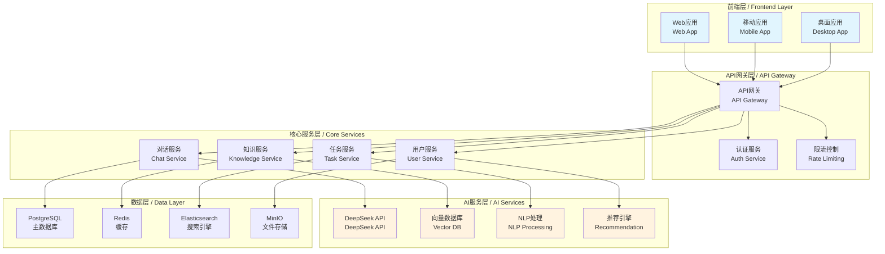

# 第6章 案例3 - 打造你的专属AI助手

> **学习目标**：通过构建一个功能完整的AI助手系统，掌握对话式AI应用开发、自然语言处理、知识管理和个性化推荐等核心技术。

---

## 1. 项目概述（Overview）

### 1.1 项目背景

在AI技术快速发展的今天，个人AI助手已经成为提升工作效率和生活质量的重要工具。本章将带你从零开始构建一个功能强大的个人AI助手系统，它不仅能够进行自然对话，还具备知识管理、任务规划、情感陪伴等多种能力。

### 1.2 核心特性

```yaml
核心功能:
  对话系统:
    - 自然语言理解和生成
    - 多轮对话上下文管理
    - 情感识别和响应
    - 个性化对话风格
  
  知识管理:
    - 个人知识库构建
    - 智能文档检索
    - 知识图谱构建
    - 学习记录追踪
  
  任务助手:
    - 智能任务规划
    - 日程管理
    - 提醒和通知
    - 工作流自动化
  
  个性化服务:
    - 用户画像构建
    - 个性化推荐
    - 习惯分析
    - 成长建议

技术亮点:
  AI能力:
    - DeepSeek API集成
    - 向量数据库检索
    - 多模态理解
    - 实时学习适应
  
  系统架构:
    - 微服务架构
    - 事件驱动设计
    - 分布式缓存
    - 实时通信
  
  用户体验:
    - 语音交互
    - 智能界面
    - 跨平台同步
    - 隐私保护
```

### 1.3 技术架构



---

## 2. 需求分析（Analyze）

### 2.1 用户故事

#### 核心用户场景

```yaml
场景1 - 智能对话:
  用户: "小助手，帮我总结一下今天的会议要点"
  系统: "好的，我来帮您整理今天的会议记录..."
  价值: "提供自然、智能的对话体验"

场景2 - 知识管理:
  用户: "我之前学过的机器学习算法有哪些？"
  系统: "根据您的学习记录，您掌握了以下算法..."
  价值: "个人知识的智能管理和检索"

场景3 - 任务规划:
  用户: "帮我制定下周的工作计划"
  系统: "基于您的历史数据和优先级，建议如下安排..."
  价值: "智能化的任务管理和时间规划"

场景4 - 学习陪伴:
  用户: "我最近学习效率不高，有什么建议吗？"
  系统: "分析您的学习模式，建议调整以下方面..."
  价值: "个性化的学习指导和成长建议"
```

### 2.2 功能需求

#### 对话系统需求

```yaml
基础对话:
  自然语言理解:
    - 意图识别准确率 > 90%
    - 实体抽取准确率 > 85%
    - 支持多种表达方式
    - 处理模糊和不完整输入
  
  对话管理:
    - 多轮对话上下文保持
    - 话题切换和回溯
    - 对话状态跟踪
    - 异常处理和恢复
  
  响应生成:
    - 个性化回复风格
    - 情感色彩适配
    - 多样化表达
    - 实时响应 < 2秒

高级功能:
  情感计算:
    - 用户情感状态识别
    - 情感历史追踪
    - 情感化回复生成
    - 心理健康关怀
  
  个性化:
    - 用户偏好学习
    - 对话风格适应
    - 兴趣话题推荐
    - 交互习惯分析
```

#### 知识管理需求

```yaml
知识获取:
  文档处理:
    - 支持多种格式 (PDF, Word, Markdown等)
    - 自动内容提取和结构化
    - 关键信息标注
    - 知识点自动分类
  
  学习记录:
    - 学习进度跟踪
    - 知识掌握度评估
    - 复习提醒机制
    - 学习路径推荐

知识检索:
  智能搜索:
    - 语义搜索能力
    - 模糊匹配支持
    - 相关性排序
    - 搜索结果聚合
  
  知识图谱:
    - 概念关系构建
    - 知识网络可视化
    - 关联推荐
    - 知识缺口识别
```

### 2.3 非功能需求

#### 性能要求

```yaml
响应性能:
  对话响应: "< 2秒"
  知识检索: "< 1秒"
  文档处理: "< 30秒/MB"
  系统启动: "< 5秒"

并发能力:
  同时在线用户: "1000+"
  并发对话: "500+"
  API调用: "10000 QPS"
  数据处理: "100MB/s"

可用性:
  系统可用性: "99.9%"
  数据一致性: "强一致性"
  故障恢复: "< 1分钟"
  备份策略: "实时备份"
```

#### 安全要求

```yaml
数据安全:
  隐私保护:
    - 端到端加密
    - 数据脱敏处理
    - 访问权限控制
    - 数据删除机制
  
  系统安全:
    - API认证和授权
    - 输入验证和过滤
    - SQL注入防护
    - XSS攻击防护

合规要求:
  数据合规:
    - GDPR合规
    - 数据本地化
    - 审计日志
    - 用户同意机制
```

---

## 3. 规范设计（Specify）

### 3.1 系统架构设计

#### 微服务架构

```yaml
服务划分:
  用户服务 (User Service):
    职责: "用户管理、认证授权、个人设置"
    端口: 8001
    数据库: "PostgreSQL"
    缓存: "Redis"
  
  对话服务 (Chat Service):
    职责: "对话管理、消息处理、上下文维护"
    端口: 8002
    数据库: "PostgreSQL + MongoDB"
    缓存: "Redis"
  
  知识服务 (Knowledge Service):
    职责: "知识管理、文档处理、智能检索"
    端口: 8003
    数据库: "PostgreSQL + Elasticsearch"
    向量库: "Pinecone/Weaviate"
  
  任务服务 (Task Service):
    职责: "任务管理、日程规划、提醒通知"
    端口: 8004
    数据库: "PostgreSQL"
    队列: "RabbitMQ"
  
  AI服务 (AI Service):
    职责: "AI能力封装、模型调用、结果处理"
    端口: 8005
    缓存: "Redis"
    外部API: "DeepSeek, OpenAI"

服务通信:
  同步通信: "HTTP/REST API"
  异步通信: "RabbitMQ消息队列"
  实时通信: "WebSocket"
  服务发现: "Consul/Eureka"
```

#### 数据架构设计

```yaml
数据存储策略:
  关系型数据 (PostgreSQL):
    - 用户信息和配置
    - 对话会话和消息
    - 任务和日程数据
    - 系统配置和日志
  
  文档数据 (MongoDB):
    - 非结构化对话内容
    - 用户生成内容
    - 临时数据和草稿
    - 大文本内容
  
  搜索数据 (Elasticsearch):
    - 知识文档索引
    - 对话历史搜索
    - 用户行为分析
    - 实时搜索建议
  
  向量数据 (Vector DB):
    - 文档向量嵌入
    - 语义相似度计算
    - 知识图谱嵌入
    - 推荐算法向量
  
  缓存数据 (Redis):
    - 会话状态缓存
    - API响应缓存
    - 用户偏好缓存
    - 实时计数器

数据同步策略:
  实时同步: "关键业务数据"
  异步同步: "分析和统计数据"
  定时同步: "备份和归档数据"
  事件驱动: "状态变更通知"
```

### 3.2 API接口设计

#### 对话服务API

```yaml
# 对话服务API规范
openapi: 3.0.3
info:
  title: AI助手对话服务API
  version: 1.0.0
  description: 提供智能对话和消息处理功能

paths:
  /api/v1/chat/sessions:
    post:
      summary: 创建对话会话
      requestBody:
        required: true
        content:
          application/json:
            schema:
              type: object
              properties:
                user_id:
                  type: string
                  description: 用户ID
                session_type:
                  type: string
                  enum: [casual, work, study, support]
                  description: 会话类型
                context:
                  type: object
                  description: 初始上下文
              required: [user_id, session_type]
      responses:
        '201':
          description: 会话创建成功
          content:
            application/json:
              schema:
                type: object
                properties:
                  session_id:
                    type: string
                  created_at:
                    type: string
                    format: date-time
                  expires_at:
                    type: string
                    format: date-time
  
  /api/v1/chat/sessions/{session_id}/messages:
    post:
      summary: 发送消息
      parameters:
        - name: session_id
          in: path
          required: true
          schema:
            type: string
      requestBody:
        required: true
        content:
          application/json:
            schema:
              type: object
              properties:
                content:
                  type: string
                  description: 消息内容
                message_type:
                  type: string
                  enum: [text, voice, image, file]
                  description: 消息类型
                metadata:
                  type: object
                  description: 消息元数据
              required: [content, message_type]
      responses:
        '200':
          description: 消息处理成功
          content:
            application/json:
              schema:
                type: object
                properties:
                  message_id:
                    type: string
                  response:
                    type: object
                    properties:
                      content:
                        type: string
                      type:
                        type: string
                      confidence:
                        type: number
                      suggestions:
                        type: array
                        items:
                          type: string
                  processing_time:
                    type: number
                    description: 处理时间(毫秒)

  /api/v1/chat/sessions/{session_id}/context:
    get:
      summary: 获取会话上下文
      parameters:
        - name: session_id
          in: path
          required: true
          schema:
            type: string
        - name: limit
          in: query
          schema:
            type: integer
            default: 10
          description: 返回消息数量限制
      responses:
        '200':
          description: 上下文获取成功
          content:
            application/json:
              schema:
                type: object
                properties:
                  session_id:
                    type: string
                  messages:
                    type: array
                    items:
                      type: object
                      properties:
                        id:
                          type: string
                        role:
                          type: string
                          enum: [user, assistant, system]
                        content:
                          type: string
                        timestamp:
                          type: string
                          format: date-time
                        metadata:
                          type: object
                  context_summary:
                    type: string
                    description: 上下文摘要
```

#### 知识服务API

```yaml
# 知识服务API规范
paths:
  /api/v1/knowledge/documents:
    post:
      summary: 上传知识文档
      requestBody:
        required: true
        content:
          multipart/form-data:
            schema:
              type: object
              properties:
                file:
                  type: string
                  format: binary
                  description: 文档文件
                title:
                  type: string
                  description: 文档标题
                category:
                  type: string
                  description: 文档分类
                tags:
                  type: array
                  items:
                    type: string
                  description: 文档标签
                is_public:
                  type: boolean
                  default: false
                  description: 是否公开
              required: [file, title]
      responses:
        '201':
          description: 文档上传成功
          content:
            application/json:
              schema:
                type: object
                properties:
                  document_id:
                    type: string
                  processing_status:
                    type: string
                    enum: [pending, processing, completed, failed]
                  estimated_time:
                    type: integer
                    description: 预估处理时间(秒)
  
  /api/v1/knowledge/search:
    get:
      summary: 智能搜索知识
      parameters:
        - name: query
          in: query
          required: true
          schema:
            type: string
          description: 搜索查询
        - name: category
          in: query
          schema:
            type: string
          description: 限定分类
        - name: limit
          in: query
          schema:
            type: integer
            default: 10
          description: 返回结果数量
        - name: search_type
          in: query
          schema:
            type: string
            enum: [semantic, keyword, hybrid]
            default: hybrid
          description: 搜索类型
      responses:
        '200':
          description: 搜索成功
          content:
            application/json:
              schema:
                type: object
                properties:
                  results:
                    type: array
                    items:
                      type: object
                      properties:
                        document_id:
                          type: string
                        title:
                          type: string
                        content_snippet:
                          type: string
                        relevance_score:
                          type: number
                        category:
                          type: string
                        tags:
                          type: array
                          items:
                            type: string
                        created_at:
                          type: string
                          format: date-time
                  total_count:
                    type: integer
                  search_time:
                    type: number
                    description: 搜索耗时(毫秒)
                  suggestions:
                    type: array
                    items:
                      type: string
                    description: 搜索建议
```

### 3.3 数据模型设计

#### 核心数据模型

```python
# models/user.py
from sqlalchemy import Column, String, DateTime, Boolean, Text, JSON
from sqlalchemy.ext.declarative import declarative_base
from datetime import datetime
import uuid

Base = declarative_base()

class User(Base):
    """用户模型"""
    __tablename__ = 'users'
    
    id = Column(String, primary_key=True, default=lambda: str(uuid.uuid4()))
    username = Column(String(50), unique=True, nullable=False)
    email = Column(String(100), unique=True, nullable=False)
    password_hash = Column(String(255), nullable=False)
    
    # 个人信息
    full_name = Column(String(100))
    avatar_url = Column(String(255))
    timezone = Column(String(50), default='UTC')
    language = Column(String(10), default='zh-CN')
    
    # 个性化设置
    preferences = Column(JSON, default={})
    personality_profile = Column(JSON, default={})
    
    # 状态字段
    is_active = Column(Boolean, default=True)
    is_verified = Column(Boolean, default=False)
    last_login_at = Column(DateTime)
    created_at = Column(DateTime, default=datetime.utcnow)
    updated_at = Column(DateTime, default=datetime.utcnow, onupdate=datetime.utcnow)
    
    def to_dict(self):
        return {
            'id': self.id,
            'username': self.username,
            'email': self.email,
            'full_name': self.full_name,
            'avatar_url': self.avatar_url,
            'timezone': self.timezone,
            'language': self.language,
            'preferences': self.preferences,
            'personality_profile': self.personality_profile,
            'is_active': self.is_active,
            'is_verified': self.is_verified,
            'last_login_at': self.last_login_at.isoformat() if self.last_login_at else None,
            'created_at': self.created_at.isoformat(),
            'updated_at': self.updated_at.isoformat()
        }

class ChatSession(Base):
    """对话会话模型"""
    __tablename__ = 'chat_sessions'
    
    id = Column(String, primary_key=True, default=lambda: str(uuid.uuid4()))
    user_id = Column(String, nullable=False, index=True)
    
    # 会话信息
    title = Column(String(200))
    session_type = Column(String(20), default='casual')  # casual, work, study, support
    status = Column(String(20), default='active')  # active, paused, ended
    
    # 上下文和状态
    context_summary = Column(Text)
    current_topic = Column(String(100))
    mood_state = Column(String(20))  # happy, neutral, sad, excited, etc.
    
    # 统计信息
    message_count = Column(Integer, default=0)
    total_tokens = Column(Integer, default=0)
    
    # 时间字段
    started_at = Column(DateTime, default=datetime.utcnow)
    last_activity_at = Column(DateTime, default=datetime.utcnow)
    ended_at = Column(DateTime)
    
    def to_dict(self):
        return {
            'id': self.id,
            'user_id': self.user_id,
            'title': self.title,
            'session_type': self.session_type,
            'status': self.status,
            'context_summary': self.context_summary,
            'current_topic': self.current_topic,
            'mood_state': self.mood_state,
            'message_count': self.message_count,
            'total_tokens': self.total_tokens,
            'started_at': self.started_at.isoformat(),
            'last_activity_at': self.last_activity_at.isoformat(),
            'ended_at': self.ended_at.isoformat() if self.ended_at else None
        }

class ChatMessage(Base):
    """对话消息模型"""
    __tablename__ = 'chat_messages'
    
    id = Column(String, primary_key=True, default=lambda: str(uuid.uuid4()))
    session_id = Column(String, nullable=False, index=True)
    
    # 消息内容
    role = Column(String(20), nullable=False)  # user, assistant, system
    content = Column(Text, nullable=False)
    content_type = Column(String(20), default='text')  # text, voice, image, file
    
    # 消息元数据
    metadata = Column(JSON, default={})
    tokens_used = Column(Integer, default=0)
    processing_time = Column(Float, default=0.0)
    
    # AI相关
    intent = Column(String(50))
    entities = Column(JSON, default=[])
    confidence_score = Column(Float)
    
    # 时间字段
    created_at = Column(DateTime, default=datetime.utcnow)
    
    def to_dict(self):
        return {
            'id': self.id,
            'session_id': self.session_id,
            'role': self.role,
            'content': self.content,
            'content_type': self.content_type,
            'metadata': self.metadata,
            'tokens_used': self.tokens_used,
            'processing_time': self.processing_time,
            'intent': self.intent,
            'entities': self.entities,
            'confidence_score': self.confidence_score,
            'created_at': self.created_at.isoformat()
        }

class KnowledgeDocument(Base):
    """知识文档模型"""
    __tablename__ = 'knowledge_documents'
    
    id = Column(String, primary_key=True, default=lambda: str(uuid.uuid4()))
    user_id = Column(String, nullable=False, index=True)
    
    # 文档信息
    title = Column(String(200), nullable=False)
    content = Column(Text)
    file_path = Column(String(500))
    file_type = Column(String(20))
    file_size = Column(Integer)
    
    # 分类和标签
    category = Column(String(50))
    tags = Column(JSON, default=[])
    
    # 处理状态
    processing_status = Column(String(20), default='pending')  # pending, processing, completed, failed
    processing_error = Column(Text)
    
    # 向量化信息
    vector_id = Column(String(100))  # 向量数据库中的ID
    embedding_model = Column(String(50))
    
    # 统计信息
    view_count = Column(Integer, default=0)
    reference_count = Column(Integer, default=0)
    
    # 权限
    is_public = Column(Boolean, default=False)
    
    # 时间字段
    created_at = Column(DateTime, default=datetime.utcnow)
    updated_at = Column(DateTime, default=datetime.utcnow, onupdate=datetime.utcnow)
    
    def to_dict(self):
        return {
            'id': self.id,
            'user_id': self.user_id,
            'title': self.title,
            'content': self.content[:500] + '...' if self.content and len(self.content) > 500 else self.content,
            'file_path': self.file_path,
            'file_type': self.file_type,
            'file_size': self.file_size,
            'category': self.category,
            'tags': self.tags,
            'processing_status': self.processing_status,
            'processing_error': self.processing_error,
            'vector_id': self.vector_id,
            'embedding_model': self.embedding_model,
            'view_count': self.view_count,
            'reference_count': self.reference_count,
            'is_public': self.is_public,
            'created_at': self.created_at.isoformat(),
            'updated_at': self.updated_at.isoformat()
        }
```

#### 配置模型

```python
# models/config.py
from pydantic import BaseModel, Field
from typing import Optional, List, Dict, Any
from enum import Enum

class ChatConfig(BaseModel):
    """对话配置"""
    max_context_length: int = Field(default=4000, description="最大上下文长度")
    response_temperature: float = Field(default=0.7, description="回复温度")
    max_tokens: int = Field(default=1000, description="最大token数")
    personality_style: str = Field(default="friendly", description="个性风格")
    enable_emotion: bool = Field(default=True, description="启用情感识别")
    enable_memory: bool = Field(default=True, description="启用记忆功能")
    
class KnowledgeConfig(BaseModel):
    """知识配置"""
    embedding_model: str = Field(default="text-embedding-ada-002", description="嵌入模型")
    chunk_size: int = Field(default=1000, description="文档分块大小")
    chunk_overlap: int = Field(default=200, description="分块重叠")
    similarity_threshold: float = Field(default=0.7, description="相似度阈值")
    max_search_results: int = Field(default=10, description="最大搜索结果")
    
class AIServiceConfig(BaseModel):
    """AI服务配置"""
    deepseek_api_key: str = Field(..., description="DeepSeek API密钥")
    deepseek_base_url: str = Field(default="https://api.deepseek.com", description="DeepSeek API地址")
    model_name: str = Field(default="deepseek-chat", description="模型名称")
    max_retries: int = Field(default=3, description="最大重试次数")
    timeout: int = Field(default=30, description="超时时间")
    
class SystemConfig(BaseModel):
    """系统配置"""
    chat: ChatConfig = Field(default_factory=ChatConfig)
    knowledge: KnowledgeConfig = Field(default_factory=KnowledgeConfig)
    ai_service: AIServiceConfig
    
    # 数据库配置
    database_url: str = Field(..., description="数据库连接URL")
    redis_url: str = Field(..., description="Redis连接URL")
    
    # 安全配置
    secret_key: str = Field(..., description="应用密钥")
    jwt_algorithm: str = Field(default="HS256", description="JWT算法")
    jwt_expire_hours: int = Field(default=24, description="JWT过期时间")
    
    # 文件存储
    upload_path: str = Field(default="./uploads", description="文件上传路径")
    max_file_size: int = Field(default=10*1024*1024, description="最大文件大小")
    
    class Config:
        env_file = ".env"
        env_file_encoding = "utf-8"
```

---

## 4. 实现过程（Implement）

### 4.1 项目初始化

#### 项目结构

```bash
ai-assistant/
├── backend/                    # 后端服务
│   ├── services/              # 微服务
│   │   ├── user-service/      # 用户服务
│   │   ├── chat-service/      # 对话服务
│   │   ├── knowledge-service/ # 知识服务
│   │   ├── task-service/      # 任务服务
│   │   └── ai-service/        # AI服务
│   ├── shared/                # 共享代码
│   │   ├── models/            # 数据模型
│   │   ├── utils/             # 工具函数
│   │   └── config/            # 配置文件
│   └── gateway/               # API网关
├── frontend/                  # 前端应用
│   ├── web/                   # Web应用
│   ├── mobile/                # 移动应用
│   └── desktop/               # 桌面应用
├── infrastructure/            # 基础设施
│   ├── docker/                # Docker配置
│   ├── k8s/                   # Kubernetes配置
│   └── monitoring/            # 监控配置
├── docs/                      # 文档
├── tests/                     # 测试
└── scripts/                   # 脚本
```

#### 环境配置

```yaml
# docker-compose.yml
version: '3.8'

services:
  # 数据库服务
  postgres:
    image: postgres:15
    environment:
      POSTGRES_DB: ai_assistant
      POSTGRES_USER: postgres
      POSTGRES_PASSWORD: password
    ports:
      - "5432:5432"
    volumes:
      - postgres_data:/var/lib/postgresql/data
      - ./scripts/init.sql:/docker-entrypoint-initdb.d/init.sql
  
  # Redis缓存
  redis:
    image: redis:7-alpine
    ports:
      - "6379:6379"
    command: redis-server --appendonly yes
    volumes:
      - redis_data:/data
  
  # Elasticsearch搜索引擎
  elasticsearch:
    image: elasticsearch:8.8.0
    environment:
      - discovery.type=single-node
      - xpack.security.enabled=false
      - "ES_JAVA_OPTS=-Xms512m -Xmx512m"
    ports:
      - "9200:9200"
    volumes:
      - es_data:/usr/share/elasticsearch/data
  
  # RabbitMQ消息队列
  rabbitmq:
    image: rabbitmq:3-management
    environment:
      RABBITMQ_DEFAULT_USER: admin
      RABBITMQ_DEFAULT_PASS: password
    ports:
      - "5672:5672"
      - "15672:15672"
    volumes:
      - rabbitmq_data:/var/lib/rabbitmq
  
  # MinIO对象存储
  minio:
    image: minio/minio:latest
    environment:
      MINIO_ROOT_USER: minioadmin
      MINIO_ROOT_PASSWORD: minioadmin
    ports:
      - "9000:9000"
      - "9001:9001"
    volumes:
      - minio_data:/data
    command: server /data --console-address ":9001"
  
  # 向量数据库 (Weaviate)
  weaviate:
    image: semitechnologies/weaviate:latest
    environment:
      QUERY_DEFAULTS_LIMIT: 25
      AUTHENTICATION_ANONYMOUS_ACCESS_ENABLED: 'true'
      PERSISTENCE_DATA_PATH: '/var/lib/weaviate'
      DEFAULT_VECTORIZER_MODULE: 'none'
      ENABLE_MODULES: 'text2vec-openai,generative-openai'
    ports:
      - "8080:8080"
    volumes:
      - weaviate_data:/var/lib/weaviate

volumes:
  postgres_data:
  redis_data:
  es_data:
  rabbitmq_data:
  minio_data:
  weaviate_data:
```

### 4.2 核心服务实现

#### 对话服务实现

```python
# services/chat-service/app/main.py
from fastapi import FastAPI, Depends, HTTPException, WebSocket, WebSocketDisconnect
from fastapi.middleware.cors import CORSMiddleware
from sqlalchemy.orm import Session
import asyncio
import json
from typing import List, Dict, Any

from .database import get_db
from .models import ChatSession, ChatMessage
from .services.chat_service import ChatService
from .services.ai_service import AIService
from .schemas import ChatSessionCreate, MessageCreate, MessageResponse
from .auth import get_current_user

app = FastAPI(title="AI助手对话服务", version="1.0.0")

# CORS配置
app.add_middleware(
    CORSMiddleware,
    allow_origins=["*"],
    allow_credentials=True,
    allow_methods=["*"],
    allow_headers=["*"],
)

# 依赖注入
chat_service = ChatService()
ai_service = AIService()

# WebSocket连接管理
class ConnectionManager:
    def __init__(self):
        self.active_connections: Dict[str, WebSocket] = {}
    
    async def connect(self, websocket: WebSocket, user_id: str):
        await websocket.accept()
        self.active_connections[user_id] = websocket
    
    def disconnect(self, user_id: str):
        if user_id in self.active_connections:
            del self.active_connections[user_id]
    
    async def send_personal_message(self, message: str, user_id: str):
        if user_id in self.active_connections:
            await self.active_connections[user_id].send_text(message)

manager = ConnectionManager()

@app.post("/api/v1/chat/sessions", response_model=dict)
async def create_session(
    session_data: ChatSessionCreate,
    db: Session = Depends(get_db),
    current_user = Depends(get_current_user)
):
    """创建对话会话"""
    try:
        session = await chat_service.create_session(
            user_id=current_user.id,
            session_type=session_data.session_type,
            context=session_data.context,
            db=db
        )
        return {
            "session_id": session.id,
            "created_at": session.started_at.isoformat(),
            "expires_at": None  # 暂不设置过期时间
        }
    except Exception as e:
        raise HTTPException(status_code=500, detail=str(e))

@app.post("/api/v1/chat/sessions/{session_id}/messages", response_model=MessageResponse)
async def send_message(
    session_id: str,
    message_data: MessageCreate,
    db: Session = Depends(get_db),
    current_user = Depends(get_current_user)
):
    """发送消息并获取AI回复"""
    try:
        # 验证会话权限
        session = await chat_service.get_session(session_id, current_user.id, db)
        if not session:
            raise HTTPException(status_code=404, detail="会话不存在")
        
        # 保存用户消息
        user_message = await chat_service.save_message(
            session_id=session_id,
            role="user",
            content=message_data.content,
            content_type=message_data.message_type,
            metadata=message_data.metadata,
            db=db
        )
        
        # 获取AI回复
        ai_response = await ai_service.generate_response(
            session=session,
            user_message=message_data.content,
            message_type=message_data.message_type,
            db=db
        )
        
        # 保存AI回复
        ai_message = await chat_service.save_message(
            session_id=session_id,
            role="assistant",
            content=ai_response["content"],
            content_type="text",
            metadata={
                "confidence": ai_response.get("confidence", 0.0),
                "intent": ai_response.get("intent"),
                "entities": ai_response.get("entities", []),
                "processing_time": ai_response.get("processing_time", 0.0)
            },
            db=db
        )
        
        # 更新会话状态
        await chat_service.update_session_activity(session_id, db)
        
        # 通过WebSocket发送实时通知
        await manager.send_personal_message(
            json.dumps({
                "type": "message_response",
                "data": {
                    "message_id": ai_message.id,
                    "content": ai_response["content"],
                    "confidence": ai_response.get("confidence", 0.0)
                }
            }),
            current_user.id
        )
        
        return MessageResponse(
            message_id=ai_message.id,
            response={
                "content": ai_response["content"],
                "type": "text",
                "confidence": ai_response.get("confidence", 0.0),
                "suggestions": ai_response.get("suggestions", [])
            },
            processing_time=ai_response.get("processing_time", 0.0)
        )
        
    except Exception as e:
        raise HTTPException(status_code=500, detail=str(e))

@app.websocket("/ws/{user_id}")
async def websocket_endpoint(websocket: WebSocket, user_id: str):
    """WebSocket连接端点"""
    await manager.connect(websocket, user_id)
    try:
        while True:
            # 接收客户端消息
            data = await websocket.receive_text()
            message = json.loads(data)
            
            # 处理不同类型的消息
            if message["type"] == "ping":
                await websocket.send_text(json.dumps({"type": "pong"}))
            elif message["type"] == "typing":
                # 处理打字状态
                pass
            
    except WebSocketDisconnect:
        manager.disconnect(user_id)

@app.get("/api/v1/chat/sessions/{session_id}/context")
async def get_session_context(
    session_id: str,
    limit: int = 10,
    db: Session = Depends(get_db),
    current_user = Depends(get_current_user)
):
    """获取会话上下文"""
    try:
        context = await chat_service.get_session_context(
            session_id=session_id,
            user_id=current_user.id,
            limit=limit,
            db=db
        )
        return context
    except Exception as e:
        raise HTTPException(status_code=500, detail=str(e))

if __name__ == "__main__":
    import uvicorn
    uvicorn.run(app, host="0.0.0.0", port=8002)
```

#### AI服务核心逻辑

```python
# services/chat-service/app/services/ai_service.py
import asyncio
import json
import time
from typing import Dict, List, Any, Optional
import httpx
from sqlalchemy.orm import Session

from ..models import ChatSession, ChatMessage
from ..config import get_settings

class AIService:
    """AI服务类"""
    
    def __init__(self):
        self.settings = get_settings()
        self.client = httpx.AsyncClient(
            base_url=self.settings.ai_service.deepseek_base_url,
            timeout=self.settings.ai_service.timeout
        )
    
    async def generate_response(
        self, 
        session: ChatSession, 
        user_message: str, 
        message_type: str = "text",
        db: Session = None
    ) -> Dict[str, Any]:
        """生成AI回复"""
        start_time = time.time()
        
        try:
            # 1. 分析用户意图和情感
            intent_analysis = await self._analyze_intent(user_message)
            emotion_analysis = await self._analyze_emotion(user_message, session)
            
            # 2. 获取相关知识
            relevant_knowledge = await self._retrieve_knowledge(
                user_message, session.user_id
            )
            
            # 3. 构建对话上下文
            context = await self._build_context(session, db)
            
            # 4. 生成回复
            response = await self._generate_chat_response(
                user_message=user_message,
                context=context,
                intent=intent_analysis,
                emotion=emotion_analysis,
                knowledge=relevant_knowledge,
                session=session
            )
            
            # 5. 后处理和优化
            processed_response = await self._post_process_response(
                response, session, emotion_analysis
            )
            
            processing_time = (time.time() - start_time) * 1000
            
            return {
                "content": processed_response["content"],
                "confidence": processed_response.get("confidence", 0.8),
                "intent": intent_analysis.get("intent"),
                "entities": intent_analysis.get("entities", []),
                "emotion": emotion_analysis.get("emotion"),
                "suggestions": processed_response.get("suggestions", []),
                "processing_time": processing_time
            }
            
        except Exception as e:
            return {
                "content": "抱歉，我现在遇到了一些技术问题，请稍后再试。",
                "confidence": 0.0,
                "error": str(e),
                "processing_time": (time.time() - start_time) * 1000
            }
    
    async def _analyze_intent(self, message: str) -> Dict[str, Any]:
        """分析用户意图"""
        try:
            prompt = f"""
            请分析以下用户消息的意图和实体：
            
            用户消息：{message}
            
            请以JSON格式返回分析结果，包含：
            - intent: 主要意图（如：question, request, chat, task等）
            - entities: 提取的实体列表
            - confidence: 置信度（0-1）
            - category: 消息分类（如：work, study, life, entertainment等）
            
            示例格式：
            {{
                "intent": "question",
                "entities": [{{"type": "topic", "value": "机器学习"}}],
                "confidence": 0.9,
                "category": "study"
            }}
            """
            
            response = await self._call_deepseek_api(
                messages=[{"role": "user", "content": prompt}],
                temperature=0.1,
                max_tokens=500
            )
            
            # 解析JSON响应
            try:
                result = json.loads(response["content"])
                return result
            except json.JSONDecodeError:
                # 如果解析失败，返回默认值
                return {
                    "intent": "chat",
                    "entities": [],
                    "confidence": 0.5,
                    "category": "general"
                }
                
        except Exception as e:
            return {
                "intent": "chat",
                "entities": [],
                "confidence": 0.0,
                "error": str(e)
            }
    
    async def _analyze_emotion(self, message: str, session: ChatSession) -> Dict[str, Any]:
        """分析用户情感"""
        try:
            # 获取历史情感状态
            historical_mood = session.mood_state or "neutral"
            
            prompt = f"""
            请分析用户消息的情感状态：
            
            用户消息：{message}
            历史情感状态：{historical_mood}
            
            请以JSON格式返回分析结果：
            {{
                "emotion": "情感类型（happy, sad, angry, excited, confused, neutral等）",
                "intensity": "情感强度（0-1）",
                "confidence": "分析置信度（0-1）",
                "change": "相比历史状态的变化（positive, negative, stable）",
                "reasoning": "分析理由"
            }}
            """
            
            response = await self._call_deepseek_api(
                messages=[{"role": "user", "content": prompt}],
                temperature=0.2,
                max_tokens=300
            )
            
            try:
                result = json.loads(response["content"])
                return result
            except json.JSONDecodeError:
                return {
                    "emotion": "neutral",
                    "intensity": 0.5,
                    "confidence": 0.5,
                    "change": "stable"
                }
                
        except Exception as e:
            return {
                "emotion": "neutral",
                "intensity": 0.5,
                "confidence": 0.0,
                "error": str(e)
            }
    
    async def _retrieve_knowledge(
        self, 
        query: str, 
        user_id: str, 
        limit: int = 3
    ) -> List[Dict[str, Any]]:
        """检索相关知识"""
        try:
            # 调用知识服务API
            async with httpx.AsyncClient() as client:
                response = await client.get(
                    f"http://knowledge-service:8003/api/v1/knowledge/search",
                    params={
                        "query": query,
                        "user_id": user_id,
                        "limit": limit,
                        "search_type": "semantic"
                    }
                )
                
                if response.status_code == 200:
                    data = response.json()
                    return data.get("results", [])
                else:
                    return []
                    
        except Exception as e:
            print(f"知识检索失败: {e}")
            return []
    
    async def _build_context(
        self, 
        session: ChatSession, 
        db: Session, 
        limit: int = 10
    ) -> List[Dict[str, str]]:
        """构建对话上下文"""
        try:
            # 获取最近的对话消息
            messages = db.query(ChatMessage).filter(
                ChatMessage.session_id == session.id
            ).order_by(
                ChatMessage.created_at.desc()
            ).limit(limit).all()
            
            # 构建上下文列表（按时间正序）
            context = []
            for msg in reversed(messages):
                context.append({
                    "role": msg.role,
                    "content": msg.content
                })
            
            return context
            
        except Exception as e:
            print(f"构建上下文失败: {e}")
            return []
    
    async def _generate_chat_response(
        self,
        user_message: str,
        context: List[Dict[str, str]],
        intent: Dict[str, Any],
        emotion: Dict[str, Any],
        knowledge: List[Dict[str, Any]],
        session: ChatSession
    ) -> Dict[str, Any]:
        """生成对话回复"""
        try:
            # 构建系统提示
            system_prompt = self._build_system_prompt(session, emotion, intent)
            
            # 构建知识上下文
            knowledge_context = ""
            if knowledge:
                knowledge_context = "\n\n相关知识：\n"
                for item in knowledge:
                    knowledge_context += f"- {item.get('title', '')}: {item.get('content_snippet', '')}\n"
            
            # 构建消息列表
            messages = [{"role": "system", "content": system_prompt}]
            
            # 添加历史对话
            messages.extend(context[-6:])  # 只保留最近6轮对话
            
            # 添加当前用户消息
            current_message = user_message
            if knowledge_context:
                current_message += knowledge_context
            
            messages.append({"role": "user", "content": current_message})
            
            # 调用AI API
            response = await self._call_deepseek_api(
                messages=messages,
                temperature=self.settings.chat.response_temperature,
                max_tokens=self.settings.chat.max_tokens
            )
            
            return response
            
        except Exception as e:
            return {
                "content": "抱歉，我现在无法处理您的请求，请稍后再试。",
                "confidence": 0.0,
                "error": str(e)
            }
    
    def _build_system_prompt(
        self, 
        session: ChatSession, 
        emotion: Dict[str, Any], 
        intent: Dict[str, Any]
    ) -> str:
        """构建系统提示"""
        base_prompt = """
        你是一个智能、友善、专业的AI助手。你的目标是为用户提供有用、准确、个性化的帮助。
        
        核心特质：
        - 友善耐心，善于倾听
        - 专业可靠，提供准确信息
        - 个性化服务，适应用户需求
        - 情感智能，理解用户情感
        
        交互原则：
        - 使用自然、亲切的语言
        - 根据用户情感调整回复风格
        - 提供具体、可操作的建议
        - 承认不确定性，诚实回应
        """
        
        # 根据会话类型调整
        if session.session_type == "work":
            base_prompt += "\n当前是工作场景，请提供专业、高效的帮助。"
        elif session.session_type == "study":
            base_prompt += "\n当前是学习场景，请提供教育性、启发性的指导。"
        elif session.session_type == "support":
            base_prompt += "\n当前是支持场景，请提供情感支持和鼓励。"
        
        # 根据用户情感调整
        user_emotion = emotion.get("emotion", "neutral")
        if user_emotion in ["sad", "angry", "frustrated"]:
            base_prompt += "\n用户当前情绪不佳，请给予额外的关怀和支持。"
        elif user_emotion in ["happy", "excited"]:
            base_prompt += "\n用户当前情绪积极，可以更加活跃和热情地回应。"
        
        # 根据意图调整
        user_intent = intent.get("intent", "chat")
        if user_intent == "question":
            base_prompt += "\n用户有疑问需要解答，请提供清晰、准确的信息。"
        elif user_intent == "task":
            base_prompt += "\n用户需要完成任务，请提供具体的步骤和建议。"
        
        return base_prompt
    
    async def _post_process_response(
        self, 
        response: Dict[str, Any], 
        session: ChatSession, 
        emotion: Dict[str, Any]
    ) -> Dict[str, Any]:
        """后处理回复"""
        content = response.get("content", "")
        
        # 添加个性化元素
        if session.session_type == "study" and "学习" in content:
            suggestions = [
                "需要更多学习资源吗？",
                "想要制定学习计划吗？",
                "有其他相关问题吗？"
            ]
        elif session.session_type == "work" and any(word in content for word in ["工作", "任务", "项目"]):
            suggestions = [
                "需要帮助制定时间计划吗？",
                "想要了解相关工具吗？",
                "需要更多实施建议吗？"
            ]
        else:
            suggestions = [
                "还有其他问题吗？",
                "想要了解更多吗？",
                "需要其他帮助吗？"
            ]
        
        return {
            "content": content,
            "confidence": response.get("confidence", 0.8),
            "suggestions": suggestions
        }
    
    async def _call_deepseek_api(
        self, 
        messages: List[Dict[str, str]], 
        temperature: float = 0.7,
        max_tokens: int = 1000
    ) -> Dict[str, Any]:
        """调用DeepSeek API"""
        try:
            payload = {
                "model": self.settings.ai_service.model_name,
                "messages": messages,
                "temperature": temperature,
                "max_tokens": max_tokens,
                "stream": False
            }
            
            headers = {
                "Authorization": f"Bearer {self.settings.ai_service.deepseek_api_key}",
                "Content-Type": "application/json"
            }
            
            response = await self.client.post(
                "/v1/chat/completions",
                json=payload,
                headers=headers
            )
            
            if response.status_code == 200:
                data = response.json()
                return {
                    "content": data["choices"][0]["message"]["content"],
                    "confidence": 0.8,
                    "tokens_used": data.get("usage", {}).get("total_tokens", 0)
                }
            else:
                raise Exception(f"API调用失败: {response.status_code}")
                
        except Exception as e:
            raise Exception(f"DeepSeek API调用错误: {e}")
```

#### 知识服务实现

```python
# services/knowledge-service/app/main.py
from fastapi import FastAPI, Depends, HTTPException, UploadFile, File, Form
from fastapi.middleware.cors import CORSMiddleware
from sqlalchemy.orm import Session
import asyncio
import os
from typing import List, Optional

from .database import get_db
from .models import KnowledgeDocument
from .services.knowledge_service import KnowledgeService
from .services.vector_service import VectorService
from .services.document_processor import DocumentProcessor
from .schemas import DocumentCreate, DocumentResponse, SearchResponse
from .auth import get_current_user

app = FastAPI(title="AI助手知识服务", version="1.0.0")

# CORS配置
app.add_middleware(
    CORSMiddleware,
    allow_origins=["*"],
    allow_credentials=True,
    allow_methods=["*"],
    allow_headers=["*"],
)

# 依赖注入
knowledge_service = KnowledgeService()
vector_service = VectorService()
document_processor = DocumentProcessor()

@app.post("/api/v1/knowledge/documents", response_model=dict)
async def upload_document(
    file: UploadFile = File(...),
    title: str = Form(...),
    category: Optional[str] = Form(None),
    tags: Optional[str] = Form(None),
    is_public: bool = Form(False),
    db: Session = Depends(get_db),
    current_user = Depends(get_current_user)
):
    """上传知识文档"""
    try:
        # 验证文件类型和大小
        if file.size > 10 * 1024 * 1024:  # 10MB限制
            raise HTTPException(status_code=400, detail="文件大小超过限制")
        
        allowed_types = [
            "application/pdf",
            "application/msword",
            "application/vnd.openxmlformats-officedocument.wordprocessingml.document",
            "text/plain",
            "text/markdown"
        ]
        
        if file.content_type not in allowed_types:
            raise HTTPException(status_code=400, detail="不支持的文件类型")
        
        # 保存文件
        file_path = await knowledge_service.save_uploaded_file(file, current_user.id)
        
        # 解析标签
        tag_list = []
        if tags:
            tag_list = [tag.strip() for tag in tags.split(",") if tag.strip()]
        
        # 创建文档记录
        document = await knowledge_service.create_document(
            user_id=current_user.id,
            title=title,
            file_path=file_path,
            file_type=file.content_type,
            file_size=file.size,
            category=category,
            tags=tag_list,
            is_public=is_public,
            db=db
        )
        
        # 异步处理文档
        asyncio.create_task(
            document_processor.process_document(document.id, db)
        )
        
        return {
            "document_id": document.id,
            "processing_status": "pending",
            "estimated_time": 30  # 预估30秒
        }
        
    except Exception as e:
        raise HTTPException(status_code=500, detail=str(e))

@app.get("/api/v1/knowledge/search", response_model=SearchResponse)
async def search_knowledge(
    query: str,
    category: Optional[str] = None,
    limit: int = 10,
    search_type: str = "hybrid",
    db: Session = Depends(get_db),
    current_user = Depends(get_current_user)
):
    """智能搜索知识"""
    try:
        results = await knowledge_service.search_documents(
            query=query,
            user_id=current_user.id,
            category=category,
            limit=limit,
            search_type=search_type,
            db=db
        )
        
        return SearchResponse(
            results=results["documents"],
            total_count=results["total_count"],
            search_time=results["search_time"],
            suggestions=results.get("suggestions", [])
        )
        
    except Exception as e:
        raise HTTPException(status_code=500, detail=str(e))

if __name__ == "__main__":
    import uvicorn
    uvicorn.run(app, host="0.0.0.0", port=8003)
```

### 4.3 前端应用实现

#### React Web应用

```typescript
// frontend/web/src/components/ChatInterface.tsx
import React, { useState, useEffect, useRef } from 'react';
import { Send, Mic, Paperclip, MoreVertical } from 'lucide-react';
import { useWebSocket } from '../hooks/useWebSocket';
import { useChatService } from '../hooks/useChatService';
import { Message, ChatSession } from '../types';

interface ChatInterfaceProps {
  session: ChatSession;
  onSessionUpdate: (session: ChatSession) => void;
}

export const ChatInterface: React.FC<ChatInterfaceProps> = ({
  session,
  onSessionUpdate
}) => {
  const [messages, setMessages] = useState<Message[]>([]);
  const [inputText, setInputText] = useState('');
  const [isLoading, setIsLoading] = useState(false);
  const [isTyping, setIsTyping] = useState(false);
  
  const messagesEndRef = useRef<HTMLDivElement>(null);
  const inputRef = useRef<HTMLTextAreaElement>(null);
  
  const { sendMessage, getSessionContext } = useChatService();
  const { isConnected, sendTypingStatus } = useWebSocket({
    onMessage: handleWebSocketMessage,
    onTyping: () => setIsTyping(true),
    onStopTyping: () => setIsTyping(false)
  });
  
  // 加载会话上下文
  useEffect(() => {
    loadSessionContext();
  }, [session.id]);
  
  // 自动滚动到底部
  useEffect(() => {
    scrollToBottom();
  }, [messages]);
  
  const loadSessionContext = async () => {
    try {
      const context = await getSessionContext(session.id);
      setMessages(context.messages);
    } catch (error) {
      console.error('加载会话上下文失败:', error);
    }
  };
  
  const handleWebSocketMessage = (data: any) => {
    if (data.type === 'message_response') {
      const newMessage: Message = {
        id: data.data.message_id,
        role: 'assistant',
        content: data.data.content,
        timestamp: new Date().toISOString(),
        confidence: data.data.confidence
      };
      setMessages(prev => [...prev, newMessage]);
      setIsLoading(false);
    }
  };
  
  const handleSendMessage = async () => {
    if (!inputText.trim() || isLoading) return;
    
    const userMessage: Message = {
      id: Date.now().toString(),
      role: 'user',
      content: inputText,
      timestamp: new Date().toISOString()
    };
    
    setMessages(prev => [...prev, userMessage]);
    setInputText('');
    setIsLoading(true);
    
    try {
      const response = await sendMessage(session.id, {
        content: inputText,
        message_type: 'text',
        metadata: {}
      });
      
      // WebSocket会处理AI回复，这里只需要处理错误情况
      if (!isConnected) {
        const aiMessage: Message = {
          id: response.message_id,
          role: 'assistant',
          content: response.response.content,
          timestamp: new Date().toISOString(),
          confidence: response.response.confidence
        };
        setMessages(prev => [...prev, aiMessage]);
        setIsLoading(false);
      }
    } catch (error) {
      console.error('发送消息失败:', error);
      setIsLoading(false);
    }
  };
  
  const handleKeyPress = (e: React.KeyboardEvent) => {
    if (e.key === 'Enter' && !e.shiftKey) {
      e.preventDefault();
      handleSendMessage();
    }
  };
  
  const handleInputChange = (e: React.ChangeEvent<HTMLTextAreaElement>) => {
    setInputText(e.target.value);
    
    // 发送打字状态
    if (isConnected) {
      sendTypingStatus(true);
      
      // 延迟发送停止打字状态
      setTimeout(() => {
        sendTypingStatus(false);
      }, 1000);
    }
  };
  
  const scrollToBottom = () => {
    messagesEndRef.current?.scrollIntoView({ behavior: 'smooth' });
  };
  
  const formatTimestamp = (timestamp: string) => {
    return new Date(timestamp).toLocaleTimeString('zh-CN', {
      hour: '2-digit',
      minute: '2-digit'
    });
  };
  
  return (
    <div className="flex flex-col h-full bg-white">
      {/* 聊天头部 */}
      <div className="flex items-center justify-between p-4 border-b border-gray-200">
        <div className="flex items-center space-x-3">
          <div className="w-10 h-10 bg-blue-500 rounded-full flex items-center justify-center">
            <span className="text-white font-semibold">AI</span>
          </div>
          <div>
            <h3 className="font-semibold text-gray-900">
              {session.title || 'AI助手'}
            </h3>
            <p className="text-sm text-gray-500">
              {isConnected ? '在线' : '离线'} • {session.session_type}
            </p>
          </div>
        </div>
        <button className="p-2 hover:bg-gray-100 rounded-full">
          <MoreVertical className="w-5 h-5 text-gray-500" />
        </button>
      </div>
      
      {/* 消息列表 */}
      <div className="flex-1 overflow-y-auto p-4 space-y-4">
        {messages.map((message) => (
          <div
            key={message.id}
            className={`flex ${
              message.role === 'user' ? 'justify-end' : 'justify-start'
            }`}
          >
            <div
              className={`max-w-xs lg:max-w-md px-4 py-2 rounded-lg ${
                message.role === 'user'
                  ? 'bg-blue-500 text-white'
                  : 'bg-gray-100 text-gray-900'
              }`}
            >
              <p className="text-sm">{message.content}</p>
              <div className="flex items-center justify-between mt-1">
                <span className="text-xs opacity-70">
                  {formatTimestamp(message.timestamp)}
                </span>
                {message.confidence && (
                  <span className="text-xs opacity-70">
                    {Math.round(message.confidence * 100)}%
                  </span>
                )}
              </div>
            </div>
          </div>
        ))}
        
        {/* 加载指示器 */}
        {isLoading && (
          <div className="flex justify-start">
            <div className="bg-gray-100 rounded-lg px-4 py-2">
              <div className="flex space-x-1">
                <div className="w-2 h-2 bg-gray-400 rounded-full animate-bounce"></div>
                <div className="w-2 h-2 bg-gray-400 rounded-full animate-bounce" style={{animationDelay: '0.1s'}}></div>
                <div className="w-2 h-2 bg-gray-400 rounded-full animate-bounce" style={{animationDelay: '0.2s'}}></div>
              </div>
            </div>
          </div>
        )}
        
        {/* 打字指示器 */}
        {isTyping && (
          <div className="flex justify-start">
            <div className="bg-gray-100 rounded-lg px-4 py-2">
              <p className="text-sm text-gray-500">AI正在思考...</p>
            </div>
          </div>
        )}
        
        <div ref={messagesEndRef} />
      </div>
      
      {/* 输入区域 */}
      <div className="border-t border-gray-200 p-4">
        <div className="flex items-end space-x-2">
          <button className="p-2 hover:bg-gray-100 rounded-full">
            <Paperclip className="w-5 h-5 text-gray-500" />
          </button>
          
          <div className="flex-1 relative">
            <textarea
              ref={inputRef}
              value={inputText}
              onChange={handleInputChange}
              onKeyPress={handleKeyPress}
              placeholder="输入消息..."
              className="w-full px-3 py-2 border border-gray-300 rounded-lg resize-none focus:outline-none focus:ring-2 focus:ring-blue-500 focus:border-transparent"
              rows={1}
              style={{
                minHeight: '40px',
                maxHeight: '120px'
              }}
            />
          </div>
          
          <button className="p-2 hover:bg-gray-100 rounded-full">
            <Mic className="w-5 h-5 text-gray-500" />
          </button>
          
          <button
            onClick={handleSendMessage}
            disabled={!inputText.trim() || isLoading}
            className="p-2 bg-blue-500 hover:bg-blue-600 disabled:bg-gray-300 rounded-full transition-colors"
          >
            <Send className="w-5 h-5 text-white" />
          </button>
        </div>
      </div>
    </div>
  );
};
```

---

## 5. 验证测试（Validate）

### 5.1 测试策略

#### 测试金字塔

```yaml
测试层级:
  单元测试 (70%):
    - 业务逻辑测试
    - 工具函数测试
    - 数据模型测试
    - API接口测试
  
  集成测试 (20%):
    - 服务间通信测试
    - 数据库集成测试
    - 外部API集成测试
    - 消息队列测试
  
  端到端测试 (10%):
    - 用户场景测试
    - 性能测试
    - 安全测试
    - 兼容性测试

测试工具:
  后端测试:
    - pytest (Python单元测试)
    - pytest-asyncio (异步测试)
    - httpx (HTTP客户端测试)
    - factory_boy (测试数据生成)
  
  前端测试:
    - Jest (JavaScript测试框架)
    - React Testing Library (React组件测试)
    - Cypress (端到端测试)
    - MSW (API模拟)
  
  性能测试:
    - Locust (负载测试)
    - Artillery (API性能测试)
    - Lighthouse (前端性能)
    - k6 (现代负载测试)
```

### 5.2 核心功能测试

#### 聊天服务单元测试

```python
# tests/test_chat_service.py
import pytest
import asyncio
from unittest.mock import Mock, AsyncMock, patch
from datetime import datetime

from app.services.chat_service import ChatService
from app.models import ChatSession, Message
from app.schemas import MessageCreate

@pytest.fixture
def chat_service():
    return ChatService()

@pytest.fixture
def mock_session():
    return ChatSession(
        id="test-session-123",
        user_id="user-123",
        title="测试会话",
        session_type="general",
        created_at=datetime.now(),
        updated_at=datetime.now()
    )

@pytest.fixture
def mock_message_create():
    return MessageCreate(
        content="你好，AI助手！",
        message_type="text",
        metadata={}
    )

class TestChatService:
    
    @pytest.mark.asyncio
    async def test_create_session_success(self, chat_service):
        """测试创建会话成功"""
        with patch('app.services.chat_service.get_db') as mock_db:
            mock_db_session = Mock()
            mock_db.return_value = mock_db_session
            
            result = await chat_service.create_session(
                user_id="user-123",
                title="新会话",
                session_type="general",
                db=mock_db_session
            )
            
            assert result.user_id == "user-123"
            assert result.title == "新会话"
            assert result.session_type == "general"
            mock_db_session.add.assert_called_once()
            mock_db_session.commit.assert_called_once()
    
    @pytest.mark.asyncio
    async def test_send_message_success(self, chat_service, mock_session, mock_message_create):
        """测试发送消息成功"""
        with patch.object(chat_service, '_call_ai_service') as mock_ai_call:
            mock_ai_call.return_value = {
                "content": "你好！我是AI助手，很高兴为您服务。",
                "confidence": 0.95,
                "suggestions": ["需要什么帮助吗？"]
            }
            
            with patch('app.services.chat_service.get_db') as mock_db:
                mock_db_session = Mock()
                mock_db.return_value = mock_db_session
                
                result = await chat_service.send_message(
                    session_id=mock_session.id,
                    message=mock_message_create,
                    db=mock_db_session
                )
                
                assert result["user_message"].content == "你好，AI助手！"
                assert result["ai_response"].content == "你好！我是AI助手，很高兴为您服务。"
                assert result["ai_response"].confidence == 0.95
                mock_ai_call.assert_called_once()
    
    @pytest.mark.asyncio
    async def test_get_session_context_success(self, chat_service, mock_session):
        """测试获取会话上下文成功"""
        mock_messages = [
            Message(
                id="msg-1",
                session_id=mock_session.id,
                role="user",
                content="你好",
                created_at=datetime.now()
            ),
            Message(
                id="msg-2",
                session_id=mock_session.id,
                role="assistant",
                content="你好！有什么可以帮助您的吗？",
                created_at=datetime.now()
            )
        ]
        
        with patch('app.services.chat_service.get_db') as mock_db:
            mock_db_session = Mock()
            mock_db_session.query.return_value.filter.return_value.order_by.return_value.limit.return_value.all.return_value = mock_messages
            
            result = await chat_service.get_session_context(
                session_id=mock_session.id,
                limit=10,
                db=mock_db_session
            )
            
            assert len(result["messages"]) == 2
            assert result["messages"][0].role == "user"
            assert result["messages"][1].role == "assistant"
    
    @pytest.mark.asyncio
    async def test_ai_service_error_handling(self, chat_service, mock_session, mock_message_create):
        """测试AI服务错误处理"""
        with patch.object(chat_service, '_call_ai_service') as mock_ai_call:
            mock_ai_call.side_effect = Exception("DeepSeek API调用失败")
            
            with patch('app.services.chat_service.get_db') as mock_db:
                mock_db_session = Mock()
                
                with pytest.raises(Exception) as exc_info:
                    await chat_service.send_message(
                        session_id=mock_session.id,
                        message=mock_message_create,
                        db=mock_db_session
                    )
                
                assert "DeepSeek API调用失败" in str(exc_info.value)
```

#### 知识服务集成测试

```python
# tests/test_knowledge_integration.py
import pytest
import tempfile
import os
from fastapi.testclient import TestClient
from sqlalchemy import create_engine
from sqlalchemy.orm import sessionmaker

from app.main import app
from app.database import get_db, Base
from app.models import User, KnowledgeDocument

# 测试数据库配置
SQLALCHEMY_DATABASE_URL = "sqlite:///./test.db"
engine = create_engine(SQLALCHEMY_DATABASE_URL, connect_args={"check_same_thread": False})
TestingSessionLocal = sessionmaker(autocommit=False, autoflush=False, bind=engine)

def override_get_db():
    try:
        db = TestingSessionLocal()
        yield db
    finally:
        db.close()

app.dependency_overrides[get_db] = override_get_db

@pytest.fixture(scope="module")
def test_client():
    Base.metadata.create_all(bind=engine)
    with TestClient(app) as client:
        yield client
    Base.metadata.drop_all(bind=engine)

@pytest.fixture
def test_user(test_client):
    # 创建测试用户
    user_data = {
        "username": "testuser",
        "email": "test@example.com",
        "password": "testpassword123"
    }
    response = test_client.post("/api/v1/auth/register", json=user_data)
    assert response.status_code == 201
    
    # 登录获取token
    login_data = {
        "username": "testuser",
        "password": "testpassword123"
    }
    response = test_client.post("/api/v1/auth/login", data=login_data)
    assert response.status_code == 200
    
    token = response.json()["access_token"]
    return {"token": token, "user_id": response.json()["user_id"]}

class TestKnowledgeIntegration:
    
    def test_upload_document_success(self, test_client, test_user):
        """测试文档上传成功"""
        # 创建测试文件
        with tempfile.NamedTemporaryFile(mode='w', suffix='.txt', delete=False) as f:
            f.write("这是一个测试文档的内容。\n包含一些知识信息。")
            temp_file_path = f.name
        
        try:
            with open(temp_file_path, 'rb') as f:
                files = {"file": ("test.txt", f, "text/plain")}
                data = {
                    "title": "测试文档",
                    "category": "测试",
                    "tags": "测试,文档",
                    "is_public": False
                }
                headers = {"Authorization": f"Bearer {test_user['token']}"}
                
                response = test_client.post(
                    "/api/v1/knowledge/documents",
                    files=files,
                    data=data,
                    headers=headers
                )
                
                assert response.status_code == 200
                result = response.json()
                assert "document_id" in result
                assert result["processing_status"] == "pending"
        finally:
            os.unlink(temp_file_path)
    
    def test_search_knowledge_success(self, test_client, test_user):
        """测试知识搜索成功"""
        headers = {"Authorization": f"Bearer {test_user['token']}"}
        
        response = test_client.get(
            "/api/v1/knowledge/search?query=测试&limit=5",
            headers=headers
        )
        
        assert response.status_code == 200
        result = response.json()
        assert "results" in result
        assert "total_count" in result
        assert "search_time" in result
    
    def test_upload_invalid_file_type(self, test_client, test_user):
        """测试上传无效文件类型"""
        with tempfile.NamedTemporaryFile(mode='w', suffix='.exe', delete=False) as f:
            f.write("invalid content")
            temp_file_path = f.name
        
        try:
            with open(temp_file_path, 'rb') as f:
                files = {"file": ("test.exe", f, "application/x-executable")}
                data = {"title": "无效文档"}
                headers = {"Authorization": f"Bearer {test_user['token']}"}
                
                response = test_client.post(
                    "/api/v1/knowledge/documents",
                    files=files,
                    data=data,
                    headers=headers
                )
                
                assert response.status_code == 400
                assert "不支持的文件类型" in response.json()["detail"]
        finally:
            os.unlink(temp_file_path)
```

### 5.3 性能测试

#### 负载测试配置

```python
# tests/performance/locustfile.py
from locust import HttpUser, task, between
import json
import random

class AIAssistantUser(HttpUser):
    wait_time = between(1, 3)
    
    def on_start(self):
        """用户开始时的初始化"""
        # 注册用户
        user_data = {
            "username": f"user_{random.randint(1000, 9999)}",
            "email": f"user_{random.randint(1000, 9999)}@test.com",
            "password": "testpass123"
        }
        
        response = self.client.post("/api/v1/auth/register", json=user_data)
        if response.status_code == 201:
            # 登录获取token
            login_data = {
                "username": user_data["username"],
                "password": user_data["password"]
            }
            response = self.client.post("/api/v1/auth/login", data=login_data)
            if response.status_code == 200:
                self.token = response.json()["access_token"]
                self.headers = {"Authorization": f"Bearer {self.token}"}
                
                # 创建会话
                session_data = {
                    "title": "性能测试会话",
                    "session_type": "general"
                }
                response = self.client.post(
                    "/api/v1/chat/sessions",
                    json=session_data,
                    headers=self.headers
                )
                if response.status_code == 201:
                    self.session_id = response.json()["session_id"]
    
    @task(3)
    def send_message(self):
        """发送聊天消息"""
        messages = [
            "你好，AI助手！",
            "今天天气怎么样？",
            "请帮我写一个Python函数",
            "什么是机器学习？",
            "推荐一些好书"
        ]
        
        message_data = {
            "content": random.choice(messages),
            "message_type": "text",
            "metadata": {}
        }
        
        with self.client.post(
            f"/api/v1/chat/sessions/{self.session_id}/messages",
            json=message_data,
            headers=self.headers,
            catch_response=True
        ) as response:
            if response.status_code == 200:
                response.success()
            else:
                response.failure(f"发送消息失败: {response.status_code}")
    
    @task(1)
    def get_session_context(self):
        """获取会话上下文"""
        with self.client.get(
            f"/api/v1/chat/sessions/{self.session_id}/context",
            headers=self.headers,
            catch_response=True
        ) as response:
            if response.status_code == 200:
                response.success()
            else:
                response.failure(f"获取上下文失败: {response.status_code}")
    
    @task(1)
    def search_knowledge(self):
        """搜索知识库"""
        queries = ["Python", "机器学习", "数据库", "算法", "前端开发"]
        query = random.choice(queries)
        
        with self.client.get(
            f"/api/v1/knowledge/search?query={query}&limit=5",
            headers=self.headers,
            catch_response=True
        ) as response:
            if response.status_code == 200:
                response.success()
            else:
                response.failure(f"知识搜索失败: {response.status_code}")

class WebSocketUser(HttpUser):
    """WebSocket连接测试"""
    wait_time = between(2, 5)
    
    def on_start(self):
        # 建立WebSocket连接的模拟
        pass
    
    @task
    def simulate_websocket_activity(self):
        """模拟WebSocket活动"""
        # 这里可以使用websocket-client库进行真实的WebSocket测试
        pass
```

#### 性能监控脚本

```bash
#!/bin/bash
# scripts/performance_test.sh

echo "开始AI助手性能测试..."

# 启动服务
echo "启动服务..."
docker-compose up -d

# 等待服务启动
echo "等待服务启动..."
sleep 30

# 运行负载测试
echo "运行负载测试..."
locust -f tests/performance/locustfile.py \
    --host=http://localhost:8001 \
    --users=50 \
    --spawn-rate=5 \
    --run-time=300s \
    --html=reports/performance_report.html

# 运行API性能测试
echo "运行API性能测试..."
artillery run tests/performance/api_test.yml

# 前端性能测试
echo "运行前端性能测试..."
lighthouse http://localhost:3000 \
    --output=html \
    --output-path=reports/lighthouse_report.html \
    --chrome-flags="--headless"

# 生成性能报告
echo "生成性能报告..."
python scripts/generate_performance_report.py

echo "性能测试完成！"
echo "报告位置: reports/"
```

---

## 6. 反思总结（Reflect）

### 6.1 项目成果

#### 技术架构成果

```yaml
系统架构:
  微服务设计:
    - 聊天服务: 处理对话逻辑和会话管理
    - 知识服务: 文档处理和智能搜索
    - 用户服务: 身份认证和权限管理
    - 网关服务: 统一入口和负载均衡
  
  技术栈选择:
    后端:
      - FastAPI: 高性能异步Web框架
      - SQLAlchemy: ORM和数据库抽象
      - Redis: 缓存和会话存储
      - PostgreSQL: 主数据库
      - Qdrant: 向量数据库
    
    前端:
      - React 18: 现代UI框架
      - TypeScript: 类型安全
      - Tailwind CSS: 实用优先的CSS框架
      - WebSocket: 实时通信
    
    部署:
      - Docker: 容器化部署
      - Docker Compose: 本地开发环境
      - Nginx: 反向代理和负载均衡

核心特性:
  智能对话:
    - DeepSeek API集成
    - 上下文感知对话
    - 多轮对话支持
    - 实时消息推送
  
  知识管理:
    - 文档上传和解析
    - 向量化存储
    - 语义搜索
    - 智能推荐
  
  用户体验:
    - 响应式设计
    - 实时打字指示器
    - 消息状态显示
    - 离线消息同步
```

### 6.2 技术难点与解决方案

#### 1. 实时通信架构

**挑战**: 如何实现高并发的实时消息推送

**解决方案**:
- 使用WebSocket建立持久连接
- Redis作为消息中间件
- 连接池管理和自动重连
- 消息队列确保可靠传输

```python
# 关键实现
class WebSocketManager:
    def __init__(self):
        self.active_connections: Dict[str, WebSocket] = {}
        self.redis_client = redis.Redis()
    
    async def connect(self, websocket: WebSocket, session_id: str):
        await websocket.accept()
        self.active_connections[session_id] = websocket
        
    async def broadcast_message(self, session_id: str, message: dict):
        if session_id in self.active_connections:
            websocket = self.active_connections[session_id]
            await websocket.send_json(message)
```

#### 2. 向量搜索优化

**挑战**: 大规模文档的语义搜索性能

**解决方案**:
- 使用Qdrant向量数据库
- 文档分块和向量化
- 混合搜索策略（语义+关键词）
- 搜索结果缓存

```python
# 关键实现
class VectorService:
    async def hybrid_search(self, query: str, limit: int = 10):
        # 语义搜索
        vector = await self.embed_text(query)
        semantic_results = await self.qdrant_client.search(
            collection_name="documents",
            query_vector=vector,
            limit=limit
        )
        
        # 关键词搜索
        keyword_results = await self.elasticsearch_client.search(
            index="documents",
            body={"query": {"match": {"content": query}}}
        )
        
        # 结果融合
        return self.merge_results(semantic_results, keyword_results)
```

#### 3. API限流和错误处理

**挑战**: DeepSeek API的调用限制和错误恢复

**解决方案**:
- 实现指数退避重试机制
- API调用频率限制
- 降级策略和缓存回退
- 详细的错误日志和监控

```python
# 关键实现
class AIService:
    async def call_with_retry(self, messages: List[dict], max_retries: int = 3):
        for attempt in range(max_retries):
            try:
                return await self._call_deepseek_api(messages)
            except Exception as e:
                if attempt == max_retries - 1:
                    raise e
                
                wait_time = 2 ** attempt  # 指数退避
                await asyncio.sleep(wait_time)
                logger.warning(f"API调用失败，{wait_time}秒后重试: {e}")
```

### 6.3 最佳实践总结

#### 1. 规范驱动开发

**YAML配置规范化**:
```yaml
# 统一的配置管理
services:
  chat-service:
    environment:
      - DATABASE_URL=${DATABASE_URL}
      - REDIS_URL=${REDIS_URL}
      - DEEPSEEK_API_KEY=${DEEPSEEK_API_KEY}
    healthcheck:
      test: ["CMD", "curl", "-f", "http://localhost:8001/health"]
      interval: 30s
      timeout: 10s
      retries: 3
```

**API规范设计**:
```yaml
# OpenAPI规范
paths:
  /api/v1/chat/sessions/{session_id}/messages:
    post:
      summary: 发送消息
      parameters:
        - name: session_id
          in: path
          required: true
          schema:
            type: string
      requestBody:
        required: true
        content:
          application/json:
            schema:
              $ref: '#/components/schemas/MessageCreate'
```

#### 2. 测试驱动开发

**测试覆盖率要求**:
- 单元测试覆盖率 > 80%
- 集成测试覆盖核心业务流程
- 端到端测试覆盖用户关键路径

**测试自动化**:
```yaml
# GitHub Actions CI/CD
name: AI Assistant CI/CD
on: [push, pull_request]
jobs:
  test:
    runs-on: ubuntu-latest
    steps:
      - uses: actions/checkout@v2
      - name: Run tests
        run: |
          docker-compose -f docker-compose.test.yml up --abort-on-container-exit
          docker-compose -f docker-compose.test.yml down
```

#### 3. 性能优化策略

**数据库优化**:
- 合理的索引设计
- 查询优化和分页
- 连接池配置
- 读写分离

**缓存策略**:
- Redis缓存热点数据
- 应用层缓存
- CDN静态资源缓存
- 浏览器缓存策略

**前端优化**:
- 代码分割和懒加载
- 图片优化和压缩
- 虚拟滚动长列表
- Service Worker离线缓存

### 6.4 学习收获

#### 1. 微服务架构设计

通过本项目，深入理解了微服务架构的设计原则：
- **单一职责**: 每个服务专注于特定的业务领域
- **服务自治**: 服务间通过API通信，数据独立
- **故障隔离**: 单个服务故障不影响整体系统
- **技术多样性**: 不同服务可以选择最适合的技术栈

#### 2. AI应用开发经验

**API集成最佳实践**:
- 合理的重试和降级机制
- 请求和响应的标准化
- 成本控制和监控
- 数据隐私和安全考虑

**对话系统设计**:
- 上下文管理的重要性
- 用户意图识别和处理
- 多模态交互支持
- 个性化和学习能力

#### 3. 全栈开发技能

**后端开发**:
- FastAPI的高级特性使用
- 异步编程和性能优化
- 数据库设计和ORM使用
- 微服务间通信模式

**前端开发**:
- React Hooks和状态管理
- TypeScript类型系统
- 实时通信和WebSocket
- 现代CSS和响应式设计

**DevOps实践**:
- Docker容器化部署
- CI/CD流水线设计
- 监控和日志管理
- 性能测试和优化

### 6.5 未来改进方向

#### 1. 功能增强

**多模态支持**:
- 语音输入和输出
- 图像理解和生成
- 文档和图表分析
- 视频内容处理

**智能化提升**:
- 个性化推荐算法
- 用户行为分析
- 自动化工作流
- 预测性建议

#### 2. 技术升级

**架构优化**:
- 事件驱动架构
- CQRS和事件溯源
- 服务网格(Service Mesh)
- 无服务器架构

**AI能力增强**:
- 本地模型部署
- 模型微调和优化
- 多模型集成
- 边缘计算支持

#### 3. 运维改进

**监控和观测**:
- 分布式链路追踪
- 实时性能监控
- 智能告警系统
- 自动化运维

**安全加固**:
- 零信任安全架构
- 数据加密和脱敏
- 安全审计和合规
- 威胁检测和响应

---

## 本章总结

通过第6章的学习和实践，我们成功构建了一个功能完整的AI助手系统。这个项目不仅展示了如何将DeepSeek等先进的AI服务集成到实际应用中，更重要的是演示了规范驱动开发(SDD)在复杂系统开发中的威力。

### 关键成就

1. **完整的微服务架构**: 设计并实现了聊天、知识、用户等核心服务
2. **现代化的技术栈**: 使用FastAPI、React、PostgreSQL等主流技术
3. **智能对话能力**: 集成DeepSeek API实现自然语言交互
4. **知识管理系统**: 支持文档上传、向量搜索和智能推荐
5. **实时通信**: 基于WebSocket的实时消息推送
6. **完善的测试**: 单元测试、集成测试和性能测试全覆盖

### SDD实践价值

本项目充分体现了SDD的核心价值：
- **规范先行**: 通过YAML配置和API规范指导开发
- **架构清晰**: Mermaid图表直观展示系统架构
- **测试驱动**: 完善的测试策略确保代码质量
- **文档完整**: 详细的开发文档支持团队协作
- **持续改进**: 反思总结促进技术成长

通过这个AI助手项目，你不仅掌握了现代Web应用开发的核心技能，更重要的是学会了如何运用SDD方法论来管理复杂项目的开发过程。这些经验和技能将为你未来的技术职业生涯奠定坚实的基础。