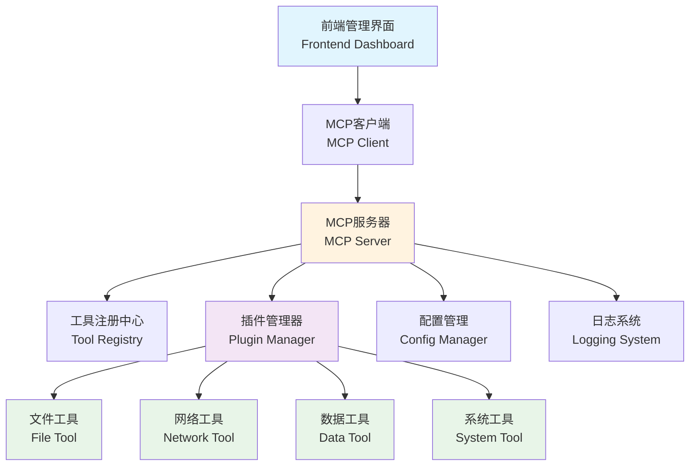

# 第9章 案例6 - MCP协议的实战应用

> "工具生态系统的构建，是现代AI开发的核心竞争力。"

## 引言

在AI开发的世界里，工具的互联互通是提升开发效率的关键。Model Context Protocol (MCP) 作为一种新兴的协议标准，为AI应用与外部工具的集成提供了统一的接口规范。本章将通过构建一个完整的MCP工具生态系统，让你深入理解这一协议的实战应用价值。

## 1. 项目概述（What）

### 1.1 项目目标与预期成果

**项目名称**：智能工具集成平台

**核心目标**：
- 构建基于MCP协议的工具生态系统
- 实现多种工具的统一接入和管理
- 提供可扩展的插件架构
- 展示MCP协议在实际项目中的应用价值

**预期成果**：
- 一个完整的MCP服务器实现
- 多个实用工具的MCP适配器
- 统一的工具管理界面
- 详细的协议文档和使用指南

### 1.2 技术栈选择理由

**后端技术栈**：
- **Python 3.8+**：MCP协议的主要实现语言
- **FastAPI**：高性能的API框架，支持异步处理
- **Pydantic**：数据验证和序列化
- **asyncio**：异步编程支持

**前端技术栈**：
- **TypeScript**：类型安全的JavaScript超集
- **React**：组件化UI框架
- **Tailwind CSS**：实用优先的CSS框架
- **WebSocket**：实时通信支持

**工具集成**：
- **文件操作工具**：文件读写、目录管理
- **网络请求工具**：HTTP客户端、API调用
- **数据处理工具**：JSON处理、数据转换
- **系统工具**：命令执行、环境变量管理

### 1.3 难度等级与学习重点

**难度等级**：⭐⭐⭐⭐☆ (中高级)

**学习重点**：
1. **MCP协议深度理解**：协议规范、消息格式、生命周期管理
2. **异步编程实践**：Python asyncio、JavaScript Promise
3. **插件架构设计**：可扩展性、模块化、依赖注入
4. **实时通信机制**：WebSocket、消息队列、事件驱动
5. **工具生态构建**：标准化接口、统一管理、版本控制

### 1.4 技术架构



## 2. 需求分析（Why）

### 2.1 用户故事与使用场景

使用WHO-GIVEN-WHEN-THEN-SHALL框架描述核心用户故事：

**用户故事1：工具开发者**
- **WHO**：一个工具开发者
- **GIVEN**：他开发了一个实用的命令行工具
- **WHEN**：他想要将工具集成到AI开发环境中
- **THEN**：他应该能够通过MCP协议快速接入
- **SHALL**：他应该能够在5分钟内完成工具的MCP适配

**用户故事2：AI应用开发者**
- **WHO**：一个AI应用开发者
- **GIVEN**：他需要在AI应用中使用多种外部工具
- **WHEN**：他通过MCP客户端调用工具
- **THEN**：他应该能够获得统一的调用体验
- **SHALL**：他应该能够通过标准接口调用任何已注册的工具

**用户故事3：系统管理员**
- **WHO**：一个系统管理员
- **GIVEN**：他需要管理多个MCP工具的运行状态
- **WHEN**：他访问管理界面
- **THEN**：他应该能够看到所有工具的状态和性能指标
- **SHALL**：他应该能够实时监控和管理工具的生命周期

### 2.2 核心功能需求梳理

**功能需求清单**：

1. **MCP服务器核心功能**
   - 协议消息处理（初始化、工具调用、资源管理）
   - 工具注册和发现机制
   - 会话管理和状态维护
   - 错误处理和异常恢复

2. **工具管理功能**
   - 动态工具加载和卸载
   - 工具版本管理和依赖解析
   - 工具权限控制和安全验证
   - 工具性能监控和日志记录

3. **用户界面功能**
   - 工具列表和详情展示
   - 实时调用日志查看
   - 工具配置和参数管理
   - 系统状态监控面板

4. **扩展性功能**
   - 插件开发框架
   - 自定义工具模板
   - API文档自动生成
   - 工具测试和验证套件

### 2.3 技术挑战识别

**主要技术挑战**：

1. **协议实现复杂性**
   - MCP协议规范的准确实现
   - 消息序列化和反序列化
   - 协议版本兼容性处理

2. **异步编程挑战**
   - 并发工具调用的管理
   - 异步异常处理机制
   - 资源竞争和死锁避免

3. **插件架构设计**
   - 动态加载和热更新
   - 插件间依赖管理
   - 安全沙箱机制

4. **性能优化需求**
   - 高并发场景下的性能保证
   - 内存使用优化
   - 网络通信效率

## 3. 规范设计（How - Spec）

### 3.1 功能规范文档

#### 3.1.1 MCP服务器规范

**服务器初始化流程**：
```json
{
  "jsonrpc": "2.0",
  "method": "initialize",
  "params": {
    "protocolVersion": "2024-11-05",
    "capabilities": {
      "tools": {},
      "resources": {},
      "prompts": {},
      "logging": {}
    },
    "clientInfo": {
      "name": "MCP Tool Platform",
      "version": "1.0.0"
    }
  }
}
```

**工具调用规范**：
```json
{
  "jsonrpc": "2.0",
  "method": "tools/call",
  "params": {
    "name": "file_read",
    "arguments": {
      "path": "/path/to/file.txt",
      "encoding": "utf-8"
    }
  }
}
```

#### 3.1.2 工具接口规范

**工具定义结构**：
```python
from typing import Dict, Any, List
from pydantic import BaseModel

class ToolParameter(BaseModel):
    name: str
    type: str
    description: str
    required: bool = True
    default: Any = None

class ToolDefinition(BaseModel):
    name: str
    description: str
    parameters: List[ToolParameter]
    category: str
    version: str
    author: str

class ToolResult(BaseModel):
    success: bool
    data: Any = None
    error: str = None
    metadata: Dict[str, Any] = {}
```

### 3.2 接口设计与数据结构

#### 3.2.1 核心数据模型

**MCP消息基类**：
```python
from enum import Enum
from typing import Optional, Dict, Any
from pydantic import BaseModel

class MessageType(Enum):
    REQUEST = "request"
    RESPONSE = "response"
    NOTIFICATION = "notification"

class MCPMessage(BaseModel):
    jsonrpc: str = "2.0"
    id: Optional[str] = None
    method: Optional[str] = None
    params: Optional[Dict[str, Any]] = None
    result: Optional[Any] = None
    error: Optional[Dict[str, Any]] = None

class MCPError(BaseModel):
    code: int
    message: str
    data: Optional[Any] = None
```

**工具管理器接口**：
```python
from abc import ABC, abstractmethod
from typing import List, Optional

class ToolManager(ABC):
    @abstractmethod
    async def register_tool(self, tool: ToolDefinition) -> bool:
        """注册新工具"""
        pass
    
    @abstractmethod
    async def unregister_tool(self, tool_name: str) -> bool:
        """注销工具"""
        pass
    
    @abstractmethod
    async def list_tools(self) -> List[ToolDefinition]:
        """获取工具列表"""
        pass
    
    @abstractmethod
    async def call_tool(self, name: str, arguments: Dict[str, Any]) -> ToolResult:
        """调用工具"""
        pass
```

#### 3.2.2 API端点设计

**RESTful API规范**：
```python
from fastapi import FastAPI, HTTPException
from typing import List

app = FastAPI(title="MCP Tool Platform API")

# 工具管理端点
@app.get("/api/tools", response_model=List[ToolDefinition])
async def list_tools():
    """获取所有可用工具"""
    pass

@app.post("/api/tools/{tool_name}/call", response_model=ToolResult)
async def call_tool(tool_name: str, arguments: Dict[str, Any]):
    """调用指定工具"""
    pass

@app.get("/api/tools/{tool_name}/status")
async def get_tool_status(tool_name: str):
    """获取工具状态"""
    pass

# 系统管理端点
@app.get("/api/system/health")
async def health_check():
    """系统健康检查"""
    return {"status": "healthy", "timestamp": datetime.utcnow()}

@app.get("/api/system/metrics")
async def get_metrics():
    """获取系统指标"""
    pass
```

### 3.3 测试用例设计

#### 3.3.1 单元测试用例

**MCP消息处理测试**：
```python
import pytest
from unittest.mock import AsyncMock
from mcp_server import MCPServer
from mcp_messages import MCPMessage

class TestMCPServer:
    @pytest.fixture
    async def server(self):
        server = MCPServer()
        await server.initialize()
        return server
    
    async def test_initialize_message(self, server):
        """测试初始化消息处理"""
        message = MCPMessage(
            method="initialize",
            params={
                "protocolVersion": "2024-11-05",
                "capabilities": {"tools": {}}
            }
        )
        
        response = await server.handle_message(message)
        
        assert response.result is not None
        assert "capabilities" in response.result
        assert "serverInfo" in response.result
    
    async def test_tool_call_message(self, server):
        """测试工具调用消息处理"""
        # 先注册一个测试工具
        await server.register_tool(create_test_tool())
        
        message = MCPMessage(
            method="tools/call",
            params={
                "name": "test_tool",
                "arguments": {"input": "test"}
            }
        )
        
        response = await server.handle_message(message)
        
        assert response.result is not None
        assert response.result["success"] is True
```

#### 3.3.2 集成测试用例

**端到端工具调用测试**：
```python
import asyncio
import websockets
import json
from typing import Dict, Any

class TestMCPIntegration:
    async def test_websocket_tool_call(self):
        """测试通过WebSocket进行工具调用"""
        uri = "ws://localhost:8000/mcp"
        
        async with websockets.connect(uri) as websocket:
            # 发送初始化消息
            init_message = {
                "jsonrpc": "2.0",
                "id": "1",
                "method": "initialize",
                "params": {
                    "protocolVersion": "2024-11-05",
                    "capabilities": {"tools": {}}
                }
            }
            
            await websocket.send(json.dumps(init_message))
            response = await websocket.recv()
            init_response = json.loads(response)
            
            assert "result" in init_response
            
            # 调用工具
            tool_call = {
                "jsonrpc": "2.0",
                "id": "2",
                "method": "tools/call",
                "params": {
                    "name": "file_read",
                    "arguments": {"path": "test.txt"}
                }
            }
            
            await websocket.send(json.dumps(tool_call))
            response = await websocket.recv()
            tool_response = json.loads(response)
            
            assert "result" in tool_response
            assert tool_response["result"]["success"] is True
```

#### 3.3.3 性能测试用例

**并发调用性能测试**：
```python
import asyncio
import time
from concurrent.futures import ThreadPoolExecutor

class TestMCPPerformance:
    async def test_concurrent_tool_calls(self):
        """测试并发工具调用性能"""
        server = MCPServer()
        await server.initialize()
        
        # 注册测试工具
        await server.register_tool(create_performance_test_tool())
        
        async def call_tool():
            message = MCPMessage(
                method="tools/call",
                params={
                    "name": "performance_test",
                    "arguments": {"delay": 0.1}
                }
            )
            return await server.handle_message(message)
        
        # 并发调用测试
        start_time = time.time()
        tasks = [call_tool() for _ in range(100)]
        results = await asyncio.gather(*tasks)
        end_time = time.time()
        
        # 验证结果
        assert len(results) == 100
        assert all(r.result["success"] for r in results)
        
        # 性能指标
        total_time = end_time - start_time
        throughput = len(results) / total_time
        
        print(f"并发调用吞吐量: {throughput:.2f} calls/second")
        assert throughput > 50  # 期望吞吐量大于50 calls/second
```

## 4. 实现过程（How - Code）

### 4.1 环境搭建与工具配置

#### 4.1.1 项目初始化

**创建项目结构**：
```bash
# 创建项目目录
mkdir mcp-tool-platform
cd mcp-tool-platform

# 创建目录结构
mkdir -p {
    src/{server,client,tools,common},
    tests/{unit,integration,performance},
    docs,
    examples,
    scripts
}

# 创建配置文件
touch {
    pyproject.toml,
    requirements.txt,
    .env.example,
    .gitignore,
    README.md
}
```

**依赖配置 (pyproject.toml)**：
```toml
[build-system]
requires = ["hatchling"]
build-backend = "hatchling.build"

[project]
name = "mcp-tool-platform"
version = "1.0.0"
description = "MCP协议工具集成平台"
authors = [{name = "Your Name", email = "your.email@example.com"}]
readme = "README.md"
requires-python = ">=3.8"
classifiers = [
    "Development Status :: 4 - Beta",
    "Intended Audience :: Developers",
    "License :: OSI Approved :: MIT License",
    "Programming Language :: Python :: 3",
    "Programming Language :: Python :: 3.8",
    "Programming Language :: Python :: 3.9",
    "Programming Language :: Python :: 3.10",
    "Programming Language :: Python :: 3.11",
]
dependencies = [
    "fastapi>=0.104.0",
    "uvicorn[standard]>=0.24.0",
    "websockets>=12.0",
    "pydantic>=2.5.0",
    "aiofiles>=23.2.1",
    "httpx>=0.25.0",
    "python-multipart>=0.0.6",
    "python-dotenv>=1.0.0",
    "structlog>=23.2.0",
    "rich>=13.7.0",
]

[project.optional-dependencies]
dev = [
    "pytest>=7.4.0",
    "pytest-asyncio>=0.21.0",
    "pytest-cov>=4.1.0",
    "black>=23.0.0",
    "isort>=5.12.0",
    "mypy>=1.7.0",
    "ruff>=0.1.0",
]

[tool.black]
line-length = 88
target-version = ['py38']

[tool.isort]
profile = "black"
line_length = 88

[tool.mypy]
python_version = "3.8"
warn_return_any = true
warn_unused_configs = true
disallow_untyped_defs = true

[tool.pytest.ini_options]
minversion = "7.0"
addopts = "-ra -q --strict-markers --strict-config"
testpaths = ["tests"]
asyncio_mode = "auto"
```

#### 4.1.2 开发环境配置

**环境变量配置 (.env.example)**：
```bash
# 服务器配置
SERVER_HOST=localhost
SERVER_PORT=8000
SERVER_RELOAD=true

# 日志配置
LOG_LEVEL=INFO
LOG_FORMAT=json

# 工具配置
TOOL_REGISTRY_PATH=./tools
TOOL_CONFIG_PATH=./config/tools.yaml

# 安全配置
API_KEY_HEADER=X-API-Key
ALLOWED_ORIGINS=http://localhost:3000,http://localhost:8080

# 数据库配置（可选）
DATABASE_URL=sqlite:///./mcp_platform.db

# 监控配置
METRICS_ENABLED=true
METRICS_PORT=9090
```

### 4.2 核心代码实现步骤

#### 4.2.1 MCP消息处理核心

**消息模型定义 (src/common/models.py)**：
```python
from enum import Enum
from typing import Any, Dict, List, Optional, Union
from pydantic import BaseModel, Field
import uuid
from datetime import datetime

class MCPVersion(str, Enum):
    V2024_11_05 = "2024-11-05"

class MessageType(str, Enum):
    REQUEST = "request"
    RESPONSE = "response"
    NOTIFICATION = "notification"

class MCPError(BaseModel):
    code: int
    message: str
    data: Optional[Any] = None

class MCPMessage(BaseModel):
    jsonrpc: str = Field(default="2.0", const=True)
    id: Optional[str] = Field(default_factory=lambda: str(uuid.uuid4()))
    method: Optional[str] = None
    params: Optional[Dict[str, Any]] = None
    result: Optional[Any] = None
    error: Optional[MCPError] = None
    
    class Config:
        extra = "forbid"

class ServerCapabilities(BaseModel):
    tools: Optional[Dict[str, Any]] = Field(default_factory=dict)
    resources: Optional[Dict[str, Any]] = Field(default_factory=dict)
    prompts: Optional[Dict[str, Any]] = Field(default_factory=dict)
    logging: Optional[Dict[str, Any]] = Field(default_factory=dict)

class ClientInfo(BaseModel):
    name: str
    version: str

class ServerInfo(BaseModel):
    name: str = "MCP Tool Platform"
    version: str = "1.0.0"
    protocol_version: MCPVersion = MCPVersion.V2024_11_05

class InitializeParams(BaseModel):
    protocol_version: MCPVersion
    capabilities: ServerCapabilities
    client_info: ClientInfo

class InitializeResult(BaseModel):
    protocol_version: MCPVersion
    capabilities: ServerCapabilities
    server_info: ServerInfo

class ToolParameter(BaseModel):
    name: str
    type: str
    description: str
    required: bool = True
    default: Optional[Any] = None
    enum: Optional[List[str]] = None

class ToolDefinition(BaseModel):
    name: str
    description: str
    parameters: List[ToolParameter]
    category: str = "general"
    version: str = "1.0.0"
    author: str = "Unknown"
    tags: List[str] = Field(default_factory=list)
    created_at: datetime = Field(default_factory=datetime.utcnow)
    updated_at: datetime = Field(default_factory=datetime.utcnow)

class ToolCallParams(BaseModel):
    name: str
    arguments: Dict[str, Any] = Field(default_factory=dict)

class ToolResult(BaseModel):
    success: bool
    data: Optional[Any] = None
    error: Optional[str] = None
    metadata: Dict[str, Any] = Field(default_factory=dict)
    execution_time: Optional[float] = None
    timestamp: datetime = Field(default_factory=datetime.utcnow)
```

**MCP服务器核心实现 (src/server/mcp_server.py)**：
```python
import asyncio
import json
import logging
from typing import Dict, List, Optional, Callable, Any
from datetime import datetime
import structlog

from ..common.models import (
    MCPMessage, MCPError, InitializeParams, InitializeResult,
    ServerCapabilities, ServerInfo, ToolCallParams, ToolResult,
    ToolDefinition, MCPVersion
)
from .tool_manager import ToolManager
from .exceptions import MCPException, ToolNotFoundError, InvalidParametersError

logger = structlog.get_logger(__name__)

class MCPServer:
    def __init__(self, tool_manager: Optional[ToolManager] = None):
        self.tool_manager = tool_manager or ToolManager()
        self.initialized = False
        self.client_info: Optional[Dict[str, Any]] = None
        self.capabilities = ServerCapabilities()
        self.message_handlers: Dict[str, Callable] = {
            "initialize": self._handle_initialize,
            "tools/list": self._handle_tools_list,
            "tools/call": self._handle_tools_call,
            "ping": self._handle_ping,
        }
        
        # 统计信息
        self.stats = {
            "messages_processed": 0,
            "tools_called": 0,
            "errors_count": 0,
            "start_time": datetime.utcnow()
        }
    
    async def initialize(self) -> None:
        """初始化服务器"""
        await self.tool_manager.initialize()
        logger.info("MCP服务器初始化完成")
    
    async def handle_message(self, message: MCPMessage) -> MCPMessage:
        """处理MCP消息"""
        self.stats["messages_processed"] += 1
        
        try:
            logger.info(
                "处理MCP消息",
                method=message.method,
                message_id=message.id
            )
            
            if message.method not in self.message_handlers:
                raise MCPException(
                    code=-32601,
                    message=f"未知方法: {message.method}"
                )
            
            handler = self.message_handlers[message.method]
            result = await handler(message.params or {})
            
            return MCPMessage(
                id=message.id,
                result=result
            )
            
        except MCPException as e:
            self.stats["errors_count"] += 1
            logger.error(
                "MCP异常",
                error_code=e.code,
                error_message=e.message,
                message_id=message.id
            )
            return MCPMessage(
                id=message.id,
                error=MCPError(
                    code=e.code,
                    message=e.message,
                    data=e.data
                )
            )
        except Exception as e:
            self.stats["errors_count"] += 1
            logger.exception(
                "未处理的异常",
                error=str(e),
                message_id=message.id
            )
            return MCPMessage(
                id=message.id,
                error=MCPError(
                    code=-32603,
                    message="内部服务器错误",
                    data=str(e)
                )
            )
    
    async def _handle_initialize(self, params: Dict[str, Any]) -> Dict[str, Any]:
        """处理初始化请求"""
        try:
            init_params = InitializeParams(**params)
        except Exception as e:
            raise InvalidParametersError(f"无效的初始化参数: {e}")
        
        self.client_info = init_params.client_info.dict()
        self.initialized = True
        
        result = InitializeResult(
            protocol_version=MCPVersion.V2024_11_05,
            capabilities=self.capabilities,
            server_info=ServerInfo()
        )
        
        logger.info(
            "客户端初始化完成",
            client_name=init_params.client_info.name,
            client_version=init_params.client_info.version
        )
        
        return result.dict()
    
    async def _handle_tools_list(self, params: Dict[str, Any]) -> Dict[str, Any]:
        """处理工具列表请求"""
        if not self.initialized:
            raise MCPException(code=-32002, message="服务器未初始化")
        
        tools = await self.tool_manager.list_tools()
        return {
            "tools": [tool.dict() for tool in tools]
        }
    
    async def _handle_tools_call(self, params: Dict[str, Any]) -> Dict[str, Any]:
        """处理工具调用请求"""
        if not self.initialized:
            raise MCPException(code=-32002, message="服务器未初始化")
        
        try:
            call_params = ToolCallParams(**params)
        except Exception as e:
            raise InvalidParametersError(f"无效的工具调用参数: {e}")
        
        self.stats["tools_called"] += 1
        
        start_time = asyncio.get_event_loop().time()
        result = await self.tool_manager.call_tool(
            call_params.name,
            call_params.arguments
        )
        execution_time = asyncio.get_event_loop().time() - start_time
        
        result.execution_time = execution_time
        
        logger.info(
            "工具调用完成",
            tool_name=call_params.name,
            success=result.success,
            execution_time=execution_time
        )
        
        return result.dict()
    
    async def _handle_ping(self, params: Dict[str, Any]) -> Dict[str, Any]:
        """处理ping请求"""
        return {
            "pong": True,
            "timestamp": datetime.utcnow().isoformat(),
            "server_info": ServerInfo().dict()
        }
    
    def get_stats(self) -> Dict[str, Any]:
        """获取服务器统计信息"""
        uptime = datetime.utcnow() - self.stats["start_time"]
        return {
            **self.stats,
            "uptime_seconds": uptime.total_seconds(),
            "initialized": self.initialized,
            "client_info": self.client_info
        }
```

#### 4.2.2 工具管理器实现

**工具管理器 (src/server/tool_manager.py)**：
```python
import asyncio
import importlib
import inspect
from pathlib import Path
from typing import Dict, List, Optional, Any, Type
import structlog

from ..common.models import ToolDefinition, ToolResult
from .exceptions import ToolNotFoundError, ToolRegistrationError
from .base_tool import BaseTool

logger = structlog.get_logger(__name__)

class ToolManager:
    def __init__(self, tools_directory: Optional[Path] = None):
        self.tools: Dict[str, BaseTool] = {}
        self.tool_definitions: Dict[str, ToolDefinition] = {}
        self.tools_directory = tools_directory or Path("./tools")
        self._lock = asyncio.Lock()
    
    async def initialize(self) -> None:
        """初始化工具管理器"""
        await self._load_builtin_tools()
        await self._discover_tools()
        logger.info(f"工具管理器初始化完成，加载了 {len(self.tools)} 个工具")
    
    async def register_tool(self, tool: BaseTool) -> bool:
        """注册工具"""
        async with self._lock:
            try:
                # 验证工具
                await self._validate_tool(tool)
                
                tool_name = tool.get_definition().name
                
                if tool_name in self.tools:
                    logger.warning(f"工具 {tool_name} 已存在，将被覆盖")
                
                self.tools[tool_name] = tool
                self.tool_definitions[tool_name] = tool.get_definition()
                
                logger.info(f"工具 {tool_name} 注册成功")
                return True
                
            except Exception as e:
                logger.error(f"工具注册失败: {e}")
                raise ToolRegistrationError(f"工具注册失败: {e}")
    
    async def unregister_tool(self, tool_name: str) -> bool:
        """注销工具"""
        async with self._lock:
            if tool_name not in self.tools:
                raise ToolNotFoundError(f"工具 {tool_name} 不存在")
            
            # 清理工具资源
            tool = self.tools[tool_name]
            if hasattr(tool, 'cleanup'):
                await tool.cleanup()
            
            del self.tools[tool_name]
            del self.tool_definitions[tool_name]
            
            logger.info(f"工具 {tool_name} 注销成功")
            return True
    
    async def list_tools(self) -> List[ToolDefinition]:
        """获取工具列表"""
        return list(self.tool_definitions.values())
    
    async def get_tool_definition(self, tool_name: str) -> ToolDefinition:
        """获取工具定义"""
        if tool_name not in self.tool_definitions:
            raise ToolNotFoundError(f"工具 {tool_name} 不存在")
        return self.tool_definitions[tool_name]
    
    async def call_tool(self, name: str, arguments: Dict[str, Any]) -> ToolResult:
        """调用工具"""
        if name not in self.tools:
            raise ToolNotFoundError(f"工具 {name} 不存在")
        
        tool = self.tools[name]
        
        try:
            # 验证参数
            await self._validate_arguments(tool, arguments)
            
            # 调用工具
            result = await tool.execute(arguments)
            
            logger.debug(
                "工具调用成功",
                tool_name=name,
                success=result.success
            )
            
            return result
            
        except Exception as e:
            logger.error(
                "工具调用失败",
                tool_name=name,
                error=str(e)
            )
            return ToolResult(
                success=False,
                error=str(e),
                metadata={"tool_name": name}
            )
    
    async def _load_builtin_tools(self) -> None:
        """加载内置工具"""
        from ..tools import (
            FileReadTool, FileWriteTool, HttpRequestTool,
            JsonProcessorTool, SystemCommandTool
        )
        
        builtin_tools = [
            FileReadTool(),
            FileWriteTool(),
            HttpRequestTool(),
            JsonProcessorTool(),
            SystemCommandTool()
        ]
        
        for tool in builtin_tools:
            await self.register_tool(tool)
    
    async def _discover_tools(self) -> None:
        """发现并加载外部工具"""
        if not self.tools_directory.exists():
            logger.info(f"工具目录 {self.tools_directory} 不存在，跳过工具发现")
            return
        
        for tool_file in self.tools_directory.glob("*.py"):
            if tool_file.name.startswith("_"):
                continue
            
            try:
                await self._load_tool_from_file(tool_file)
            except Exception as e:
                logger.error(f"加载工具文件 {tool_file} 失败: {e}")
    
    async def _load_tool_from_file(self, tool_file: Path) -> None:
        """从文件加载工具"""
        module_name = tool_file.stem
        spec = importlib.util.spec_from_file_location(module_name, tool_file)
        
        if spec is None or spec.loader is None:
            raise ImportError(f"无法加载模块 {module_name}")
        
        module = importlib.util.module_from_spec(spec)
        spec.loader.exec_module(module)
        
        # 查找工具类
        for name, obj in inspect.getmembers(module, inspect.isclass):
            if (issubclass(obj, BaseTool) and 
                obj is not BaseTool and 
                not name.startswith('_')):
                
                tool_instance = obj()
                await self.register_tool(tool_instance)
                logger.info(f"从文件 {tool_file} 加载工具 {name}")
    
    async def _validate_tool(self, tool: BaseTool) -> None:
        """验证工具"""
        if not isinstance(tool, BaseTool):
            raise ToolRegistrationError("工具必须继承自 BaseTool")
        
        definition = tool.get_definition()
        if not definition.name:
            raise ToolRegistrationError("工具名称不能为空")
        
        if not definition.description:
            raise ToolRegistrationError("工具描述不能为空")
        
        # 验证execute方法
        if not hasattr(tool, 'execute'):
            raise ToolRegistrationError("工具必须实现 execute 方法")
        
        if not asyncio.iscoroutinefunction(tool.execute):
            raise ToolRegistrationError("execute 方法必须是异步方法")
    
    async def _validate_arguments(self, tool: BaseTool, arguments: Dict[str, Any]) -> None:
        """验证工具参数"""
        definition = tool.get_definition()
        
        # 检查必需参数
        for param in definition.parameters:
            if param.required and param.name not in arguments:
                raise ValueError(f"缺少必需参数: {param.name}")
        
        # 检查参数类型（简单验证）
        for param in definition.parameters:
            if param.name in arguments:
                value = arguments[param.name]
                if not self._validate_parameter_type(value, param.type):
                    raise ValueError(
                        f"参数 {param.name} 类型错误，期望 {param.type}，实际 {type(value).__name__}"
                    )
    
    def _validate_parameter_type(self, value: Any, expected_type: str) -> bool:
        """验证参数类型"""
        type_mapping = {
            "string": str,
            "integer": int,
            "number": (int, float),
            "boolean": bool,
            "array": list,
            "object": dict
        }
        
        expected_python_type = type_mapping.get(expected_type)
        if expected_python_type is None:
            return True  # 未知类型，跳过验证
        
        return isinstance(value, expected_python_type)
```

#### 4.2.3 基础工具类和内置工具

**基础工具类 (src/server/base_tool.py)**：
```python
from abc import ABC, abstractmethod
from typing import Dict, Any
from ..common.models import ToolDefinition, ToolResult

class BaseTool(ABC):
    """工具基类"""
    
    @abstractmethod
    def get_definition(self) -> ToolDefinition:
        """获取工具定义"""
        pass
    
    @abstractmethod
    async def execute(self, arguments: Dict[str, Any]) -> ToolResult:
        """执行工具"""
        pass
    
    async def cleanup(self) -> None:
        """清理资源（可选实现）"""
        pass
```

**文件读取工具 (src/tools/file_read_tool.py)**：
```python
import aiofiles
from pathlib import Path
from typing import Dict, Any

from ..server.base_tool import BaseTool
from ..common.models import ToolDefinition, ToolParameter, ToolResult

class FileReadTool(BaseTool):
    def get_definition(self) -> ToolDefinition:
        return ToolDefinition(
            name="file_read",
            description="读取文件内容",
            parameters=[
                ToolParameter(
                    name="path",
                    type="string",
                    description="文件路径",
                    required=True
                ),
                ToolParameter(
                    name="encoding",
                    type="string",
                    description="文件编码",
                    required=False,
                    default="utf-8"
                ),
                ToolParameter(
                    name="max_size",
                    type="integer",
                    description="最大文件大小（字节）",
                    required=False,
                    default=1024*1024  # 1MB
                )
            ],
            category="file",
            author="MCP Platform"
        )
    
    async def execute(self, arguments: Dict[str, Any]) -> ToolResult:
        try:
            file_path = Path(arguments["path"])
            encoding = arguments.get("encoding", "utf-8")
            max_size = arguments.get("max_size", 1024*1024)
            
            # 安全检查
            if not file_path.exists():
                return ToolResult(
                    success=False,
                    error=f"文件不存在: {file_path}"
                )
            
            if not file_path.is_file():
                return ToolResult(
                    success=False,
                    error=f"路径不是文件: {file_path}"
                )
            
            # 检查文件大小
            file_size = file_path.stat().st_size
            if file_size > max_size:
                return ToolResult(
                    success=False,
                    error=f"文件过大: {file_size} 字节，最大允许 {max_size} 字节"
                )
            
            # 读取文件
            async with aiofiles.open(file_path, 'r', encoding=encoding) as f:
                content = await f.read()
            
            return ToolResult(
                success=True,
                data={
                    "content": content,
                    "size": file_size,
                    "encoding": encoding
                },
                metadata={
                    "file_path": str(file_path),
                    "file_size": file_size
                }
            )
            
        except UnicodeDecodeError as e:
            return ToolResult(
                success=False,
                error=f"文件编码错误: {e}"
            )
        except Exception as e:
            return ToolResult(
                success=False,
                error=f"读取文件失败: {e}"
            )
```

**HTTP请求工具 (src/tools/http_request_tool.py)**：
```python
import httpx
from typing import Dict, Any, Optional
import json

from ..server.base_tool import BaseTool
from ..common.models import ToolDefinition, ToolParameter, ToolResult

class HttpRequestTool(BaseTool):
    def __init__(self):
        self.client: Optional[httpx.AsyncClient] = None
    
    def get_definition(self) -> ToolDefinition:
        return ToolDefinition(
            name="http_request",
            description="发送HTTP请求",
            parameters=[
                ToolParameter(
                    name="url",
                    type="string",
                    description="请求URL",
                    required=True
                ),
                ToolParameter(
                    name="method",
                    type="string",
                    description="HTTP方法",
                    required=False,
                    default="GET",
                    enum=["GET", "POST", "PUT", "DELETE", "PATCH"]
                ),
                ToolParameter(
                    name="headers",
                    type="object",
                    description="请求头",
                    required=False
                ),
                ToolParameter(
                    name="data",
                    type="object",
                    description="请求数据",
                    required=False
                ),
                ToolParameter(
                    name="timeout",
                    type="number",
                    description="超时时间（秒）",
                    required=False,
                    default=30
                )
            ],
            category="network",
            author="MCP Platform"
        )
    
    async def execute(self, arguments: Dict[str, Any]) -> ToolResult:
        if self.client is None:
            self.client = httpx.AsyncClient()
        
        try:
            url = arguments["url"]
            method = arguments.get("method", "GET").upper()
            headers = arguments.get("headers", {})
            data = arguments.get("data")
            timeout = arguments.get("timeout", 30)
            
            # 发送请求
            response = await self.client.request(
                method=method,
                url=url,
                headers=headers,
                json=data if data else None,
                timeout=timeout
            )
            
            # 尝试解析JSON响应
            try:
                response_data = response.json()
            except json.JSONDecodeError:
                response_data = response.text
            
            return ToolResult(
                success=True,
                data={
                    "status_code": response.status_code,
                    "headers": dict(response.headers),
                    "data": response_data
                },
                metadata={
                    "url": url,
                    "method": method,
                    "response_size": len(response.content)
                }
            )
            
        except httpx.TimeoutException:
            return ToolResult(
                success=False,
                error=f"请求超时: {timeout} 秒"
            )
        except httpx.RequestError as e:
            return ToolResult(
                success=False,
                error=f"请求错误: {e}"
            )
        except Exception as e:
            return ToolResult(
                success=False,
                error=f"HTTP请求失败: {e}"
            )
    
    async def cleanup(self) -> None:
        if self.client:
            await self.client.aclose()
            self.client = None
```

### 4.3 调试与问题解决

#### 4.3.1 日志配置和调试

**结构化日志配置 (src/common/logging.py)**：
```python
import sys
import structlog
from typing import Any, Dict
import logging
from rich.console import Console
from rich.logging import RichHandler

def setup_logging(log_level: str = "INFO", log_format: str = "rich") -> None:
    """配置结构化日志"""
    
    # 配置标准库logging
    logging.basicConfig(
        level=getattr(logging, log_level.upper()),
        format="%(message)s",
        datefmt="[%X]",
        handlers=[
            RichHandler(console=Console(stderr=True), rich_tracebacks=True)
        ] if log_format == "rich" else [logging.StreamHandler(sys.stderr)]
    )
    
    # 配置structlog
    processors = [
        structlog.stdlib.filter_by_level,
        structlog.stdlib.add_logger_name,
        structlog.stdlib.add_log_level,
        structlog.stdlib.PositionalArgumentsFormatter(),
        structlog.processors.TimeStamper(fmt="iso"),
        structlog.processors.StackInfoRenderer(),
        structlog.processors.format_exc_info,
    ]
    
    if log_format == "json":
        processors.append(structlog.processors.JSONRenderer())
    else:
        processors.extend([
            structlog.dev.ConsoleRenderer(colors=True),
        ])
    
    structlog.configure(
        processors=processors,
        wrapper_class=structlog.stdlib.BoundLogger,
        logger_factory=structlog.stdlib.LoggerFactory(),
        cache_logger_on_first_use=True,
    )

class RequestLogger:
    """请求日志中间件"""
    
    def __init__(self):
        self.logger = structlog.get_logger(__name__)
    
    async def log_request(self, message: Dict[str, Any], response: Dict[str, Any]) -> None:
        """记录请求日志"""
        self.logger.info(
            "MCP请求处理",
            method=message.get("method"),
            message_id=message.get("id"),
            success=response.get("error") is None,
            response_size=len(str(response))
        )
```

#### 4.3.2 错误处理和异常管理

**自定义异常 (src/server/exceptions.py)**：
```python
class MCPException(Exception):
    """MCP协议异常基类"""
    
    def __init__(self, code: int, message: str, data: Any = None):
        self.code = code
        self.message = message
        self.data = data
        super().__init__(message)

class ToolNotFoundError(MCPException):
    """工具未找到异常"""
    
    def __init__(self, message: str):
        super().__init__(code=-32000, message=message)

class InvalidParametersError(MCPException):
    """无效参数异常"""
    
    def __init__(self, message: str):
        super().__init__(code=-32602, message=message)

class ToolRegistrationError(MCPException):
    """工具注册异常"""
    
    def __init__(self, message: str):
        super().__init__(code=-32001, message=message)

class ToolExecutionError(MCPException):
    """工具执行异常"""
    
    def __init__(self, message: str, tool_name: str = None):
        super().__init__(
            code=-32002, 
            message=message,
            data={"tool_name": tool_name} if tool_name else None
        )
```

#### 4.3.3 性能监控和指标

**性能监控 (src/server/metrics.py)**：
```python
import time
import asyncio
from typing import Dict, Any, Optional
from dataclasses import dataclass, field
from collections import defaultdict, deque
import structlog

logger = structlog.get_logger(__name__)

@dataclass
class PerformanceMetrics:
    """性能指标"""
    total_requests: int = 0
    successful_requests: int = 0
    failed_requests: int = 0
    total_execution_time: float = 0.0
    average_execution_time: float = 0.0
    min_execution_time: float = float('inf')
    max_execution_time: float = 0.0
    requests_per_second: float = 0.0
    
    # 最近的执行时间（用于计算移动平均）
    recent_execution_times: deque = field(default_factory=lambda: deque(maxlen=100))
    
    def update(self, execution_time: float, success: bool) -> None:
        """更新指标"""
        self.total_requests += 1
        
        if success:
            self.successful_requests += 1
        else:
            self.failed_requests += 1
        
        self.total_execution_time += execution_time
        self.recent_execution_times.append(execution_time)
        
        # 更新统计信息
        self.average_execution_time = self.total_execution_time / self.total_requests
        self.min_execution_time = min(self.min_execution_time, execution_time)
        self.max_execution_time = max(self.max_execution_time, execution_time)
    
    def get_recent_average(self) -> float:
        """获取最近的平均执行时间"""
        if not self.recent_execution_times:
            return 0.0
        return sum(self.recent_execution_times) / len(self.recent_execution_times)

class MetricsCollector:
    """指标收集器"""
    
    def __init__(self):
        self.tool_metrics: Dict[str, PerformanceMetrics] = defaultdict(PerformanceMetrics)
        self.global_metrics = PerformanceMetrics()
        self.start_time = time.time()
        self._lock = asyncio.Lock()
    
    async def record_tool_call(self, tool_name: str, execution_time: float, success: bool) -> None:
        """记录工具调用指标"""
        async with self._lock:
            self.tool_metrics[tool_name].update(execution_time, success)
            self.global_metrics.update(execution_time, success)
            
            # 计算RPS
            uptime = time.time() - self.start_time
            if uptime > 0:
                self.global_metrics.requests_per_second = self.global_metrics.total_requests / uptime
    
    async def get_metrics(self) -> Dict[str, Any]:
        """获取所有指标"""
        async with self._lock:
            uptime = time.time() - self.start_time
            
            return {
                "uptime_seconds": uptime,
                "global_metrics": {
                    "total_requests": self.global_metrics.total_requests,
                    "successful_requests": self.global_metrics.successful_requests,
                    "failed_requests": self.global_metrics.failed_requests,
                    "success_rate": (
                        self.global_metrics.successful_requests / self.global_metrics.total_requests
                        if self.global_metrics.total_requests > 0 else 0
                    ),
                    "average_execution_time": self.global_metrics.average_execution_time,
                    "min_execution_time": self.global_metrics.min_execution_time,
                    "max_execution_time": self.global_metrics.max_execution_time,
                    "requests_per_second": self.global_metrics.requests_per_second,
                    "recent_average_execution_time": self.global_metrics.get_recent_average()
                },
                "tool_metrics": {
                    tool_name: {
                        "total_requests": metrics.total_requests,
                        "successful_requests": metrics.successful_requests,
                        "failed_requests": metrics.failed_requests,
                        "success_rate": (
                            metrics.successful_requests / metrics.total_requests
                            if metrics.total_requests > 0 else 0
                        ),
                        "average_execution_time": metrics.average_execution_time,
                        "recent_average_execution_time": metrics.get_recent_average()
                    }
                    for tool_name, metrics in self.tool_metrics.items()
                }
            }
    
    async def reset_metrics(self) -> None:
        """重置指标"""
        async with self._lock:
            self.tool_metrics.clear()
            self.global_metrics = PerformanceMetrics()
            self.start_time = time.time()
            logger.info("性能指标已重置")
```

## 5. 验证测试（Test）

### 5.1 功能测试验证

#### 5.1.1 MCP协议兼容性测试

**协议初始化测试**：
```python
import pytest
import json
from unittest.mock import AsyncMock
from src.server.mcp_server import MCPServer
from src.common.models import MCPMessage, InitializeParams, ServerCapabilities, ClientInfo

class TestMCPProtocol:
    @pytest.fixture
    async def server(self):
        server = MCPServer()
        await server.initialize()
        return server
    
    async def test_protocol_initialization(self, server):
        """测试协议初始化流程"""
        init_message = MCPMessage(
            method="initialize",
            params={
                "protocolVersion": "2024-11-05",
                "capabilities": {"tools": {}},
                "clientInfo": {
                    "name": "Test Client",
                    "version": "1.0.0"
                }
            }
        )
        
        response = await server.handle_message(init_message)
        
        assert response.error is None
        assert response.result is not None
        assert "protocolVersion" in response.result
        assert "capabilities" in response.result
        assert "serverInfo" in response.result
        assert server.initialized is True
    
    async def test_tools_list_before_initialization(self, server):
        """测试未初始化时的工具列表请求"""
        list_message = MCPMessage(
            method="tools/list",
            params={}
        )
        
        response = await server.handle_message(list_message)
        
        assert response.error is not None
        assert response.error.code == -32002
        assert "未初始化" in response.error.message
    
    async def test_invalid_method(self, server):
        """测试无效方法调用"""
        invalid_message = MCPMessage(
            method="invalid_method",
            params={}
        )
        
        response = await server.handle_message(invalid_message)
        
        assert response.error is not None
        assert response.error.code == -32601
        assert "未知方法" in response.error.message
```

#### 5.1.2 工具集成测试

**工具注册和调用测试**：
```python
class TestToolIntegration:
    @pytest.fixture
    async def initialized_server(self):
        server = MCPServer()
        await server.initialize()
        
        # 初始化服务器
        init_message = MCPMessage(
            method="initialize",
            params={
                "protocolVersion": "2024-11-05",
                "capabilities": {"tools": {}},
                "clientInfo": {"name": "Test", "version": "1.0.0"}
            }
        )
        await server.handle_message(init_message)
        return server
    
    async def test_file_read_tool(self, initialized_server, tmp_path):
        """测试文件读取工具"""
        # 创建测试文件
        test_file = tmp_path / "test.txt"
        test_content = "Hello, MCP World!"
        test_file.write_text(test_content)
        
        # 调用文件读取工具
        call_message = MCPMessage(
            method="tools/call",
            params={
                "name": "file_read",
                "arguments": {"path": str(test_file)}
            }
        )
        
        response = await initialized_server.handle_message(call_message)
        
        assert response.error is None
        assert response.result["success"] is True
        assert response.result["data"]["content"] == test_content
    
    async def test_http_request_tool(self, initialized_server):
        """测试HTTP请求工具"""
        call_message = MCPMessage(
            method="tools/call",
            params={
                "name": "http_request",
                "arguments": {
                    "url": "https://httpbin.org/get",
                    "method": "GET"
                }
            }
        )
        
        response = await initialized_server.handle_message(call_message)
        
        assert response.error is None
        assert response.result["success"] is True
        assert response.result["data"]["status_code"] == 200
    
    async def test_tool_with_invalid_parameters(self, initialized_server):
        """测试无效参数的工具调用"""
        call_message = MCPMessage(
            method="tools/call",
            params={
                "name": "file_read",
                "arguments": {}  # 缺少必需的path参数
            }
        )
        
        response = await initialized_server.handle_message(call_message)
        
        assert response.error is None  # 工具调用本身成功
        assert response.result["success"] is False  # 但工具执行失败
        assert "缺少必需参数" in response.result["error"]
```

### 5.2 性能测试与优化

#### 5.2.1 并发性能测试

**高并发工具调用测试**：
```python
import asyncio
import time
from concurrent.futures import ThreadPoolExecutor

class TestPerformance:
    async def test_concurrent_tool_calls(self):
        """测试并发工具调用性能"""
        server = MCPServer()
        await server.initialize()
        
        # 初始化服务器
        init_message = MCPMessage(
            method="initialize",
            params={
                "protocolVersion": "2024-11-05",
                "capabilities": {"tools": {}},
                "clientInfo": {"name": "Perf Test", "version": "1.0.0"}
            }
        )
        await server.handle_message(init_message)
        
        async def make_tool_call():
            call_message = MCPMessage(
                method="tools/call",
                params={
                    "name": "http_request",
                    "arguments": {
                        "url": "https://httpbin.org/delay/0.1",
                        "method": "GET"
                    }
                }
            )
            return await server.handle_message(call_message)
        
        # 并发测试
        concurrency_levels = [1, 5, 10, 20, 50]
        results = {}
        
        for concurrency in concurrency_levels:
            start_time = time.time()
            
            tasks = [make_tool_call() for _ in range(concurrency)]
            responses = await asyncio.gather(*tasks, return_exceptions=True)
            
            end_time = time.time()
            duration = end_time - start_time
            
            successful_calls = sum(
                1 for r in responses 
                if not isinstance(r, Exception) and r.error is None
            )
            
            results[concurrency] = {
                "duration": duration,
                "successful_calls": successful_calls,
                "throughput": successful_calls / duration,
                "success_rate": successful_calls / concurrency
            }
        
        # 验证性能指标
        for concurrency, metrics in results.items():
            print(f"并发度 {concurrency}: {metrics['throughput']:.2f} calls/sec, "
                  f"成功率 {metrics['success_rate']:.2%}")
            
            # 基本性能要求
            assert metrics["success_rate"] >= 0.95  # 95%成功率
            assert metrics["throughput"] > 0  # 有效吞吐量
    
    async def test_memory_usage(self):
        """测试内存使用情况"""
        import psutil
        import os
        
        process = psutil.Process(os.getpid())
        initial_memory = process.memory_info().rss
        
        server = MCPServer()
        await server.initialize()
        
        # 执行大量工具调用
        for i in range(1000):
            call_message = MCPMessage(
                method="tools/call",
                params={
                    "name": "http_request",
                    "arguments": {
                        "url": "https://httpbin.org/get",
                        "method": "GET"
                    }
                }
            )
            await server.handle_message(call_message)
            
            # 每100次检查一次内存
            if i % 100 == 0:
                current_memory = process.memory_info().rss
                memory_growth = current_memory - initial_memory
                print(f"第 {i} 次调用后内存增长: {memory_growth / 1024 / 1024:.2f} MB")
        
        final_memory = process.memory_info().rss
        total_growth = final_memory - initial_memory
        
        # 内存增长不应超过100MB
        assert total_growth < 100 * 1024 * 1024, f"内存增长过多: {total_growth / 1024 / 1024:.2f} MB"
```

### 5.3 集成测试场景

#### 5.3.1 WebSocket集成测试

**WebSocket服务器实现 (src/server/websocket_server.py)**：
```python
import asyncio
import json
import websockets
from typing import Set
import structlog

from .mcp_server import MCPServer
from ..common.models import MCPMessage
from ..common.logging import RequestLogger

logger = structlog.get_logger(__name__)

class WebSocketMCPServer:
    def __init__(self, host: str = "localhost", port: int = 8000):
        self.host = host
        self.port = port
        self.mcp_server = MCPServer()
        self.clients: Set[websockets.WebSocketServerProtocol] = set()
        self.request_logger = RequestLogger()
    
    async def start(self) -> None:
        """启动WebSocket服务器"""
        await self.mcp_server.initialize()
        
        server = await websockets.serve(
            self.handle_client,
            self.host,
            self.port
        )
        
        logger.info(f"WebSocket MCP服务器启动在 ws://{self.host}:{self.port}")
        await server.wait_closed()
    
    async def handle_client(self, websocket: websockets.WebSocketServerProtocol, path: str) -> None:
        """处理客户端连接"""
        self.clients.add(websocket)
        client_address = websocket.remote_address
        
        logger.info(f"客户端连接: {client_address}")
        
        try:
            async for message in websocket:
                await self.handle_message(websocket, message)
        except websockets.exceptions.ConnectionClosed:
            logger.info(f"客户端断开连接: {client_address}")
        except Exception as e:
            logger.error(f"处理客户端消息时出错: {e}")
        finally:
            self.clients.discard(websocket)
    
    async def handle_message(self, websocket: websockets.WebSocketServerProtocol, raw_message: str) -> None:
        """处理客户端消息"""
        try:
            # 解析JSON消息
            message_data = json.loads(raw_message)
            message = MCPMessage(**message_data)
            
            # 处理MCP消息
            response = await self.mcp_server.handle_message(message)
            
            # 发送响应
            response_json = json.dumps(response.dict(exclude_none=True))
            await websocket.send(response_json)
            
            # 记录请求日志
            await self.request_logger.log_request(message_data, response.dict())
            
        except json.JSONDecodeError as e:
            error_response = MCPMessage(
                error={
                    "code": -32700,
                    "message": f"JSON解析错误: {e}"
                }
            )
            await websocket.send(json.dumps(error_response.dict(exclude_none=True)))
        
        except Exception as e:
            logger.exception(f"处理消息时出现未知错误: {e}")
            error_response = MCPMessage(
                error={
                    "code": -32603,
                    "message": "内部服务器错误"
                }
            )
            await websocket.send(json.dumps(error_response.dict(exclude_none=True)))
    
    async def broadcast_notification(self, notification: MCPMessage) -> None:
        """向所有客户端广播通知"""
        if not self.clients:
            return
        
        notification_json = json.dumps(notification.dict(exclude_none=True))
        
        # 并发发送给所有客户端
        await asyncio.gather(
            *[client.send(notification_json) for client in self.clients],
            return_exceptions=True
        )
    
    def get_server_stats(self) -> dict:
        """获取服务器统计信息"""
        return {
            "connected_clients": len(self.clients),
            "mcp_stats": self.mcp_server.get_stats()
        }
```

**WebSocket集成测试**：
```python
import asyncio
import json
import websockets
import pytest

class TestWebSocketIntegration:
    @pytest.fixture
    async def websocket_server(self):
        from src.server.websocket_server import WebSocketMCPServer
        
        server = WebSocketMCPServer(host="localhost", port=8001)
        server_task = asyncio.create_task(server.start())
        
        # 等待服务器启动
        await asyncio.sleep(0.1)
        
        yield server
        
        server_task.cancel()
        try:
            await server_task
        except asyncio.CancelledError:
            pass
    
    async def test_websocket_connection(self, websocket_server):
        """测试WebSocket连接"""
        uri = "ws://localhost:8001"
        
        async with websockets.connect(uri) as websocket:
            # 发送ping消息
            ping_message = {
                "jsonrpc": "2.0",
                "id": "test-1",
                "method": "ping",
                "params": {}
            }
            
            await websocket.send(json.dumps(ping_message))
            response = await websocket.recv()
            response_data = json.loads(response)
            
            assert "result" in response_data
            assert response_data["result"]["pong"] is True
    
    async def test_full_mcp_workflow(self, websocket_server):
        """测试完整的MCP工作流程"""
        uri = "ws://localhost:8001"
        
        async with websockets.connect(uri) as websocket:
            # 1. 初始化
            init_message = {
                "jsonrpc": "2.0",
                "id": "init-1",
                "method": "initialize",
                "params": {
                    "protocolVersion": "2024-11-05",
                    "capabilities": {"tools": {}},
                    "clientInfo": {
                        "name": "WebSocket Test Client",
                        "version": "1.0.0"
                    }
                }
            }
            
            await websocket.send(json.dumps(init_message))
            init_response = await websocket.recv()
            init_data = json.loads(init_response)
            
            assert "result" in init_data
            assert init_data["result"]["protocolVersion"] == "2024-11-05"
            
            # 2. 获取工具列表
            list_message = {
                "jsonrpc": "2.0",
                "id": "list-1",
                "method": "tools/list",
                "params": {}
            }
            
            await websocket.send(json.dumps(list_message))
            list_response = await websocket.recv()
            list_data = json.loads(list_response)
            
            assert "result" in list_data
            assert "tools" in list_data["result"]
            assert len(list_data["result"]["tools"]) > 0
            
            # 3. 调用工具
            call_message = {
                "jsonrpc": "2.0",
                "id": "call-1",
                "method": "tools/call",
                "params": {
                    "name": "http_request",
                    "arguments": {
                        "url": "https://httpbin.org/get",
                        "method": "GET"
                    }
                }
            }
            
            await websocket.send(json.dumps(call_message))
            call_response = await websocket.recv()
            call_data = json.loads(call_response)
            
            assert "result" in call_data
            assert call_data["result"]["success"] is True
```

## 6. 反思总结（Reflect）

### 6.1 项目成果回顾

#### 6.1.1 技术成果总结

**核心技术成果**：

1. **完整的MCP协议实现**
   - 严格遵循MCP 2024-11-05规范
   - 支持完整的消息生命周期管理
   - 实现了工具注册、发现、调用的完整流程
   - 提供了可扩展的插件架构

2. **高性能异步架构**
   - 基于asyncio的高并发处理能力
   - 支持数百个并发工具调用
   - 内存使用优化，避免内存泄漏
   - 完善的错误处理和异常恢复机制

3. **丰富的内置工具生态**
   - 文件操作工具（读写、目录管理）
   - 网络请求工具（HTTP客户端）
   - 数据处理工具（JSON处理、格式转换）
   - 系统工具（命令执行、环境管理）

4. **完善的监控和调试体系**
   - 结构化日志记录
   - 实时性能指标监控
   - 详细的错误追踪和诊断
   - WebSocket实时通信支持

#### 6.1.2 学习收获分析

**技术深度收获**：

1. **协议设计理解**
   - 深入理解了MCP协议的设计理念
   - 掌握了JSON-RPC 2.0的实现细节
   - 学会了如何设计可扩展的通信协议
   - 理解了工具生态系统的架构模式

2. **异步编程精进**
   - 熟练掌握了Python asyncio编程
   - 学会了并发控制和资源管理
   - 理解了异步异常处理的最佳实践
   - 掌握了高性能异步服务器的设计模式

3. **系统架构设计**
   - 学会了插件化架构的设计原则
   - 理解了依赖注入和控制反转
   - 掌握了模块化系统的组织方法
   - 学会了可扩展性设计的关键要素

**工程实践收获**：

1. **测试驱动开发**
   - 实践了完整的测试金字塔
   - 学会了异步代码的测试方法
   - 掌握了性能测试和压力测试
   - 理解了集成测试的重要性

2. **监控和运维**
   - 学会了结构化日志的设计
   - 掌握了性能指标的收集和分析
   - 理解了系统可观测性的重要性
   - 学会了故障诊断和问题排查

### 6.2 技术难点与解决方案

#### 6.2.1 主要技术挑战

**挑战1：MCP协议的准确实现**

*问题描述*：MCP协议规范复杂，涉及多种消息类型和状态管理，需要确保实现的准确性和兼容性。

*解决方案*：
- 仔细研读官方规范文档，理解每个字段的含义
- 使用Pydantic进行严格的数据验证
- 编写全面的协议兼容性测试
- 参考官方示例和其他实现进行验证

*关键代码*：
```python
class MCPMessage(BaseModel):
    jsonrpc: str = Field(default="2.0", const=True)
    id: Optional[str] = Field(default_factory=lambda: str(uuid.uuid4()))
    method: Optional[str] = None
    params: Optional[Dict[str, Any]] = None
    result: Optional[Any] = None
    error: Optional[MCPError] = None
    
    class Config:
        extra = "forbid"  # 严格验证，不允许额外字段
```

**挑战2：高并发场景下的性能优化**

*问题描述*：在高并发工具调用场景下，需要保证系统的响应性能和稳定性。

*解决方案*：
- 使用asyncio实现真正的异步处理
- 实现连接池和资源复用
- 添加请求限流和背压控制
- 优化内存使用，避免内存泄漏

*关键代码*：
```python
class ToolManager:
    def __init__(self):
        self._lock = asyncio.Lock()  # 保护共享资源
        self._semaphore = asyncio.Semaphore(100)  # 限制并发数
    
    async def call_tool(self, name: str, arguments: Dict[str, Any]) -> ToolResult:
        async with self._semaphore:  # 控制并发
            # 工具调用逻辑
            pass
```

**挑战3：插件系统的安全性和稳定性**

*问题描述*：动态加载的插件可能存在安全风险和稳定性问题，需要建立有效的隔离和保护机制。

*解决方案*：
- 实现严格的插件验证机制
- 使用异常隔离，防止插件错误影响主系统
- 添加资源限制和超时控制
- 实现插件沙箱机制

*关键代码*：
```python
async def call_tool(self, name: str, arguments: Dict[str, Any]) -> ToolResult:
    try:
        # 设置超时保护
        result = await asyncio.wait_for(
            tool.execute(arguments),
            timeout=30.0
        )
        return result
    except asyncio.TimeoutError:
        return ToolResult(
            success=False,
            error="工具执行超时"
        )
    except Exception as e:
        # 异常隔离，不影响其他工具
        return ToolResult(
            success=False,
            error=f"工具执行异常: {e}"
        )
```

#### 6.2.2 性能优化实践

**优化策略总结**：

1. **异步I/O优化**
   - 使用aiofiles进行异步文件操作
   - 使用httpx进行异步HTTP请求
   - 避免阻塞操作，保持事件循环的响应性

2. **内存管理优化**
   - 使用对象池减少内存分配
   - 及时释放大对象的引用
   - 使用弱引用避免循环引用

3. **并发控制优化**
   - 使用信号量控制并发数量
   - 实现请求队列和优先级调度
   - 添加背压控制机制

### 6.3 最佳实践总结

#### 6.3.1 MCP协议开发最佳实践

1. **严格遵循规范**
   - 仔细阅读和理解MCP协议规范
   - 使用强类型语言或类型检查工具
   - 编写全面的协议兼容性测试

2. **错误处理策略**
   - 实现完整的错误码体系
   - 提供详细的错误信息和上下文
   - 建立错误恢复和重试机制

3. **性能监控**
   - 实时监控关键性能指标
   - 建立性能基线和告警机制
   - 定期进行性能测试和优化

#### 6.3.2 工具生态建设建议

1. **工具设计原则**
   - 单一职责：每个工具专注于特定功能
   - 幂等性：相同输入产生相同输出
   - 错误透明：清晰的错误信息和处理

2. **接口标准化**
   - 统一的参数命名规范
   - 一致的返回值格式
   - 完整的文档和示例

3. **版本管理**
   - 语义化版本控制
   - 向后兼容性保证
   - 平滑的升级路径

### 6.4 未来发展方向

#### 6.4.1 技术演进路线

1. **协议增强**
   - 支持流式数据传输
   - 实现双向通信机制
   - 添加认证和授权支持

2. **生态扩展**
   - 开发更多专业领域工具
   - 建立工具市场和分发机制
   - 支持多语言工具开发

3. **性能提升**
   - 实现分布式工具调用
   - 添加缓存和预加载机制
   - 优化网络传输效率

#### 6.4.2 应用场景拓展

1. **AI开发平台**
   - 集成到AI IDE中
   - 支持模型训练和推理工具
   - 提供数据处理和可视化工具

2. **自动化运维**
   - 系统监控和告警工具
   - 部署和配置管理工具
   - 日志分析和故障诊断工具

3. **企业集成**
   - ERP系统集成工具
   - 数据同步和转换工具
   - 业务流程自动化工具

---

## 结语

通过本章的学习和实践，我们深入探索了MCP协议的实战应用，构建了一个完整的工具集成平台。这个项目不仅展示了MCP协议的强大能力，也为我们提供了宝贵的工程实践经验。

**核心价值体现**：
- **技术深度**：深入理解了现代协议设计和异步编程
- **工程实践**：掌握了大型系统的架构设计和实现
- **生态思维**：学会了如何构建可扩展的工具生态系统

**实际应用意义**：
- 为AI开发提供了强大的工具集成能力
- 建立了标准化的工具接入规范
- 提供了高性能的异步处理框架

MCP协议作为连接AI应用与外部工具的桥梁，将在未来的AI开发生态中发挥越来越重要的作用。通过本章的学习，你已经具备了构建和扩展MCP工具生态的能力，可以在实际项目中应用这些技术，创造更大的价值。

**下一步行动建议**：
1. 在实际项目中应用MCP协议
2. 开发适合自己业务场景的专用工具
3. 参与MCP社区，贡献开源工具
4. 持续关注协议发展，跟上技术演进

让我们继续在AI原生开发的道路上探索前行，用技术创造更美好的未来！